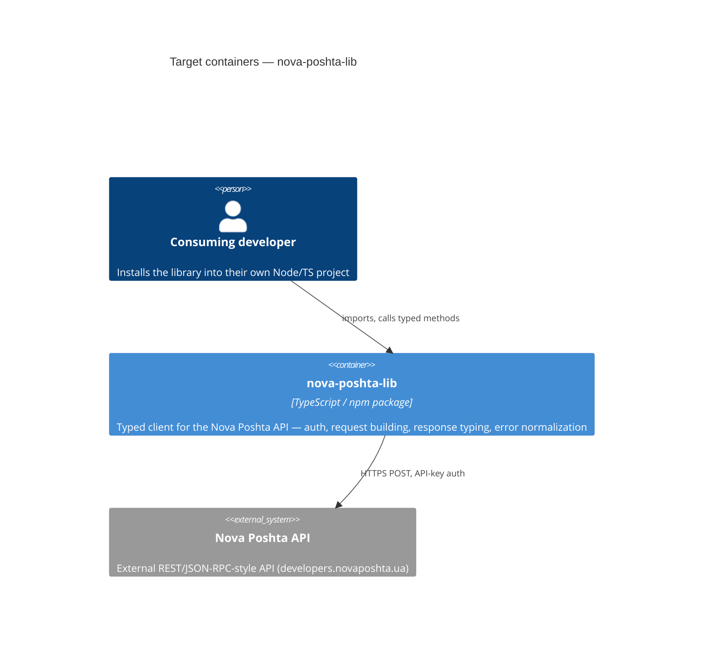

# Architecture map — nova-poshta-lib

> **Greenfield foundation** (target baseline), fixed with the user before any code exists. This is
> what `scaffold` materializes; the per-feature flow (`specify → … → implement`) builds real
> features into this skeleton afterwards. No authored architecture doc existed to reconcile with.

## Intent

A TypeScript client library for the [Nova Poshta API](https://developers.novaposhta.ua/documentation),
published as a public GitHub repo (and to npm) so it can be installed and used from other projects.
Requirements driving the foundation: documented, tested, and the `main` branch protected from
unauthorized/direct commits.

## Stack

- Language / runtime: TypeScript, Node.js >=18 (native `fetch`, no HTTP client dependency)
- Frameworks: none — this is a library, not an application; no web framework, no database
- Build / test / lint: `tsup` (dual ESM+CJS build) / `vitest` / `eslint` + `prettier`
- Release: `changesets` (semantic version bump + changelog + npm publish on merge)

## C4 — target containers

## Module inventory (target)

| Module | Path | Layers | Wired at | Responsibility |
|---|---|---|---|---|
| Core client | `src/client.ts` | infra | `src/index.ts` | Builds requests (`apiKey`/`modelName`/`calledMethod`/`methodProperties` envelope), sends via `fetch`, unwraps `success`/`errors`/`data`, throws typed errors |
| Domain modules | `src/modules/<domain>/` (address, counterparty, internet-document, tracking-document, common, …) | domain | `src/index.ts` | One typed method-set per Nova Poshta API model, each built on the core client |
| Types | `src/types/` | domain | imported by modules | Request/response interfaces per model, plus shared envelope + error types |
| Public surface | `src/index.ts` | app | package `main`/`module`/`types` entry | Re-exports the client factory + all domain modules + public types |

## Conventions (fixed for this foundation)

- **Module wiring:** each `src/modules/<domain>/index.ts` exports a factory taking the core `NovaPoshtaClient` and returning its typed methods; `src/index.ts` composes them — new domains (e.g. a new Nova Poshta model) follow the same shape.
- **Error handling:** a single `NovaPoshtaApiError` (extends `Error`) carries the API's `errors[]`/`errorCodes[]`/`warnings[]`; thrown whenever the envelope's `success` is `false` or the HTTP call fails. No silent swallowing.
- **IDs:** N/A — the library holds no persistent identifiers of its own; it passes through whatever IDs the Nova Poshta API returns (refs, waybill numbers).
- **Persistence / DB access:** none — the library is stateless; the Nova Poshta API is the only backing store.
- **Migrations:** N/A — no schema, no database.
- **Tests:** Vitest. `test/unit/**` mocks `fetch` (no network) and is required in CI. `test/integration/**` hits the real API with a key from `NOVA_POSHTA_TEST_API_KEY`; skipped automatically when that env var is absent, so CI runs it only if the secret is configured.
- **Inter-module communication:** direct function calls only (domain modules call the shared core client) — no events, no queues; this is a synchronous request/response library.

## Datastores

| Store | Engine | Accessed via | Notes |
|---|---|---|---|
| — | — | — | None. The Nova Poshta API is the sole external dependency; this library holds no state. |

## Frontend / UI foundation

<!-- N/A: no frontend -->

## Where things live / closest precedents

- A new Nova Poshta API model (e.g. adding `ScanSheet`) → new folder `src/modules/scan-sheet/`, modelled on `src/modules/address/` — one `index.ts` exporting typed methods built on `NovaPoshtaClient.request()`, plus `src/types/scan-sheet.ts` for its request/response shapes, plus `test/unit/modules/scan-sheet.test.ts` mocking `fetch`.
- A change to auth or request framing → `src/client.ts` only; every domain module inherits it automatically since none frame requests themselves.

## Constraints & known tech-debt

- No code exists yet — this map describes the target the `scaffold` skill will materialize, not something already built.
- The Nova Poshta API's actual request/response shapes (field names, required properties per model) are external and must be verified against https://developers.novaposhta.ua/documentation while building each domain module — the API is not versioned in this repo and can change independently.
- Repo governance (branch protection on `main`, required CI status checks, npm publish token) is a GitHub-settings task, not a code task — done once the repo exists on GitHub, outside `scaffold`.

## Reconciliation with the authored architecture doc

No authored architecture doc existed (empty repo); this map is the current reference and the target the scaffold materializes.
