# Software Architecture Document — additional-service

<!-- 12 Arc42 sections. Empty section → <!-- N/A: <one-line reason> -->. -->
<!-- C4 Context (L1) lives inline in §3. C4 Container (L2) lives inline in §5. -->
<!-- Numbers in §10 come VERBATIM from spec.md §6 NFR — no inventing, no rounding. -->

## 1. Introduction and goals

**Intent.** `additional-service` gives every consuming developer a typed, discoverable way to manage
the three post-creation shipment actions Nova Poshta's `AdditionalServiceGeneral` model exposes —
return, redirect, and waybill edit (`spec.md` §2) — the same hand-rolled-call gap `common`, `address`,
`counterparty`, `internet-document`, `tracking-document`, and `scan-sheet` already closed for their own
slices of the API. It wraps 18 confirmed raw methods spanning each order type's
check/create/calculate/update/list lifecycle plus one shared `delete`, plus one convenience method
(`createReturnIfPossible`) that chains the eligibility check and creation for the most common return
case into a single call. This is the roadmap's 7th and final domain module — closing it completes the
library's full target surface.

**Top-3 quality goals (1-liners; full scenarios in §10):**

1. Error-contract correctness — a declined/malformed/network-failed call always throws
   `NovaPoshtaApiError`, exactly like every sibling module, across all 19 methods (AC-21, AC-22, AC-23).
2. Discriminant safety — `OrderType`/`OnlyGetPricing` are never caller-settable, and mixing two
   `createReturn` destination variants is a compile-time error even when the payload is assembled
   field-by-field in a variable, not only as a fresh object literal (AC-04, §4 decision 4).
3. Honest wire-contract completeness under genuine sourcing uncertainty — all 19 methods ship typed
   and callable, with the 2 still-unconfirmed edit-check field lists and `createReturnIfPossible`'s
   address-mapping assumption explicitly risk-tracked (§11) rather than silently guessed or used to
   block the whole feature (spec.md §8).

**Stakeholders.**

| Role | Interest | Sign-off owner? |
|---|---|---|
| Consuming developer | Calls the 19 typed methods to manage returns, redirects, and waybill edits | No |
| Tech Lead | SAD approval; owns `spec.md` §8's 5 open questions (1 blocking, see ¶4 override below); performs the §6.1 security review this module requires before `sdd:ship` | Yes |

**Decision override — proceeding past `spec.md` §8's blocking open question.** `spec.md` §8 flags
whether `checkReturnPossible`'s `Ref` maps onto `createReturn`'s `ReturnAddressRef` as blocking
*before* `design`/`api`, and blocking `createReturnIfPossible`'s implementation specifically. This
design pass proceeds without resolving it: no §4–§9 decision below actually depends on knowing the
answer — the client-extension, discriminant, and error-handling decisions are all shape-level, not
value-level. Flow 1 (§6) is built so a wrong assumption fails safely (a thrown `NovaPoshtaApiError`,
never a corrupted or silently-wrong order). The spec's "blocks" language is re-scoped here to mean
specifically before `/sdd:api` — where the literal field mapping must be pinned in the OpenAPI
contract — and before `/sdd:review` can PASS (`CLAUDE.md` sourcing policy), not before `design`. See
§11 row 1.

<!-- Further decision overrides (¶4) — none additional raised by the critic pass; the spec's own 9
     §1 Decision overrides and the clarify-stage AC-04/AC-12/AC-13/AC-14/AC-17/AC-21 tightenings are
     inherited unchanged, not re-litigated here — see §4. -->

## 2. Constraints

**Technical.**
- TypeScript, Node.js ≥18 (native `fetch`, no HTTP client dependency)
- No framework — this is a library, not an application
- No datastore — `additional-service` is stateless; the Nova Poshta API is the sole backing store
- Architecture convention: one folder per Nova Poshta model (`src/modules/<domain>/`), dual ESM+CJS
  build via `tsup` (project-level convention)
- This is the first feature since the library's foundation to require changes to the shared core
  client (`src/client.ts`) itself — see §4 decisions 2 and 3 (ADR-0001, ADR-0002)

**Organisational.**
- Effort budget: sized M per `.size` / route `standard` — the broadest raw-method count in the repo
  (18 raw + 1 convenience, vs. `internet-document`'s 8), but structurally repetitive rather than 19
  independently novel designs (`spec.md` §1 Decision override: 4 near-identical check reads, 3 list
  reads, 2 reason lookups, 2 calculate wrappers mirroring their sibling creates, 1 shared delete)
- **Re-justified here, not just inherited:** `spec.md` §1's M-not-L reasoning rests on "touches no
  shared infrastructure" and "breaks no existing consumer" — this design pass's own §4 decisions 2–3
  touch `src/client.ts` and refactor `internet-document`. Still M, not L, because the size matrix's
  actual L-trigger is *cross-module, multi-team, breaking* change: both additions are purely additive
  to the client's public interface (existing callers unaffected), and the `internet-document` change
  is a behavior-preserving extraction with its own unit suite as the regression check (§11) — not a
  breaking change for that module's own consumers, and no second team is involved.
- No hard deadline stated in `spec.md`
- Team: single maintainer (project owner)

**Conventions.**
- Convention file: `CLAUDE.md` + `docs/architecture-map.md`
- Error handling: a single `NovaPoshtaApiError`, no subclassing (project-level convention);
  `clarify`'s AC-21 resolution confirms this module's "malformed response" check stays envelope-level
  only, matching `src/client.ts`'s existing behavior — no per-method body-shape validation
- `src/types/additional-service.ts` holds this feature's request/response interfaces, per the
  `src/types/<domain>.ts`-per-model convention every prior module already established

**Regulatory / external.**
- `spec.md` §6.1: data classification confidential — sender/recipient contact names, phone numbers,
  addresses, and payment/cost details across all three order types, matching or exceeding
  `internet-document`'s and `tracking-document`'s posture. Personal data is touched whenever the
  underlying counterparty is a `PrivatePerson` (CONTEXT glossary).
- AuthZ/AuthN: the library sends the caller's API key the same way every module does (AC-23); Nova
  Poshta itself enforces the sender-only restriction on check/create/calculate (AC-02) and the
  sender-vs-recipient field-permission difference on redirect edits, inferred solely from the calling
  key with no role parameter on the wire (AC-13, 2-SDK-confirmed during `clarify`) — no client-side
  role or field-permission check of this library's own.
- Security review: **required** before `sdd:ship` — new money-bearing fields (`PaymentMethod`,
  return/redirect cost, backward-delivery-adjacent amounts), personal data at write time, no
  field-permission gating on waybill edits, and no atomicity on `createReturnIfPossible` (`spec.md`
  §6.1; carried into §11).

## 3. Context and scope

`additional-service` gives a consuming developer typed access to Nova Poshta's `AdditionalServiceGeneral`
domain — returning, redirecting, or editing an already-created shipment — so they can build these
post-creation flows without hand-rolling an untyped call. It ships inside the existing
`nova-poshta-lib` npm package, alongside the shared core client and the six already-shipped modules.

<!-- brownfield: read directly (src/client.ts, src/types/envelope.ts, src/modules/internet-document/index.ts
     [firstOrThrow, the ServiceType/CargoType discriminated-union precedent], src/modules/scan-sheet/index.ts
     [module-shape + module-local-helper precedent], src/index.ts). docs/architecture-map.md
     (reflects_commit 94201ac) predates scan-sheet/additional-service shipping but its target
     conventions still match what's on disk: module wiring, dual-build, and the client's
     array-shape-checked read path are unchanged by every module shipped since. No Explore subagent
     needed — same reasoning every prior module's sad.md already used for this trivially-sized
     codebase. internet-document's private firstOrThrow helper and its ServiceType/CargoType
     discriminated-union ADRs are the two closest structural precedents this design reuses (promoted
     to shared infra — §4 decisions 2, 3 — rather than copied). -->

**External systems (in / out):**

| Actor or system | Type | Interaction |
|---|---|---|
| Consuming developer | Person | Installs `nova-poshta-lib`, calls `additional-service`'s typed methods |
| Nova Poshta API | System (external) | HTTPS, `apiKey` auth — the sole backing store for return/redirect/waybill-edit orders |

**C4 Context (L1):**

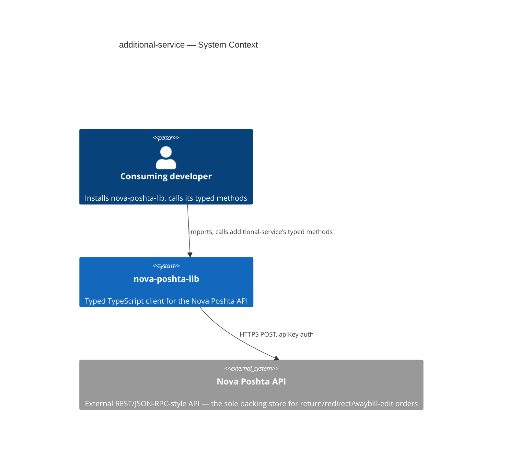

*Identical in shape to every sibling module's: the consuming developer talks only to
`nova-poshta-lib`, and the library itself is the only thing that talks to the external Nova Poshta
API. No new external system — `additional-service`'s calls land on the same single external API, just
a different `modelName` (`AdditionalServiceGeneral`). All 19 methods return the standard JSON
envelope; `checkReturnEditPossible` additionally reads the envelope's `info` field (§4 decision 2,
ADR-0001) — still the same one transport path, not a second one.*

## 4. Solution strategy

**Top strategic choices (the seeds for ADRs):**

1. **Target surface: `library-sdk`.** Same single-surface shape every prior module already
   established and the only fit for this repo (no server, no UI). Written to this document's
   frontmatter (`target_surfaces: ["library-sdk"]`); §5 draws one container for it, alongside the six
   already-shipped modules. Single surface → the multi-surface blast-radius trigger never fires.
2. **Extend `requestEnvelope()` to expose the envelope's `info` field — ADR-0001.** `checkReturnEditPossible`
   is the first method in this library that needs a field the shared client currently discards.
   `architecture-map.md`'s own convention is that a request/response-framing change belongs in
   `src/client.ts` alone, inherited automatically by every module — so `src/client.ts` gains one
   additive, backward-compatible field rather than this module framing a second, parallel JSON-parsing
   path that would duplicate `sendRequest()`'s existing error handling. See ADR-0001.
3. **Promote `firstOrThrow` into the core client as `requestFirst<T>()` — ADR-0002.** 12 of this
   module's 19 methods need the same single-record unwrap `internet-document` already does privately,
   at 2 call sites. Reusing it as-is would mean `additional-service` importing from a sibling domain
   module's file — coupling two modules that must stay independent (`architecture-map.md`); writing a
   second, independent copy inside `additional-service` would leave the same logic maintained twice
   (`internet-document`'s original serving 2 call sites, a new copy serving 12) with no single source
   of truth. Promoting it to shared infra — with `internet-document` refactored to adopt the same
   implementation — collapses both into one implementation serving all 14 call sites, and keeps both
   modules independent of each other. See ADR-0002.
4. **`createReturn`'s three destination variants carry a wire-stripped discriminant tag.** Mirrors
   `internet-document`'s `ServiceType`/`CargoType` pattern for "one wire call, several typed variants,"
   but the discriminant here has no wire counterpart (Nova Poshta's `save` call has no field for it) —
   a deliberate divergence from that precedent, not an oversight. This mechanism — an explicit
   discriminant tag, stripped before the wire call — is what `spec.md` AC-04 itself already specifies
   (fixed during `clarify`), so no legitimate alternative is actually open to this design pass; it's a
   building-block decision here, not an ADR (the same standard decision 5 below applies).
5. **`createReturnIfPossible` composes this module's own `checkReturnPossible` + `createReturn`
   internally, never a separate lookup path.** The same shape `scan-sheet`'s `addToTodaysScanSheet`
   and `internet-document`'s `deleteBatch→delete` composition already use (a module's own convenience
   method calling its own raw methods, no new client capability needed). Fully spec-mandated
   (`spec.md` AC-20, resolved during `clarify`: an empty option list is treated as ineligible, no
   create call attempted) — no legitimate alternative is open to this design pass, so it's a
   building-block decision here, not an ADR. Concretely: it calls the module's own `checkReturnPossible`
   (the list-shaped, `request<T>()`-backed method — §5), checks the returned array's length itself,
   and throws a clear "no return address available" `NovaPoshtaApiError` when it's empty, rather than
   relying on `requestFirst()`'s generic empty-array message — see §6 Flow 1.
6. **Ship all 19 methods now; type the 2 unconfirmed edit-check field lists defensively rather than
   holding the feature back.** `checkReturnEditPossible`'s/`checkRedirectEditPossible`'s exact request
   fields (`spec.md` §8) and whether `checkReturnPossible`'s `Ref` really maps onto `createReturn`'s
   `ReturnAddressRef` (§8, elevated to blocking before `api`/`review` — see §1's decision override)
   remain genuinely open. Both risks degrade safely rather than silently: an uncertain edit-check field
   is typed loosely (`Record<string, unknown>` merged with the known fields) rather than a
   falsely-precise interface that would break silently if wrong, and `createReturnIfPossible`'s worst
   case if the `Ref`/`ReturnAddressRef` assumption is wrong is Nova Poshta's own decline surfacing as
   the standard error (AC-21) — never a corrupted or silently-wrong order. Matches `scan-sheet`'s own
   precedent of shipping with 2 unconfirmed wire details tracked as risk rather than blocking the whole
   feature (`scan-sheet` §11). Carried into §11 with owner + due, not silently accepted.

Each tactical decision in later sections traces to one of these six. Decisions 2–3 are this pass's two
ADRs; decisions 4–5 are building-block decisions the spec/clarify pass already fixed, with no
legitimate alternative left open here; decision 6 is the risk-acceptance call re-examined in §11, not
architecture in its own right.

## 5. Building block view

Layered per the existing modular-domain convention: a thin `additional-service` domain module sits on
top of the shared core client, using `client.request<T>()` for every list-shaped method,
`client.requestFirst<T>()` (§4 decision 3, ADR-0002) for every single-record method, and
`client.requestEnvelope<T>()` (§4 decision 2, ADR-0001) for the one method that also needs `info`.

**Method classification** (drives which client entry point each of the 19 methods uses):

| Shape | Client call | Methods |
|---|---|---|
| List (array pass-through, matches AC-08/AC-14/AC-17's no-client-pagination stance) | `request<T>()` | `checkReturnPossible`, `getReturnOrdersList`, `getReturnReasons`, `getReturnReasonsSubtypes`, `getRedirectionOrdersList`, `getChangeEWOrdersList` |
| Single record (throws if the array comes back empty) | `requestFirst<T>()` (ADR-0002) | `createReturn`, `calculateReturn`, `updateReturn`, `checkRedirectPossible`, `checkRedirectEditPossible`, `createRedirect`, `calculateRedirect`, `updateRedirect`, `checkWaybillEditPossible`, `createWaybillEdit`, `deleteAdditionalServiceOrder`, `createReturnIfPossible` (convenience, wraps `checkReturnPossible` + `createReturn`) |
| List + envelope `info` | `requestEnvelope<T>()` (ADR-0001) | `checkReturnEditPossible` |

*The return-side and redirect-side "check possibility" methods are asymmetric on the wire: `checkReturnPossible`
returns a genuine list of address options to choose from, while `checkRedirectPossible` returns one
info record describing the redirect's current possibility — not a list of choices. This asymmetry is
Nova Poshta's own (confirmed by the spec's method table, not a choice this design makes) and is why
the two "new" checks land in different rows of the table above. Whether `checkRedirectEditPossible`
genuinely never carries an `info` block the way `checkReturnEditPossible` does, and whether a
malformed mixed request to either dual-purpose wire method could produce an ambiguous or wrong-shaped
response neither this table nor this module's tests anticipate, are both open — widened into §11 row 2
alongside the existing request-field-list uncertainty, not fully resolved here.*

**Internal decomposition:**

```
src/
├── client.ts                     # CHANGED — adds requestFirst<T>() (ADR-0002) and info?: unknown
│                                  #   on NovaPoshtaSuccessEnvelope<T> (ADR-0001); request()/
│                                  #   requestEnvelope() behavior otherwise unchanged
├── types/
│   ├── envelope.ts                # unchanged — NovaPoshtaEnvelope<T>.info already existed, just
│   │                               #   wasn't surfaced past the client boundary until now
│   └── additional-service.ts      # NEW — request/response interfaces for all 19 methods, including
│                                   #   the ReturnDestination-discriminated union (§4 decision 4) and
│                                   #   the CheckReturnEditPossibleResult { options, info } composite
│                                   #   type (ADR-0001). Every Ref/OrderRef inlined as `string`
│                                   #   (spec.md §1 Decision override — no shared Ref alias).
│                                   #   BeginDate/EndDate typed as plain `string`, passthrough only
│                                   #   (spec.md §1 note).
├── modules/
│   ├── common/                   # existing — unchanged
│   ├── address/                  # existing — unchanged
│   ├── counterparty/              # existing — unchanged
│   ├── internet-document/
│   │   └── index.ts               # CHANGED (ADR-0002) — its private firstOrThrow() is removed;
│   │                               #   getDocumentPrice/getDocumentDeliveryDate call the new shared
│   │                               #   client.requestFirst<T>() instead. Behavior-preserving.
│   ├── tracking-document/        # existing — unchanged
│   ├── scan-sheet/               # existing — unchanged
│   └── additional-service/
│       └── index.ts               # NEW — factory: createAdditionalServiceModule(client) → 19 typed
│                                   #   methods. 6 list methods delegate straight to client.request();
│                                   #   12 single-record methods delegate to client.requestFirst()
│                                   #   (§5 table); checkReturnEditPossible uses client.requestEnvelope()
│                                   #   and narrows its info field (ADR-0001). createReturn/calculateReturn
│                                   #   share one internal payload-builder that strips the TS-only
│                                   #   destination discriminant before the wire call (§4 decision 4) and
│                                   #   injects OnlyGetPricing:"1" for the calculate variant.
│                                   #   createReturnIfPossible composes its own checkReturnPossible +
│                                   #   createReturn internally, branching on an empty array itself
│                                   #   rather than relying on requestFirst()'s generic message (§4
│                                   #   decision 5, §6 Flow 1).
└── index.ts                       # public re-exports (existing 6 modules + additional-service + types)
```

`tsup`'s existing dual ESM+CJS build already emits matching `.d.ts`/`.d.cts` declarations for whatever
`src/index.ts` re-exports — no new build step needed.

**C4 Container (L2):**

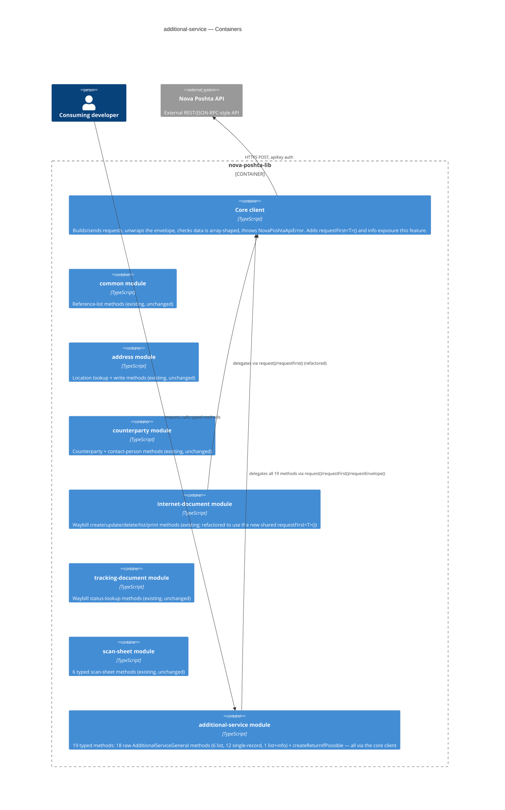

*The Containers view draws the one declared surface (`library-sdk`, the whole `nova-poshta-lib`
package) as a boundary holding eight pieces: the core client (extended by this feature),
`internet-document` (refactored, not behavior-changed), five other existing modules (untouched), and
the new `additional-service` module. `additional-service` does not call `internet-document` or
`counterparty` at runtime — a waybill `IntDocNumber`/`Number` or counterparty `Ref` is only ever a
plain string input, never resolved through a live cross-module call (`spec.md` §1 Decision override,
AC-10).*

## 6. Runtime view

**Critical flow 1: `createReturnIfPossible` — two-call convenience, decline-safe on every uncertainty**

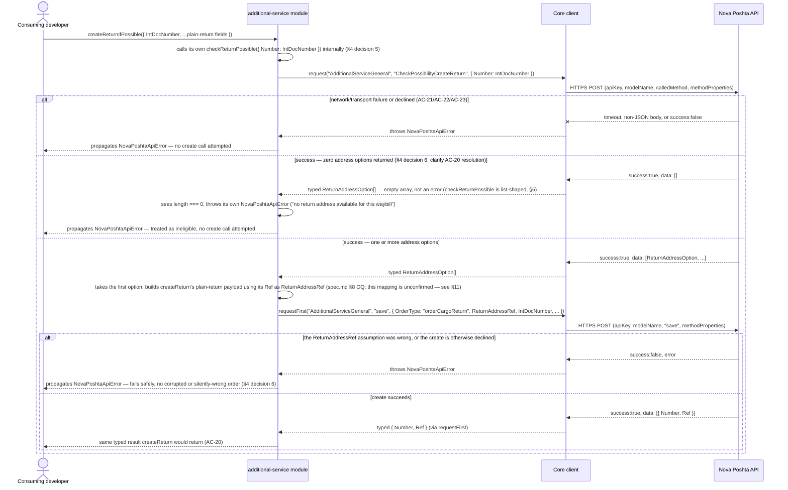

**Critical flow 2: `checkReturnEditPossible` — the one method needing the envelope's `info` field**

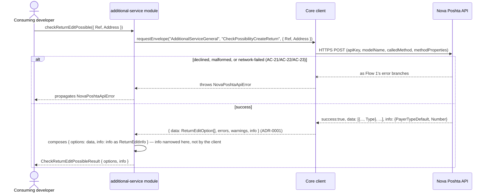

*Flow 1 covers `createReturnIfPossible` (AC-20) and demonstrates §4 decision 6's core property: every
point where the still-open §8 questions could bite (an empty option list, a wrong `ReturnAddressRef`
mapping) resolves to a thrown `NovaPoshtaApiError`, never a silent wrong action. Flow 2 covers
`checkReturnEditPossible` (part of AC-06/US-04) and demonstrates ADR-0001's mechanism end-to-end. The
remaining 17 methods follow one of two simpler shapes already shown in full by `scan-sheet`'s and
`internet-document`'s sad.md flows — a single `request()`/`requestFirst()` call with the standard
AC-21/AC-22/AC-23 error branches and no additional sequencing — and are covered exhaustively, one
flow per AC, by the `sequences` stage next, not repeated here.*

### Flow 3: `checkReturnPossible` → `createReturn` — the return check-then-create pair

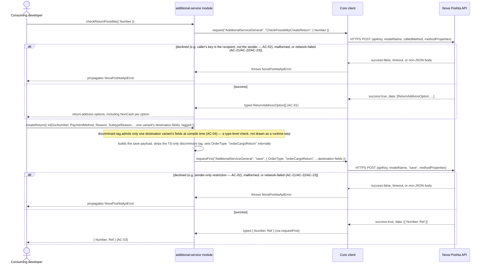

### Flow 4: `calculateReturn` — cost preview, no order created

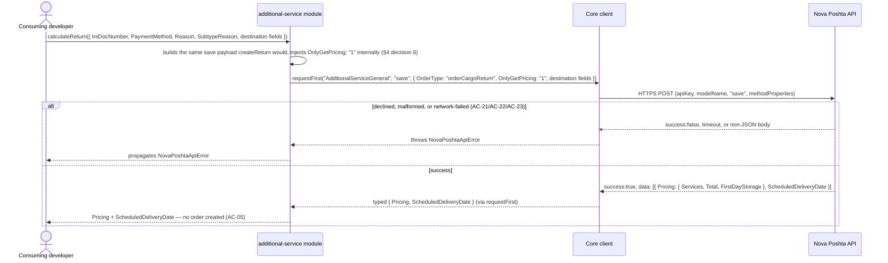

### Flow 5: `updateReturn` — applying an edit after Flow 2's `checkReturnEditPossible`

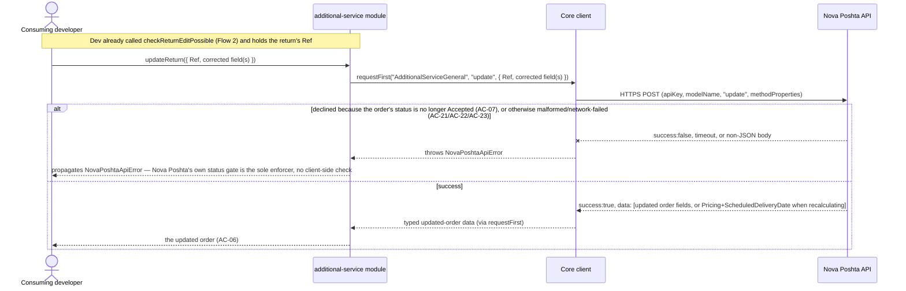

### Flow 6: generic list-read — one shape, 5 methods

*Covers `getReturnOrdersList`, `getReturnReasons`, `getReturnReasonsSubtypes`, `getRedirectionOrdersList`, and
`getChangeEWOrdersList` — all five are structurally identical single-call list reads (§5 table's `request<T>()`
row), so one diagram stands for all five rather than five near-copies. `<method>`/`<calledMethod>`/`<filters>`
substitute per call: `checkReturnPossible`/`checkRedirectPossible` are excluded here since they're already drawn
individually in Flows 2, 3, and 7 with their own check semantics.*

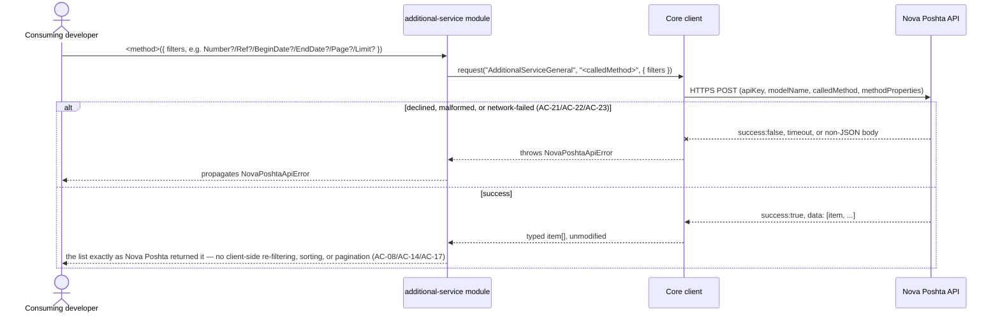

### Flow 7: `checkRedirectPossible` → `createRedirect` — the redirect check-then-create pair

*Unlike `checkReturnPossible` (Flow 3, list-shaped), `checkRedirectPossible` returns one info record
describing the redirect's current possibility, not a list of choices (§5's asymmetry note) — so it
uses `requestFirst()`, not `request()`.*

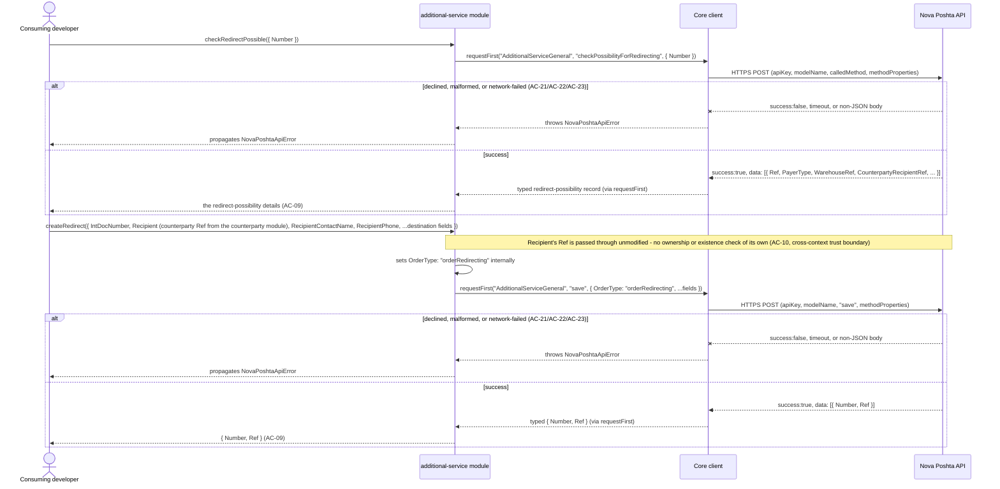

### Flow 8: `calculateRedirect` — cost preview, no order created

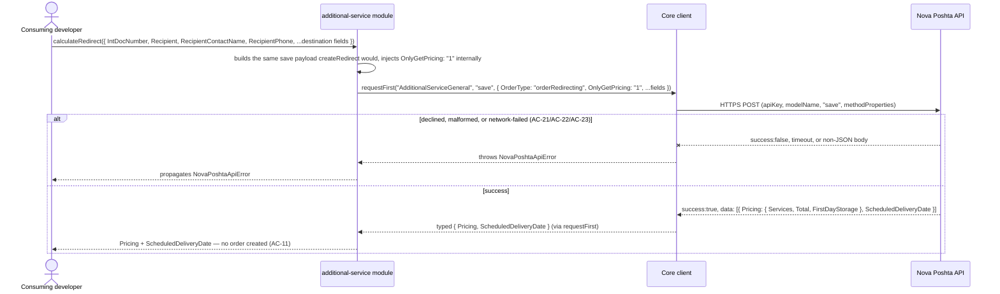

### Flow 9: `checkRedirectEditPossible` → `updateRedirect` — sender or recipient, same call shape

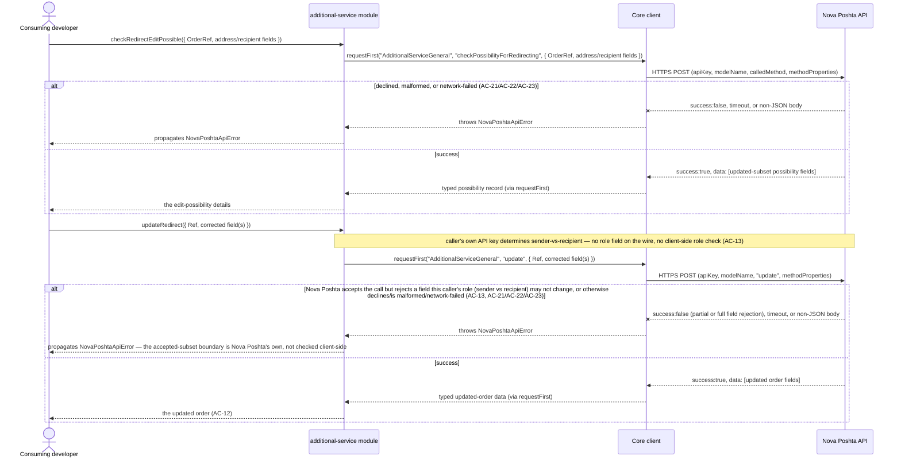

### Flow 10: `checkWaybillEditPossible` → `createWaybillEdit` — flags are informational only

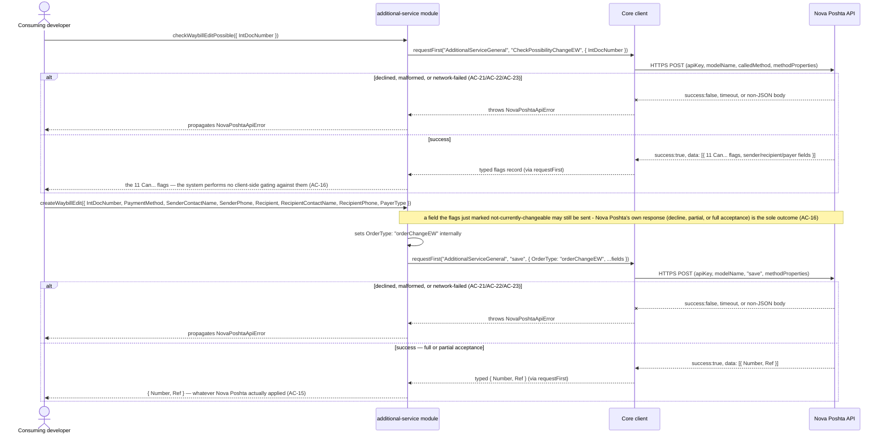

### Flow 11: `deleteAdditionalServiceOrder` — one method, all three order types

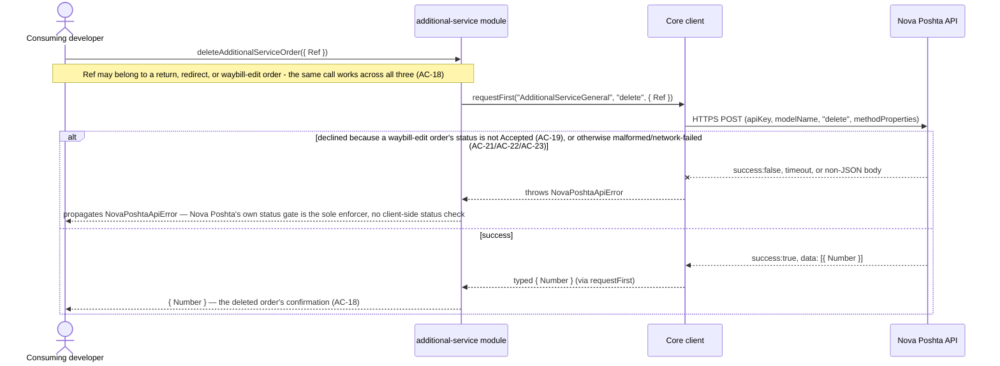

### §6 coverage check

**User-story → flow.** Every §4 user story maps to ≥1 flow:

| US | Flow(s) |
|---|---|
| US-01 Check whether a return is possible | Flow 3 |
| US-02 Create a return | Flow 3 |
| US-03 Estimate a return's cost | Flow 4 |
| US-04 Edit an existing return request | Flow 2, Flow 5 |
| US-05 Browse return requests / reasons | Flow 6 |
| US-06 Check + create a redirect | Flow 7 |
| US-07 Estimate a redirect's cost | Flow 8 |
| US-08 Edit an existing redirect request | Flow 9 |
| US-09 Browse redirect requests | Flow 6 |
| US-10 Check + submit a waybill edit | Flow 10 |
| US-11 Browse waybill-edit requests | Flow 6 |
| US-12 Delete a pending request | Flow 11 |
| US-13 `createReturnIfPossible` | Flow 1 |
| US-14 Standard error on failure | the `alt` error branch present in every flow above (not a dedicated flow) |

**AC → flow / branch / N/A.** Every §5 acceptance criterion is shown:

| AC | Shown by |
|---|---|
| AC-01 | Flow 3, happy branch |
| AC-02 | Flow 3, both decline branches |
| AC-03 | Flow 3, `createReturn` happy branch |
| AC-04 | Flow 3, `Note` — explicit non-runtime N/A: compile-time discriminant check, not a wire step |
| AC-05 | Flow 4 |
| AC-06 | Flow 2 (check) + Flow 5 (apply) |
| AC-07 | Flow 5, decline branch |
| AC-08 | Flow 6 |
| AC-09 | Flow 7 |
| AC-10 | Flow 7, `Note` on the `createRedirect` step |
| AC-11 | Flow 8 |
| AC-12 | Flow 9, `updateRedirect` happy branch |
| AC-13 | Flow 9, `Note` + decline branch |
| AC-14 | Flow 6 |
| AC-15 | Flow 10, `createWaybillEdit` happy branch |
| AC-16 | Flow 10, `Note` on the `createWaybillEdit` step |
| AC-17 | Flow 6 |
| AC-18 | Flow 11, happy branch |
| AC-19 | Flow 11, decline branch |
| AC-20 | Flow 1 (pre-existing) |
| AC-21 | the malformed-response arm of the `alt` error branch present in every flow |
| AC-22 | the network-failure arm of the `alt` error branch present in every flow |
| AC-23 | the decline arm of the `alt` error branch present in every flow |

No §4 user story and no §5 acceptance criterion is left uncovered.

**Flagged for `data-model`:** every flow's writes are `save`/`update`/`delete` calls to Nova Poshta's own API — this module persists nothing of its own (no local datastore, per `CLAUDE.md`'s "No persistence"), so no new index or schema change is implied by any persist note above; `data-model`'s hard-refuse condition ("no schema change") applies and that stage should be skipped for this feature.

**Flagged for `design`:** no new participant beyond the generic vocabulary already declared in §5 (`<client>`≈`Dev`, `<service>`≈`Addl`+`Client`, `<external-system>`≈`NP`) was needed by any flow — nothing to reconcile back into §5.

## 7. Deployment view

<!-- N/A: this feature ships inside the existing npm package publish process (project-level release
     strategy via changesets) — no new infrastructure, no new deployment unit, no server to operate.
     Identical reasoning to every sibling module's §7. -->

## 8. Crosscutting concepts

| Concept | Convention | Where defined |
|---|---|---|
| Logging | None — the library emits no logs of its own | — (repo default, undocumented) |
| Authentication | Caller-supplied `apiKey`, unchanged by this feature; no independent key-validity check (AC-23); sender-vs-recipient role inferred by Nova Poshta from the calling key, no role field on the wire (AC-13, 2-SDK-confirmed) | `architecture-map.md`; spec.md §6.1 |
| Error handling | Single `NovaPoshtaApiError` for all 19 methods; envelope-level check only (AC-21, clarify) — no per-method body-shape validation | `src/client.ts`; `CLAUDE.md`; spec.md §6.1 |
| Read-return shape | List methods return `T[]` unmodified (`request()`); single-record methods return `T` (`requestFirst()`, throws on an empty array — ADR-0002); `checkReturnEditPossible` returns `{options: T[], info: U}` (`requestEnvelope()` — ADR-0001) | additional-service §5 |
| Discriminant safety | `OrderType`/`OnlyGetPricing` set internally, never caller-settable (spec.md §6 NFR); `createReturn`'s destination variants carry a wire-stripped TS-only discriminant (§4 decision 4) | spec.md §1 Decision override; AC-04 |
| Response-field typing | `BeginDate`/`EndDate` and every other date-bearing field are raw, unparsed `string`s — no client-side `Date`/`number` coercion, deliberately avoiding a repeat of `scan-sheet`'s cross-format `DateTime`-ordering defect | spec.md §1 note (post-clarify) |
| Cross-module type reuse | None — every `Ref`/`OrderRef`/`IntDocNumber` field is inlined as `string`, no shared `Ref` alias imported from `internet-document` or `scan-sheet` (spec.md §3 non-goal) | spec.md §3; additional-service §5 |
| Shared client surface | `requestFirst<T>()` (ADR-0002) and `info` exposure on `requestEnvelope()` (ADR-0001) are new, permanent additions to `src/client.ts`'s public interface — every future module inherits both | ADR-0001; ADR-0002 |
| ID strategy | N/A — the library holds no persistent IDs of its own; a `Ref`/`OrderRef`/`Number` is Nova Poshta's, passed through live | `architecture-map.md` |
| Internationalisation | N/A — pass-through of Nova Poshta's own fields, no library-side selection | `docs/features/common/spec.md` §8 |
| Observability | None new — no metrics/tracing added by this feature | — |
| Events | N/A — synchronous request/response only | `architecture-map.md` |
| Rate-limiting | None of our own — Nova Poshta's own throttling governs; no client-side cap | spec.md §6.1 |
| Testing | Mocked unit suite required in CI (`test/unit/modules/additional-service`, plus updated `test/unit/modules/internet-document` for the ADR-0002 refactor), plus an opt-in integration suite against the real API | spec.md Test plan; `docs/adr/0003-testing-strategy.md` |

## 9. Architecture decisions

| # | Title | Status | Section |
|---|---|---|---|
| 0001 | Expose the envelope's `info` field via `requestEnvelope()` | Accepted | §4, §5 |
| 0002 | Promote `firstOrThrow` into the core client as `requestFirst<T>()` | Accepted | §4, §5 |

ADR files live under `docs/features/additional-service/adr/`. `createReturn`'s wire-stripped
discriminant tag (§4 decision 4) and `createReturnIfPossible`'s composition (§4 decision 5) were
considered for an ADR but demoted to building-block decisions during the critic pass — `spec.md`
AC-04/AC-20 already mandate their exact mechanism, leaving no legitimate alternative genuinely open
to this design pass (a strawman ADR is worse than no ADR). This feature also relies on `common`'s
already-Accepted array-shape-only validation ADR (unchanged, inherited by every list method) — no new
ADR needed for it here.

## 10. Quality requirements

Each top-3 goal from §1 expanded into a full scenario:

**QG-1. Error-contract correctness**
- **When:** any of the 19 methods is declined, malformed, or network-failed.
- **Then:** 100% of in-scope methods throw `NovaPoshtaApiError` on a decline, envelope-level
  malformation, or network failure — `spec.md` §6 NFR row "Error-contract coverage", AC-21, AC-22,
  AC-23.
- **How verify:** unit test suite `test/unit/modules/additional-service` (spec.md test plan
  AC-21/AC-22/AC-23 rows), reusing the shared error-contract fixture pattern every sibling module's
  suite already establishes.

**QG-2. Discriminant safety**
- **When:** a consuming developer builds a `createReturn`/`createReturnIfPossible` payload, whether as
  a fresh object literal or assembled field-by-field in a variable, and whether directly or via
  `calculateReturn`.
- **Then:** 100% of `OrderType`/`OnlyGetPricing` values are set internally — 0 public method
  signatures accept either as a caller-settable field; mixing two destination variants' fields is a
  compile-time type error in both the literal and the variable case — `spec.md` §6 NFR row
  "Discriminant safety", AC-04, §4 decision 4.
- **How verify:** static check in CI (public API surface review, spec.md §6) plus a `tsd`/type-level
  test asserting a mixed-variant object (built via a variable, not a literal) fails to compile —
  `spec.md` test plan AC-04 row.

**QG-3. Honest wire-contract completeness under sourcing uncertainty**
- **When:** any of the 19 methods is exported and called, including the 3 riding on the still-open
  §8 questions (`checkReturnEditPossible`, `checkRedirectEditPossible`, `createReturnIfPossible`).
- **Then:** all 19 methods are exported, typed, and callable (`spec.md` §6 NFR "Method-surface
  completeness", §7 KPI); the 2 unconfirmed edit-check field lists are typed defensively rather than
  falsely precisely, and a wrong `ReturnAddressRef` assumption in `createReturnIfPossible` always
  surfaces as `NovaPoshtaApiError`, never a corrupted or silently-wrong order (§4 decision 6, spec.md
  §7 KPI "Convenience-method correctness": 0 GitHub issues within 90 days reporting a duplicate return
  or an undeterminable outcome); the still-open `spec.md` §7 KPI "API-contract sourcing completeness"
  (target: 100% of the 19 methods' request/response shapes confirmed against official documentation
  before ship) names exactly the gap this quality goal accepts as risk for now — the 2 unconfirmed
  edit-check field lists and the `ReturnAddressRef` mapping are precisely what that KPI is not yet at
  100% on.
- **How verify:** unit test suite asserting all 19 methods are exported/callable (spec.md §6 row 3);
  a dedicated `createReturnIfPossible` fixture covering the empty-option-list and the
  create-declined branches, both asserting `NovaPoshtaApiError` and zero side effects (spec.md test
  plan AC-20 row); the sourcing-completeness KPI itself is verified manually before `sdd:ship`, not by
  a unit test (§11 row 1).

Two further `spec.md` §6 NFR rows apply library-wide, not to one specific quality goal above, and are
still binding: **Type-safety coverage** (100% of the 19 in-scope methods carry zero `any` in their
public signatures, static check in CI) and **Library-added overhead per call** (median ≤5ms beyond
the underlying network round-trip for the 18 raw methods, `createReturnIfPossible` explicitly excluded
since its two-call cost is by design — benchmarked with `fetch` stubbed to near-zero latency across
≥30 repeated single-item calls, always runs in CI). The **Calculate/create isolation** row (added
during `clarify`) is verified the same way: a unit test asserting `calculateReturn`/`calculateRedirect`'s
outgoing request carries `OnlyGetPricing: "1"`.

## 11. Risks and technical debt

| Risk / debt | Severity | Mitigation | Owner |
|---|---|---|---|
| ~~**Blocked design on this, then overridden (§1 ¶4):** does `checkReturnPossible`'s per-option `Ref` genuinely map onto `createReturn`'s `ReturnAddressRef`?~~ **Resolved 2026-09-23** (review round 1) — official docs' own `save`/`orderCargoReturn` example confirms `ReturnAddressRef` as the real wire field; no source contradicts the mapping (spec.md §1 "Official documentation quotes"). | ~~High~~ Closed | Confirmed via official-docs capture, quoted verbatim in spec.md §1 | Tech Lead — closed 2026-09-23 |
| ~~`checkReturnEditPossible`'s/`checkRedirectEditPossible`'s exact request field lists are unconfirmed~~ **Resolved 2026-09-23** — both field lists confirmed verbatim by official docs (spec.md §1); `checkRedirectEditPossible`'s response carries no `info` key (only the return edit-check does, per the same capture) | ~~Medium~~ Closed | Types tightened to the confirmed field lists in `src/types/additional-service.ts` | Tech Lead — closed 2026-09-23 |
| Security review required before release — new money-bearing fields, PII at write time, no field-permission gating on `createWaybillEdit` (AC-16), no atomicity on `createReturnIfPossible` (spec.md §6.1) | Medium | Performed by the Tech Lead during `sdd:review`/before `sdd:ship`, matching every prior module's precedent | Tech Lead |
| A waybill-edit (ChangeEW) request has no typed `update` method — amending one means delete-then-recreate (spec.md §3, §8), a TOCTOU race no code change removes. **Confirmed 2026-09-23**: official docs' complete "Змінити дані" section lists no `update` method at all. | Low | Accepted by design — documented in `spec.md` AC-19/§6.1; no mitigation beyond documentation, matching `scan-sheet`'s tolerated `addToTodaysScanSheet` TOCTOU precedent | Tech Lead |
| `orderTermExtension` (storage-term extension) excluded from scope — single, self-admittedly reverse-engineered source only (spec.md §1, §8); this session's official-docs capture confirms no mention of it either | Low | Tracked as an open question, not shipped as an AC; revisit once a 2nd agreeing source or official docs confirm it | Tech Lead |
| ~~Re-verify the full 19-method surface...against Nova Poshta's live/official documentation once reachable~~ **Substantially resolved 2026-09-23** — official docs captured and quoted verbatim (spec.md §1); surfaced and fixed 4 real defects the original SDK-only sourcing missed: `NonCash` is a boolean not a string, `Pricing.FirstDayStorage` is a string not a number, `RedirectOrderListItem` was missing `DocumentNumber`, and `update` requires `OrderType` (now set internally). Only `CreateRedirectPayload.ServiceType`'s full enum remains open (spec.md §8). | Low | `CreateRedirectPayload.ServiceType`'s remaining enum values — next live-API verification pass or a 2nd agreeing SDK | Tech Lead |
| `createReturnIfPossible`'s two-call gap is not atomic (spec.md §3 non-goal, §6.1) — a lost response between the check and the create leaves the caller unable to tell whether a return now exists | Low | Accepted by design — this library holds no state to reconcile against, matching `internet-document`'s identical stance on chained calls; documented in AC-20/§6.1 | Tech Lead |
| ADR-0002's `internet-document` refactor (extracting `firstOrThrow` to the shared client) must not change that module's existing public behavior or test results | Low | Pure extraction, same call sites, same error message shape; `internet-document`'s existing unit suite is the regression check — must stay green unmodified in behavior (only its import source changes) | Tech Lead |

**Accepted debt (acceptable in v1, plan to fix later):**
- No client-side validation of `checkWaybillEditPossible`'s 11 `Can...` flags before submitting
  `createWaybillEdit` — Nova Poshta's own response is the sole judge (spec.md §3 non-goal, AC-16).
- No branded `Ref` type distinguishing a return/redirect/waybill-edit order's `Ref` from any other
  module's — matches `scan-sheet`'s explicit precedent (spec.md §3 non-goal).
- 8 of `checkWaybillEditPossible`'s 11 flags (backward-delivery, afterpayment, lifting-on-floor,
  warranty) have no corresponding field on `createWaybillEdit` — confirmed by 2 independent SDKs, not
  this library's own scoping choice (spec.md §3 non-goal).

## 12. Glossary

| Term | Meaning |
|---|---|
| Consuming developer | A developer who installs and calls this library's typed methods from their own Node.js/TypeScript project. NOT Nova Poshta itself, and NOT an end customer or shipment recipient. |
| Return (return request) | See root `CONTEXT.md` — a request to send an already-created shipment back to the sender, a new address, or a new warehouse. |
| Redirect (redirection request) | See root `CONTEXT.md` — a request to change an in-transit shipment's destination. |
| Waybill edit (ChangeEW request) | See root `CONTEXT.md` — a request to change an already-accepted waybill's sender/recipient/payer/payment fields. |
| `requestFirst<T>()` | The core client's single-record entry point (ADR-0002) — resolves `client.request<T>()`'s array, returns its first element, throws `NovaPoshtaApiError` if the array is empty. Shared by `internet-document` (2 call sites) and `additional-service` (12 call sites). |
| `info` exposure | `requestEnvelope<T>()`'s new optional `info` field (ADR-0001) — the envelope's own `info` block, narrowed by the calling module (not the client) into a method-specific type. Used only by `checkReturnEditPossible` in this feature. |
| Wire-stripped discriminant | A TypeScript-only tag on `createReturn`'s destination-variant union (§4 decision 4, AC-04) that has no counterpart on Nova Poshta's wire payload — removed by the module before the request is sent. Distinct from `internet-document`'s `ServiceType`, which is both a TS discriminant and a real wire field. |
| `CheckReturnEditPossibleResult` | This module's composite response type for `checkReturnEditPossible` — `{ options: ReturnEditOption[], info: ReturnEditInfo }` — assembled from `requestEnvelope()`'s `data` and `info` fields (ADR-0001). |
| `NovaPoshtaApiError` | The library's single standard error class (extends `Error`), carrying `errors[]`/`errorCodes[]`/`warnings[]` — thrown on any declined call, envelope-level malformation, or transport failure across all 19 methods. |
