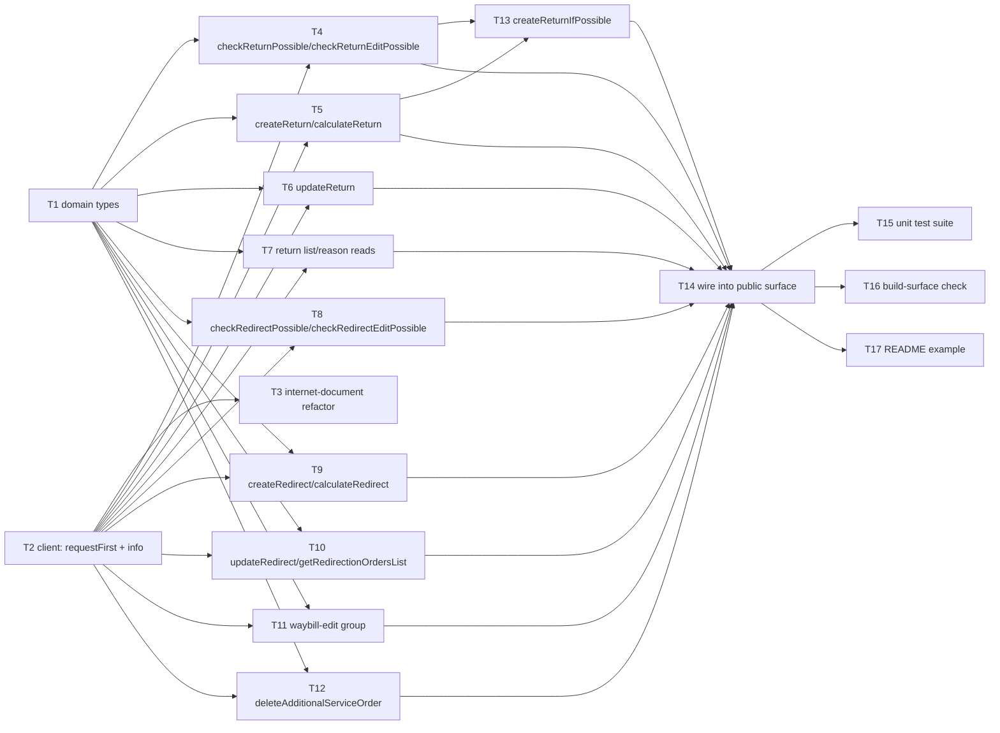

# Epic — additional-service

> **Spec:** [spec.md](../spec.md) · **Design:** [sad.md](../sad.md) · **Contract:** [contracts/public-api.md](../contracts/public-api.md) · **ADRs:** [adr/](../adr/)

## Goal

Give consuming developers a typed, discoverable way to manage the three post-creation shipment
actions Nova Poshta's `AdditionalServiceGeneral` model exposes — return, redirect, and waybill edit
(spec.md §2) — closing the roadmap's 7th and final domain module. 18 raw methods plus one convenience
(`createReturnIfPossible`), all sharing the library's one `NovaPoshtaApiError` error contract.

## Scope

- **In:** `src/types/additional-service.ts`, `src/modules/additional-service/index.ts`, two additive
  changes to `src/client.ts` (`requestFirst<T>()`, `info` exposure — ADR-0001/ADR-0002), a
  behavior-preserving refactor of `src/modules/internet-document/index.ts` onto the new shared
  `requestFirst<T>()`, the public re-exports in `src/index.ts`, and the matching test/README updates.
- **Out (spec.md §3):** client-side validation of `checkWaybillEditPossible`'s flags before
  `createWaybillEdit`; reconciliation/retry/rollback for `createReturnIfPossible`'s two-call gap;
  carry-forward semantics on `updateReturn`/`updateRedirect`; `orderTermExtension`; a branded `Ref`
  type; a typed `updateWaybillEdit` method.

## Task map

## Tasks

See [tracker.md](./tracker.md) for status. Machine contract: [tasks.json](../tasks.json).

| # | Task | Layer | Blocked by | DoD (short) |
|---|---|---|---|---|
| T1 | Define additional-service domain types | domain | — | Types compile, AC-04 union, 6 OQ fields typed defensively |
| T2 | Add `requestFirst<T>()` + `info` exposure to the core client | infra | — | Additive-only client change, ADR-0001/ADR-0002 |
| T3 | Refactor internet-document onto shared `requestFirst<T>()` | app | T2 | internet-document's own suite stays green |
| T4 | `checkReturnPossible` / `checkReturnEditPossible` | app | T1, T2 | Happy + decline tests, ADR-0001's `info` path |
| T5 | `createReturn` / `calculateReturn` | app | T1, T2 | Discriminant payload builder, AC-04 compile check |
| T6 | `updateReturn` | app | T1, T2 | Happy + status-decline (AC-07) |
| T7 | Return list/reason reads | app | T1, T2 | 3 methods, filter pass-through |
| T8 | `checkRedirectPossible` / `checkRedirectEditPossible` | app | T1, T2 | Single-record vs list asymmetry |
| T9 | `createRedirect` / `calculateRedirect` | app | T1, T2 | AC-10 cross-context passthrough |
| T10 | `updateRedirect` / `getRedirectionOrdersList` | app | T1, T2 | AC-13 field-permission decline |
| T11 | Waybill-edit group | app | T1, T2 | AC-16 no client gating |
| T12 | `deleteAdditionalServiceOrder` | app | T1, T2 | One method, 3 order kinds |
| T13 | `createReturnIfPossible` | app | T4, T5 | Empty-list + check-declined branches |
| T14 | Wire into public package surface | wiring | T4–T13 | `src/index.ts` re-exports |
| T15 | Unit test suite (shared error contract) | tests | T14 | All 23 ACs covered |
| T16 | Build-surface check | tests | T14 | 19 identifiers in `.d.ts`/`.d.cts` |
| T17 | README usage example | docs | T14 | Real example + open-risk note |

## Risks / Hard rules

- **No cross-module runtime calls.** `additional-service` never calls `internet-document` or
  `counterparty` at runtime — a `Ref`/`IntDocNumber`/`Number` is always a plain string input
  (`sad.md` §5, AC-10). T9/T14 must not introduce one.
- **`OrderType`/`OnlyGetPricing` never caller-settable** (spec.md §6 NFR "Discriminant safety") — T5/T9
  set both internally only; T15's suite includes the static public-API-surface check.
- **No client-side status/role/flag gating** anywhere (AC-07, AC-13, AC-16, AC-19) — Nova Poshta's own
  response is the sole judge; T6/T10/T11/T12 must not add one.
- **T2/T3 is a behavior-preserving refactor**, not a new feature for `internet-document` — its existing
  unit suite must stay green with zero behavior change (only the import source moves).
- **Open risk carried, not silently resolved:** `ReturnAddressRef`'s mapping to `checkReturnPossible`'s
  `Ref` (`contracts/public-api.md` header, `sad.md` §11 row 1) ships as designed — T13's DoD requires
  the decline path to be tested precisely because this assumption may be wrong.
