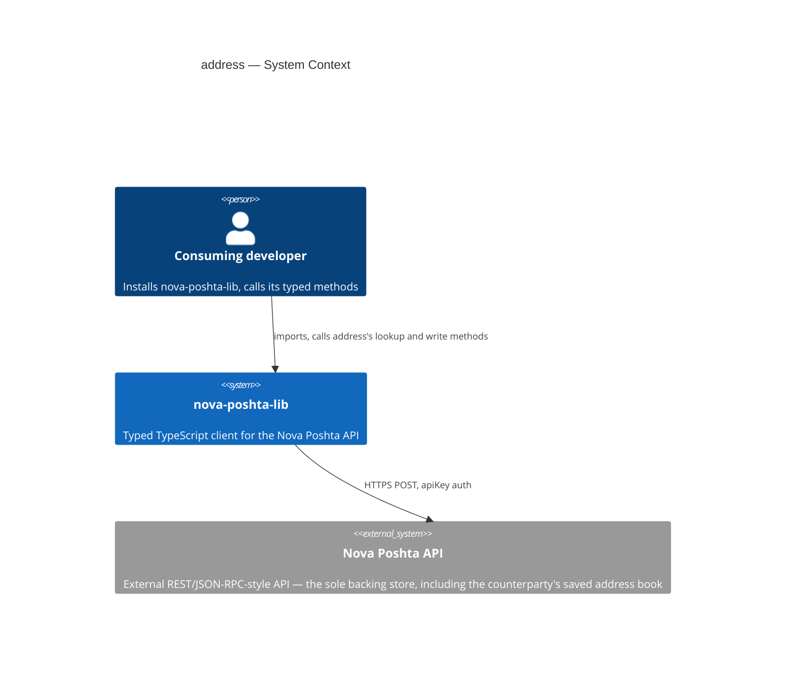
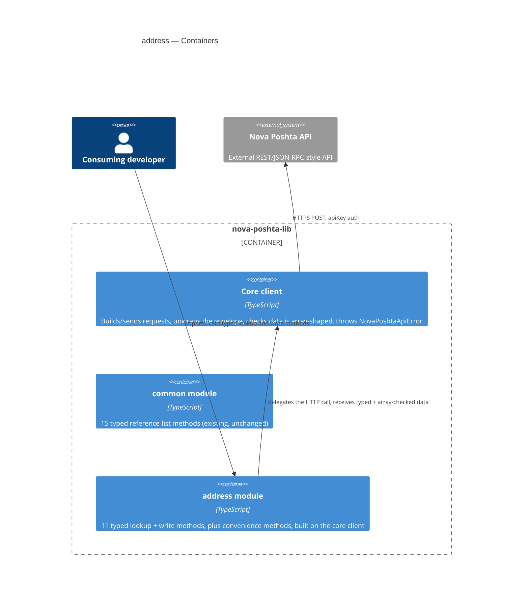
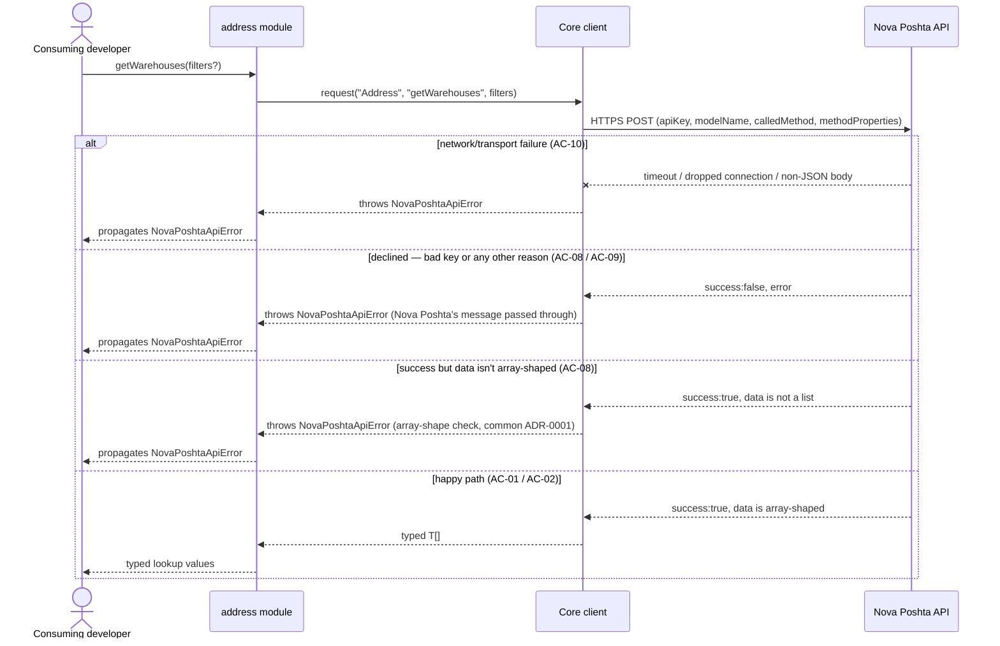
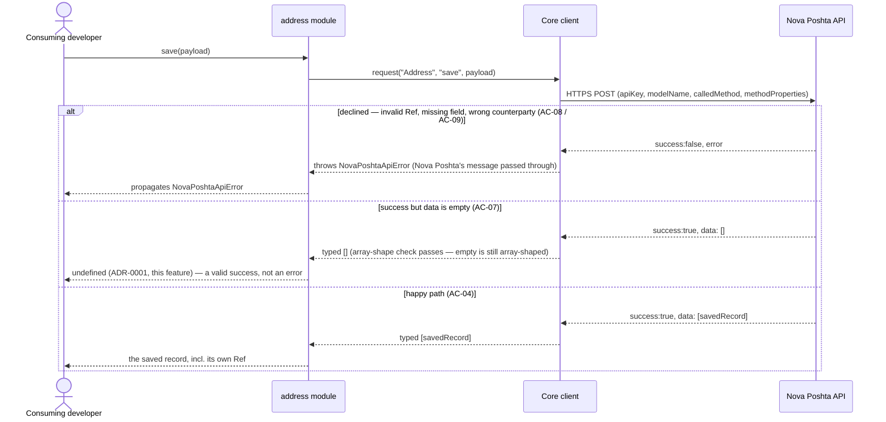

# Software Architecture Document — address

## 1. Introduction and goals

**Intent.** `address` gives every consuming developer typed, discoverable access to Nova Poshta's
Address domain — 8 read-only lookups (cities, settlements, streets, warehouses, areas, warehouse
types) plus 3 writes on a counterparty's saved address book (`save`/`update`/`delete`) — so they can
resolve human-readable input into the `Ref` values other Nova Poshta calls need, and manage a saved
address, without hand-rolling untyped calls (`spec.md` §2). It is the first module in the library with
write operations and the first to touch personal/business address data, building directly on the
structural and error-handling precedent `common` established.

**Top-3 quality goals (1-liners; full scenarios in §10):**

1. Type-safety — all 11 in-scope Address methods (lookups + writes) fully typed, zero `any` in public
   signatures, including the two response shapes that are structurally different from the rest.
2. Error-contract correctness — every declined, malformed, or network-failed call throws the same
   `NovaPoshtaApiError`, including the write-specific "success but no record" case, which must
   resolve as success, not an error.
3. Write-safety — the `update` method can never silently drop a previously-saved field; the compiler
   rejects a partial payload.

**Stakeholders.**

| Role | Interest | Sign-off owner? |
|---|---|---|
| Consuming developer | Calls the 11 typed methods to resolve `Ref` values and manage a saved address | No |
| Tech Lead | SAD approval; owns the remaining `spec.md` §8 open questions | Yes |
| Security Lead | Reviews the module before release — first write-capable, personal-data-touching module (`spec.md` §6.1) | Yes |

<!-- Decision overrides (¶4) — none raised during this design pass. -->

## 2. Constraints

**Technical.**
- TypeScript, Node.js ≥18 (native `fetch`, no HTTP client dependency)
- No framework — this is a library, not an application
- No datastore — `address` is stateless; the Nova Poshta API is the sole backing store
- Architecture convention: one folder per Nova Poshta model (`src/modules/<domain>/`), dual ESM+CJS
  build via `tsup` (project-level ADR-0002)

**Organisational.**
- Effort budget: sized S (2–5 PRs, ~1 week) per `classify-size`
- No hard deadline stated in `spec.md`
- Team: single maintainer (project owner)

**Conventions.**
- Convention file: `CLAUDE.md` + `docs/architecture-map.md`
- Error handling: a single `NovaPoshtaApiError`, no subclassing (project-level convention), reused
  unchanged for both lookups and writes
- `src/types/address.ts` holds this feature's request/response interfaces, per the
  `src/types/<domain>.ts`-per-model convention already established by `common`

**Regulatory / external.**
- `spec.md` §6.1: data classification confidential — write methods and saved-address data concern a
  counterparty's address book (street, building number, flat, counterparty `Ref`), qualifying as
  personal/business address data when the counterparty is a private individual. Security review
  required before release (first write-capable, personal-data-touching module) — tracked as an open
  risk in §11, not performed in this design session.
- AuthZ/AuthN: none beyond the existing single-API-key model; cross-counterparty write protection is
  enforced by Nova Poshta itself, not independently verified by this library (`spec.md` §6.1).

## 3. Context and scope

`address` gives a consuming developer typed access to Nova Poshta's location/address directory
(cities, settlements, streets, warehouses, areas) and to a counterparty's saved address book, so they
can resolve `Ref` values and manage saved pickup/return addresses without hardcoding values or
guessing response shapes. It ships inside the existing `nova-poshta-lib` npm package, alongside the
shared core client and the already-shipped `common` module.

<!-- brownfield: read directly (src/client.ts, src/index.ts, src/modules/common/index.ts,
     src/types/common.ts, src/types/envelope.ts — trivial codebase size, no Explore subagent needed).
     docs/architecture-map.md (reflects_commit 94201ac) is stale relative to current HEAD (common is
     now implemented) but its target conventions still match what's on disk — no drift found in the
     conventions that matter to this feature (module wiring, error handling, test layout). -->

**External systems (in / out):**

| Actor or system | Type | Interaction |
|---|---|---|
| Consuming developer | Person | Installs `nova-poshta-lib`, calls `address`'s typed lookup and write methods |
| Nova Poshta API | System (external) | HTTPS POST, `apiKey` auth — the sole backing store for address/location data and the counterparty's saved address book |

**C4 Context (L1):**



*The Context is identical in shape to `common`'s: the consuming developer talks only to
`nova-poshta-lib`, and the library itself is the only thing that talks to the external Nova Poshta
API. No new external system — `address`'s writes still land on the same single external API, just a
different `modelName`/`calledMethod` pair per call.*

## 4. Solution strategy

**Top strategic choices (the seeds for ADRs):**

1. **Target surface: `library-sdk`.** Same single-surface shape `common` already established and the
   only fit for this repo (no server, no UI). Written to this document's frontmatter
   (`target_surfaces: ["library-sdk"]`); §5 draws one container for it, alongside the already-shipped
   `common` module.
2. **Synchronous, direct calls into the existing core client — unchanged.** `address`'s methods call
   `NovaPoshtaClient.request()` directly, exactly like `common`. No client-level change: the
   pagination/warnings gap noted in `spec.md` §1's Decision override stays a known limitation for this
   feature, not fixed here.
3. **Stateless — no persistence, no caching.** Per the non-goal fixed in `spec.md` §3.
4. **Inherit `common`'s array-shape check unchanged (`common` ADR-0001).** The check — "is the
   response's `data` array-shaped at all" — already tolerates an empty array on success, which is
   exactly what AC-07's "successful write, no record" case needs. No new validation logic in the
   shared core client.
5. **Write-return shape: `T | undefined` on `save`/`update`/`delete` (ADR-0001, this feature).** The
   first write-capable module has to decide how "successful write, no record returned" (AC-07)
   surfaces in the public TypeScript signature; `T | undefined` was chosen over an always-array
   return, becoming the library's standard for every future write module with the same pattern.
6. **Two response shapes stay verbatim, never unwrapped (AC-03).** `searchSettlements` and
   `searchSettlementStreets` return Nova Poshta's own `TotalCount`/`Addresses`-style wrapper record,
   typed as a shared generic wrapper shape reused by both methods — not unwrapped to a plain array,
   per the spec's explicit invariant. This is a spec-locked shape (AC-03 leaves no legitimate
   alternative), so it stays an inline decision, not an ADR.
7. **`update`'s full-replace guard is compile-time only (AC-05, closes `spec.md` §8 OQ-4).** The
   `update` payload type makes every field mandatory, derived from the `save` payload type via a
   TypeScript utility type so the two can't drift apart. No added runtime validation — matching the
   library's existing convention (`common`, `spec.md` §3 non-goal) — plus a doc comment on `update()`
   explaining the full-replace semantics for anyone reading the source.
8. **Convenience methods sit flat on the same module object as the raw methods.** No sub-namespace,
   matching how `common` already flattened all 15 of its methods. The exact convenience-method set
   stays open per `spec.md` §8 OQ-3, resolved at `tasks`, not here.

Each tactical decision in later sections traces to one of these eight. Decisions 4, 5, and 6 are
paired: the shared client's tolerant array-shape check (4) is what makes AC-07's empty-success case
possible in the first place; decision 5 is how that possibility surfaces in the public type; decision
6 is the other place a documented Nova Poshta response shape must be modeled exactly, not smoothed
over.

## 5. Building block view

Layered per the existing modular-domain convention (project-level ADR-0002): a thin `address` domain
module sits on top of the shared core client, exactly like `common`. No new layering style —
`address` follows the same shape every `src/modules/<domain>/` folder does.

**Internal decomposition:**

```
src/
├── client.ts                   # core: request(), NovaPoshtaApiError — unchanged by this feature
├── modules/
│   ├── common/
│   │   └── index.ts             # existing — 15 typed reference-list methods
│   └── address/
│       └── index.ts             # NEW — factory: createAddressModule(client) → 11 typed methods
│                                 #   (8 lookups + 3 writes), plus convenience methods (set TBD at tasks)
├── types/
│   ├── envelope.ts               # existing — shared envelope/request types
│   ├── common.ts                 # existing — common's 15 reference-list interfaces
│   └── address.ts                # NEW — Address request/response interfaces, incl. the AC-03
│                                  #   search-wrapper type and the AC-05 full-replace update type
└── index.ts                     # public re-exports (client + common + address + types)
```

`tsup`'s existing dual ESM+CJS build (project-level ADR-0002) already emits matching
`.d.ts`/`.d.cts` declarations for whatever `src/index.ts` re-exports — no new build step is needed to
satisfy AC-13 (every method discoverable via autocomplete in both published formats); `tasks`/
`plan-tests` verify the *published* output, not just the source, exactly as `common` already does.

**C4 Container (L2):**



*The Containers view draws the one declared surface (`library-sdk`, the whole `nova-poshta-lib`
package) as a boundary holding three pieces: the existing core client (fully unchanged by this
feature), the existing `common` module, and the new `address` module the developer imports directly.
All three stay inside the same package — there's no second deployable, no new process, and `address`
never talks to `common` or vice versa — each domain module only ever talks down to the shared core
client.*

## 6. Runtime view

**Critical flow 1: fetch a lookup — happy path + every error branch**



**Critical flow 2: save a new address — happy path + the empty-on-success branch**



*Flow 1 mirrors `common`'s already-established lookup pattern exactly — every lookup method
(`getCities`, `getSettlements`, `searchSettlements`, `getAreas`, `getStreet`,
`searchSettlementStreets`, `getWarehouses`, `getWarehouseTypes`) and every convenience method takes
this same shape, just with a different `calledMethod` and typed result (AC-03's two search methods
return the wrapper type instead of a plain array, but the branch structure is identical). Flow 2 shows
what's new for this feature: a three-way split instead of the lookup's four-way one, because writes
add the empty-on-success branch (AC-07) that lookups never see — `update` and `delete` follow the
identical shape, just with `update`/`delete` as the `calledMethod` and their own Ref values.*

**Coverage check — user stories and acceptance criteria against the runtime view above:**

| Item | Covered by |
|---|---|
| US-01 Fetch address lookup data | Flow 1, happy-path branch |
| US-02 Filter a lookup | Flow 1, happy-path branch (`filters?` parameter) |
| US-03 Get typed results | Flow 1, happy-path branch (`typed T[]` return); AC-03's wrapper shape is a type-level concern, not a distinct runtime path — same Flow 1 shape |
| US-04 Save a new address | Flow 2 |
| US-05 Update a saved address | Flow 2 (identical shape, `update` in place of `save`) |
| US-06 Delete a saved address | Flow 2 (identical shape, `delete` in place of `save`) |
| US-07 Use a convenience method | Flow 1 (identical shape — a convenience method narrows input then makes one call, per AC-11) |
| US-08 Get a clear error on failure | Flow 1 + Flow 2, all error branches |
| US-09 Discover the full set of available methods | N/A — not a runtime path; satisfied by published `.d.ts`/`.d.cts` autocomplete (§5), verified by AC-13 |
| US-10 Rely on Address as the authoritative Ref source | N/A — not a distinct runtime path; the same Flow 1 call is what any future module would make. The invariant itself is a cross-cutting concept (§8), not a sequence |
| AC-01 happy-path lookup | Flow 1 |
| AC-02 filtered lookup | Flow 1 |
| AC-03 irregular response shape | N/A — non-runtime, type-level concern (§4 decision 6, §5 `src/types/address.ts`) |
| AC-04 save happy path | Flow 2 |
| AC-05 update full-replace guard | N/A — non-runtime, compile-time type concern (§4 decision 7) |
| AC-06 delete happy path | Flow 2 (identical shape) |
| AC-07 empty-on-success write | Flow 2, "success but data is empty" branch |
| AC-08 declined for a reason | Flow 1 + Flow 2, "declined" branches |
| AC-09 authorization / bad key | Flow 1 + Flow 2, "declined" branches (same code path as AC-08) |
| AC-10 network/transport failure | Flow 1, "network/transport failure" branch (identical for Flow 2, omitted there for diagram brevity) |
| AC-11 convenience method | Flow 1 (identical shape) |
| AC-12 authoritative cross-context Ref | N/A — non-runtime; the invariant is cross-cutting (§8), not a sequence |
| AC-13 published-build discoverability | N/A — non-runtime, build-time/tooling concern; §5 explains the `.d.ts`/`.d.cts` mechanism |

No user story and no acceptance criterion is left uncovered.

## 7. Deployment view

<!-- N/A: this feature ships inside the existing npm package publish process (project-level ADR-0004,
     release strategy via changesets) — no new infrastructure, no new deployment unit, no server to
     operate. Identical reasoning to common's §7. -->

## 8. Crosscutting concepts

| Concept | Convention | Where defined |
|---|---|---|
| Logging | None — the library emits no logs of its own | — (repo default, undocumented) |
| Authentication | Caller-supplied `apiKey`, unchanged by this feature | `architecture-map.md` |
| Error handling | Single `NovaPoshtaApiError`; array-shape check only, no per-field validation; identical for lookups and writes | `src/client.ts`; `common` ADR-0001 |
| Write-return shape | `T \| undefined` when a successful write's data is empty | `address` ADR-0001 |
| ID strategy | N/A — the library holds no persistent IDs of its own | `architecture-map.md` |
| Internationalisation | N/A — pass-through of Nova Poshta's own language fields, no library-side selection | `spec.md` §8 (common's open question, inherited, not `address`-specific) |
| Observability | None new — no metrics/tracing added by this feature | — |
| Events | N/A — synchronous request/response only | `architecture-map.md` |
| Rate-limiting | None of our own — Nova Poshta's own throttling governs | `spec.md` §6.1 |
| Testing | Mocked unit suite required in CI (`test/unit/modules/address`) + opt-in integration suite against the real API, unchanged by this feature | `docs/adr/0003-testing-strategy.md` |
| API documentation | `update()` carries a doc comment explaining the full-replace semantics (AC-05) — documentation only, no runtime check. Closes `spec.md` §8 OQ-4 | `src/modules/address/index.ts` |
| Cross-module value consistency | `address` is the sole source of truth for location/address `Ref` values; it enforces nothing about how another module later uses one — that check, if any, belongs to the receiving module | `spec.md` AC-12 / US-10 |

## 9. Architecture decisions

| # | Title | Status | Section |
|---|---|---|---|
| 0001 | Return `T \| undefined` from a write method when the success response carries no record | Accepted | §4 |

ADR files live under `docs/features/address/adr/`. This feature also relies on `common`'s
already-Accepted `0001-array-shape-only-validation.md` and `0002-open-value-typing-with-fallback.md`
(unchanged, inherited — no new client-level ADR needed here).

## 10. Quality requirements

Each top-3 goal from §1 expanded into a full scenario:

**QG-1. Type-safety**
- **When:** any of the 11 in-scope Address methods (8 lookups + 3 writes) is exported from `address`.
- **Then:** 100% of in-scope methods have zero `any` in their public signatures — including
  `searchSettlements`/`searchSettlementStreets`'s wrapper shape and `update`'s full-replace payload.
- **How verify:** static check in CI (`spec.md` §6, row 1).

**QG-2. Error-contract correctness**
- **When:** an Address call is declined by Nova Poshta, its response isn't array-shaped, or a write
  succeeds with an empty data array.
- **Then:** 100% of in-scope methods throw `NovaPoshtaApiError` on a decline or non-array-shaped
  response; 0% throw on a successful write with empty data — that resolves to `undefined`, not an
  error (AC-07, ADR-0001).
- **How verify:** unit test suite `test/unit/modules/address` (`spec.md` §6, row 2).

**QG-3. Write-safety**
- **When:** a consuming developer calls `update` with an incomplete payload.
- **Then:** 100% of such calls fail to compile — the full-replace type accepts nothing less than every
  field.
- **How verify:** static check in CI, type-level test (`spec.md` §6, row 3).

## 11. Risks and technical debt

| Risk / debt | Severity | Mitigation | Owner |
|---|---|---|---|
| Security review required before release — first write-capable, personal-data-touching module (`spec.md` §6.1) | High | Schedule and complete a security review before `sdd:ship address`; not performed in this design session | Security Lead |
| The §1 in-scope 11-method list was cross-checked against a third-party SDK, not Nova Poshta's own docs portal (blocks automated fetches) | Medium | Re-verify against Nova Poshta's live/official docs before release (`spec.md` §8 OQ-2) | Tech Lead |
| Cross-counterparty write enforcement (AC-09) is trusted from Nova Poshta's own documented behavior, not independently verified by this library's test suite | Medium | Unit tests confirm the library surfaces whatever decline Nova Poshta sends back (mocked), not that Nova Poshta's own enforcement holds in production (`spec.md` §6.1) | Tech Lead |
| Open architectural decision: should the shared core client be extended to expose pagination metadata (`totalCount`) and success-path warnings — `address` is the first module where their absence materially bites (large city/warehouse lists can silently truncate; a `save`/`update` warning, e.g. a normalized building number, is never surfaced) | Open question | Resolve before `sdd:design` of any future module whose lookups depend on complete, multi-page Address results (`spec.md` §8 OQ-1, kept as a known limitation for this feature per the §1 Decision override) | Tech Lead |
| Open architectural decision: which specific convenience methods (US-07) ship in v1 | Open question | Resolve before `sdd:tasks address`, based on which raw lookups see the most friction in practice (`spec.md` §8 OQ-3) | Tech Lead |

**Accepted debt (acceptable in v1, plan to fix later):**
- No client-side pagination walking and no surfaced success-path warnings (`spec.md` §1 Decision
  override) — the project owner's deliberate choice to keep the shared core client's scope unchanged
  for this S-sized feature, not a shortcut awaiting cleanup by default. Revisit only when a future
  module's lookups genuinely need complete multi-page results (§8 OQ-1 above).

## 12. Glossary

| Term | Meaning |
|---|---|
| Consuming developer | A developer who installs and calls this library's typed methods from their own Node.js/TypeScript project. NOT Nova Poshta itself, and NOT an end customer or shipment recipient. |
| Counterparty | A legal entity or private individual Nova Poshta associates with a shipment (sender, recipient, or the API key holder's own registered entity), used to scope which saved addresses belong to whom. NOT the consuming developer. |
| `Ref` | A UUID Nova Poshta assigns to identify a specific record (a city, street, warehouse, settlement, address, or counterparty) so it can be passed into later API calls. NOT a human-readable name or address string. |
| Settlement | Nova Poshta's broader directory of Ukrainian localities (cities, towns, villages) reachable for delivery, independent of whether Nova Poshta has a branch there. NOT city — a city is the narrower subset where Nova Poshta actually operates a branch. |
| Warehouse | A Nova Poshta branch, depot, or parcel locker where a shipment can be picked up or dropped off. NOT the consuming developer's or their customer's own storage space. |
| `NovaPoshtaApiError` | The library's single standard error class (extends `Error`), carrying `errors[]`/`errorCodes[]`/`warnings[]` — thrown on any declined call or transport failure, for both lookups and writes. |
| Array-shape check | The one runtime check the shared core client performs (`common` ADR-0001): confirming a response's `data` is actually an array before it's returned as typed data. An empty array still passes — this is what makes AC-07's "successful write, no record" possible. |
| Search-wrapper shape | The `TotalCount`/`Addresses`-style record `searchSettlements` and `searchSettlementStreets` return instead of a plain list (AC-03) — modeled verbatim, never unwrapped. |
