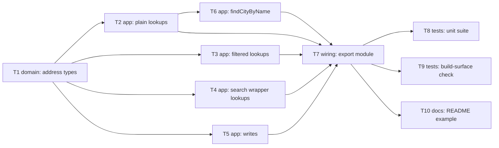

# Epic — address

> **Spec:** [spec.md](../spec.md) · **Design:** [sad.md](../sad.md) · **Data model:** [data-model.md](../data-model.md) (no schema change) · **API:** [contracts/public-api.md](../contracts/public-api.md) · **ADRs:** [adr/](../adr/)

## Goal

Ship the `address` domain module: 8 typed read-only lookups over Nova Poshta's location directory,
3 typed writes on a counterparty's saved address book, and one convenience method
(`findCityByName`), so consuming developers get compile-time-checked access to `Ref` values and
address management without hand-rolling untyped calls (`spec.md` §2).

## Scope

- **In:** `src/types/address.ts` (all request/response types), `src/modules/address/index.ts`
  (the 11 raw methods + `findCityByName`), wiring into `src/index.ts`, the mocked unit suite, the
  published-build type-surface check, a README usage example.
- **Out (from `spec.md` §3):** chaining multiple Address calls into one convenience method;
  caching/persisting any Address data; client-side validation of write payload fields; extending
  the shared core client for pagination metadata or success-path warnings (`spec.md` §8 OQ-1,
  tracked separately). Also out: any further convenience method beyond `findCityByName` — the v1
  set was scoped down from `spec.md` §8 OQ-3 to this one method to keep the S sizing.

## Task map

*T2–T5 all touch the single `src/modules/address/index.ts` file (mirroring `common`'s one-file
factory), so `implement` serializes them via the overlapping `files_hint` even though the DAG
above shows them as parallel candidates off `T1` — see Risks below.*

## Tasks

See [tracker.md](./tracker.md) for status. Machine contract: [tasks.json](../tasks.json).

| # | Task | Layer | Blocked by | DoD (short) |
|---|---|---|---|---|
| T1 | Define address domain types | domain | — | All request/response types compile, zero `any` |
| T2 | Implement plain lookup methods | app | T1 | `getCities`/`getSettlements`/`getAreas`/`getWarehouseTypes` typed + tested against a mocked client |
| T3 | Implement filtered directory lookups | app | T1 | `getStreet`/`getWarehouses` pass filters through unmodified |
| T4 | Implement search-wrapper lookups | app | T1 | `searchSettlements`/`searchSettlementStreets` return the wrapper verbatim, unwrapped one level |
| T5 | Implement write methods | app | T1 | `save`/`update`/`delete` resolve `T \| undefined` on empty-on-success |
| T6 | Implement `findCityByName` convenience method | app | T2 | Exactly one call to `getCities`, no post-filtering |
| T7 | Wire `address` module into the public package surface | wiring | T2, T3, T4, T5, T6 | `createAddressModule` + `AddressModule` re-exported from `src/index.ts` |
| T8 | Unit test suite for `address` | tests | T7 | Every AC-01..AC-11 branch covered against a mocked `fetch` |
| T9 | Extend published-build type-surface check | tests | T7 | Both `dist/index.d.ts` and `.d.cts` assert all 12 address identifiers |
| T10 | Update README usage example | docs | T7 | README shows a real `address` call, not the placeholder comment |

## Risks / Hard rules

- `sad.md` §4 decision 7: `update`'s full-replace payload type must be derived from `save`'s payload
  type via a TypeScript utility type, not hand-duplicated — a hand-duplicated pair could silently
  drift apart. T1 owns this.
- `sad.md` §4 decision 4/`common` ADR-0001: no new validation logic in the shared core client —
  T2–T6 call `client.request()` unchanged, exactly like `common`.
- No task may add caching, retries, or client-side re-filtering/pagination-walking (`spec.md` §3
  non-goals) — applies to T2–T6 and especially T6 (AC-11's "exactly one call" rule).
- T2–T5 share one file (`src/modules/address/index.ts`); despite the DAG showing them as siblings
  off T1, `implement` will serialize them in practice via the shared `files_hint` — expected and
  fine at this feature's size, not a bug in the graph.
