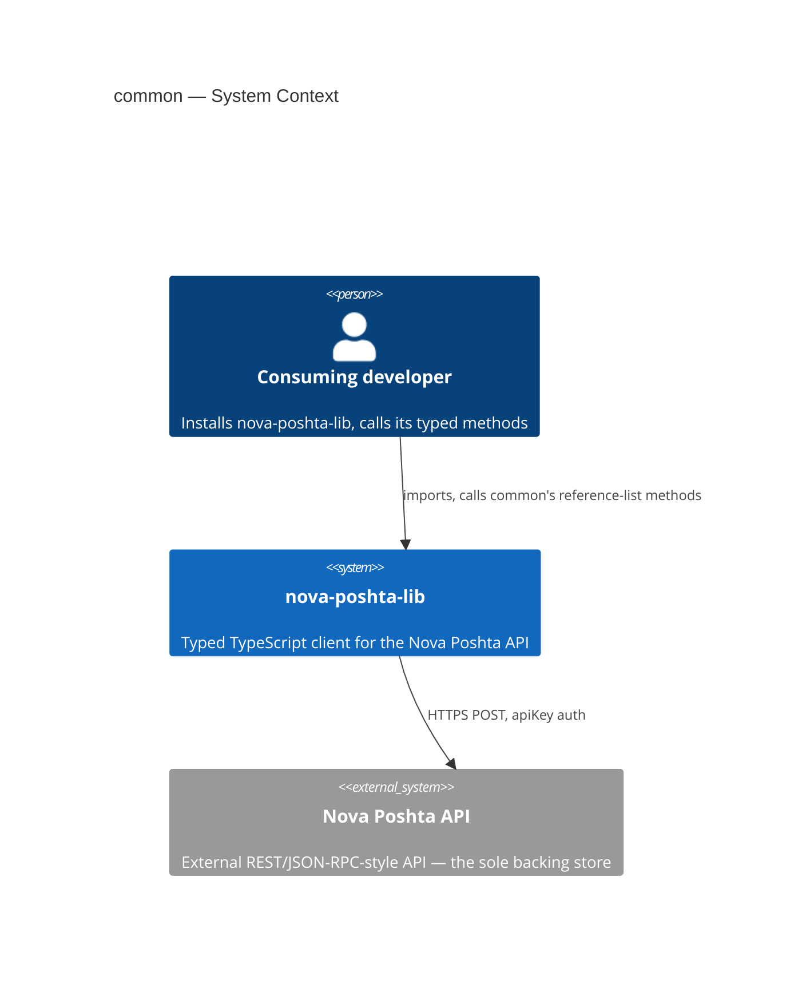
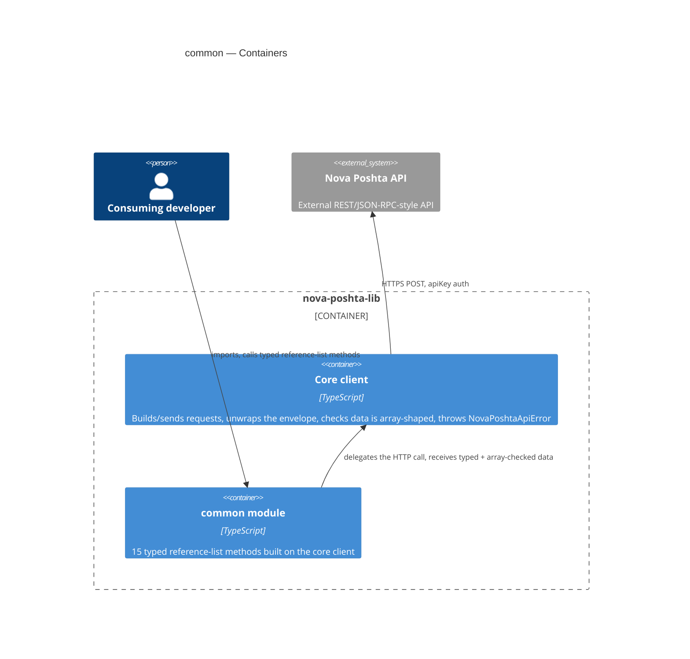
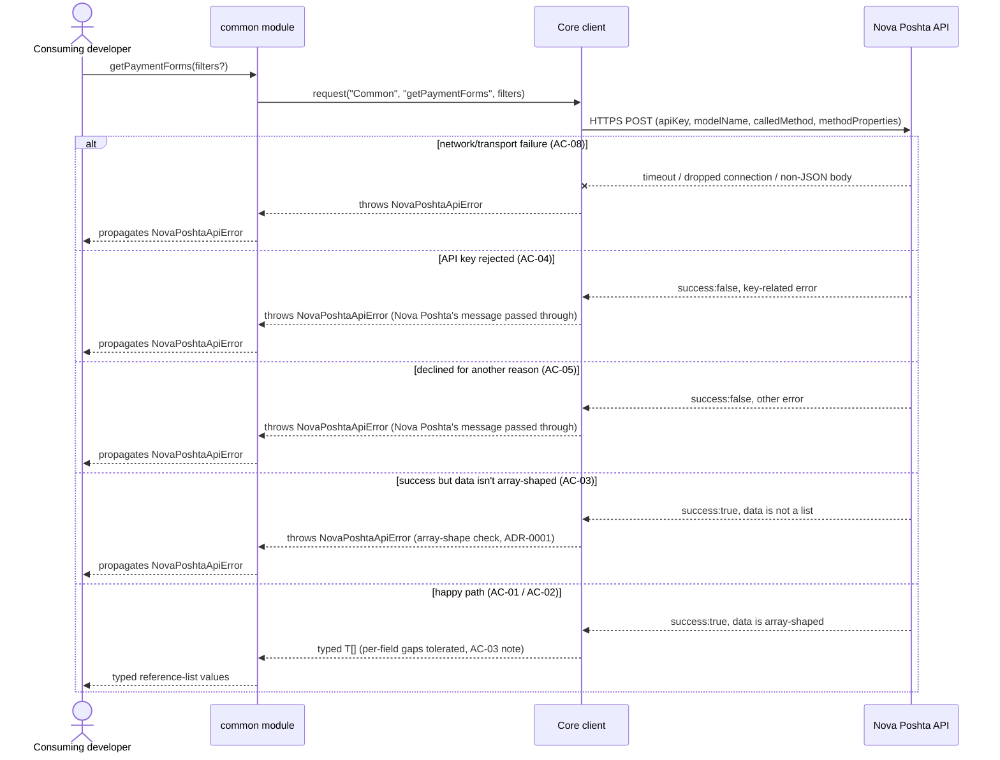

# Software Architecture Document — common

## 1. Introduction and goals

**Intent.** `common` gives every consuming developer typed, discoverable access to all 15 of Nova Poshta's documented reference/lookup lists (payment forms, cargo types, ownership forms, pallets, time intervals, and the rest — enumerated in `spec.md` §1), so they can populate valid input values for other Nova Poshta API calls without hardcoding values or guessing response shapes. It is deliberately pragmatic about the Nova Poshta API's real-world inconsistency: fail loudly only when a response is genuinely unusable, tolerate everything else (see §1 Decision override in `spec.md`).

**Top-3 quality goals (1-liners; full scenarios in §10):**

1. Type-safety — every in-scope reference-list method fully typed, zero `any` in public signatures.
2. Error-contract correctness — fails loudly (and *only*) on a genuinely unusable response; never silently wrong, never falsely blocking on normal Nova Poshta API noise.
3. Low overhead — the library adds a median ≤5ms per call beyond the network round-trip, including the shape check.

**Stakeholders.**

| Role | Interest | Sign-off owner? |
|---|---|---|
| Consuming developer | Calls the 15 typed methods to get valid reference values | No |
| Tech Lead | SAD approval; owns the remaining `spec.md` §8 open questions | Yes |

<!-- Decision overrides (¶4) — none raised during this design pass; the shape-check/value-typing override already lives in spec.md §1. -->

## 2. Constraints

**Technical.**
- TypeScript, Node.js ≥18 (native `fetch`, no HTTP client dependency)
- No framework — this is a library, not an application
- No datastore — `common` is stateless; the Nova Poshta API is the sole backing store
- Architecture convention: one folder per Nova Poshta model (`src/modules/<domain>/`), dual ESM+CJS build via `tsup` (project-level ADR-0002)

**Organisational.**
- Effort budget: sized S (2–5 PRs, ~1 week) per `classify-size`
- No hard deadline stated in `spec.md`
- Team: single maintainer (project owner)

**Conventions.**
- Convention file: `CLAUDE.md` + `docs/architecture-map.md`
- Error handling: a single `NovaPoshtaApiError`, no subclassing (project-level convention)
- Naming fix: `src/types/common.ts` already exists today holding the *shared* envelope/request types (`NovaPoshtaEnvelope`, `NovaPoshtaRequest`) — it is renamed to `src/types/envelope.ts` (its two importers, `src/client.ts` and `src/index.ts`, updated accordingly), freeing `src/types/common.ts` for this feature's own reference-list request/response interfaces, per the `src/types/<domain>.ts`-per-model convention.

**Regulatory / external.**
- `spec.md` §6.1: data classification public, no PII touched, no new authZ/authN boundary — reuses the existing single-API-key model. N/A beyond that.

## 3. Context and scope

`common` gives a consuming developer typed access to Nova Poshta's 15 reference/lookup lists so they can populate valid input values for other Nova Poshta API calls, without hardcoding values or guessing response shapes. It ships inside the existing `nova-poshta-lib` npm package, alongside the shared core client and (eventually) other per-model domain modules.

<!-- brownfield: read directly (4 source files — trivial codebase size, no Explore subagent needed): src/client.ts (core request + NovaPoshtaApiError), src/index.ts (public re-exports), src/types/common.ts (today holds the shared envelope types, to be renamed per §2), package.json/tsconfig/tsup.config (zero runtime dependencies, dual ESM+CJS, strict TS). docs/architecture-map.md (reflects_commit 94201ac) matches what's on disk — no drift found. -->

**External systems (in / out):**

| Actor or system | Type | Interaction |
|---|---|---|
| Consuming developer | Person | Installs `nova-poshta-lib`, calls `common`'s typed reference-list methods |
| Nova Poshta API | System (external) | HTTPS POST, `apiKey` auth — the sole backing store for reference-list data |

**C4 Context (L1):**



*The Context shows the consuming developer talking only to `nova-poshta-lib`; the library itself is the only thing that talks to the external Nova Poshta API. No other external system is involved — `common` introduces no new external dependency.*

## 4. Solution strategy

**Top strategic choices (the seeds for ADRs):**

1. **Target surface: `library-sdk`.** The only fit — this repo has no server, no UI, nothing else it could be; already the container `architecture-map.md` declares for the whole package. Written to this document's frontmatter (`target_surfaces: ["library-sdk"]`); §5 draws one container for it.
2. **Synchronous, direct calls into the existing core client.** `common`'s methods call `NovaPoshtaClient.request()` directly — no background jobs, no event queue. This is already how the scaffolded client works (`src/client.ts`); nothing about `common` needs to change it, and `spec.md` §3 rules out any of the state that would justify async coupling.
3. **Stateless — no persistence.** `common` holds no data of its own, per the non-goal already fixed in `spec.md` §3 and the architecture map's "Datastores: none."
4. **Pragmatic, structural-only response validation (ADR-0001).** AC-03 requires failing loudly on a genuinely unusable response, but real production experience with the Nova Poshta API (spec §1 Decision override) is that individual records routinely omit or vary documented fields — normal API noise, not a defect worth blocking a delivery-vendor integration over. The check is narrowed to "is the response's data array-shaped at all," implemented once in the shared core client so every future domain module gets the same guard for free.
5. **Open, provisional value typing (ADR-0002).** Reference values (e.g. a payment-form code) are typed as their known values today plus an open string fallback, so a new value Nova Poshta adds live never breaks a consumer's build — directly serving the spec §7 "stale-enum issue rate = 0" KPI and the §1 Decision override's "pass through whatever Nova Poshta sends when in doubt."

Each tactical decision in later sections traces to one of these five. Decisions 4 and 5 are paired: both exist because the shape-check catches only structural breakage, so every documented field — including value-bearing ones — must be modeled as possibly absent or possibly novel, never as a closed guarantee.

## 5. Building block view

Layered per the existing modular-domain convention (project-level ADR-0002): a thin `common` domain module sits on top of the shared core client, which is the only piece that ever talks to Nova Poshta over HTTP. No new layering style — `common` follows the same shape every future `src/modules/<domain>/` folder will.

**Internal decomposition:**

```
src/
├── client.ts                   # core: request(), NovaPoshtaApiError, array-shape check (ADR-0001)
├── modules/
│   └── common/
│       └── index.ts             # factory: createCommonModule(client) → 15 typed methods
├── types/
│   ├── envelope.ts               # renamed from common.ts — shared envelope/request types (§2)
│   └── common.ts                 # NEW — the 15 reference-list request/response interfaces
└── index.ts                     # public re-exports (client + common + types)
```

**C4 Container (L2):**



*The Containers view draws the one declared surface (`library-sdk`, the whole `nova-poshta-lib` package) as a boundary holding two pieces: the existing core client (unchanged in shape, gains the array-shape check) and the new `common` module, which the developer imports directly. Both stay inside the same package — there's no second deployable, no new process.*

## 6. Runtime view

**Critical flow 1: fetch a reference list — happy path + every error branch**



*Flow 1 — fetch a reference list: the developer calls a `common` method, which delegates straight to the core client, which POSTs to Nova Poshta. Five branches from there: a transport failure (timeout, dropped connection, bad body) throws; a rejected key throws with Nova Poshta's own message; any other decline throws the same way; a successful-but-non-list response throws via the new array-shape check; and the true happy path returns typed data, with any missing or off-shape individual fields tolerated rather than rejected. Every branch converges on the same `NovaPoshtaApiError`, never a raw/unhandled error.*

**Critical flow 2: <e.g. async event propagation>** — N/A, this library is synchronous request/response only (§4 decision 2).

## 7. Deployment view

<!-- N/A: this feature ships inside the existing npm package publish process (project-level ADR-0004, release strategy via changesets) — no new infrastructure, no new deployment unit, no server to operate. -->

## 8. Crosscutting concepts

| Concept | Convention | Where defined |
|---|---|---|
| Logging | None — the library emits no logs of its own | `CLAUDE.md` |
| Authentication | Caller-supplied `apiKey`, unchanged by this feature | `CLAUDE.md` / `architecture-map.md` |
| Error handling | Single `NovaPoshtaApiError`; array-shape check only, no per-field validation | `src/client.ts`; ADR-0001 |
| ID strategy | N/A — the library holds no persistent IDs of its own | `architecture-map.md` |
| Internationalisation | N/A — pass-through of Nova Poshta's own language fields, no library-side selection | `spec.md` §8 open question (owner: Tech Lead, due before `tasks`) |
| Observability | None new — no metrics/tracing added by this feature | — |
| Events | N/A — synchronous request/response only | `architecture-map.md` |
| Rate-limiting | None of our own — Nova Poshta's own throttling governs | `spec.md` §6.1 |

## 9. Architecture decisions

| # | Title | Status | Section |
|---|---|---|---|
| 0001 | Validate only that reference-list data is array-shaped | Accepted | §4 |
| 0002 | Type reference values as known-literals with an open string fallback | Accepted | §4 |

ADR files live under `docs/features/common/adr/`.

## 10. Quality requirements

**QG-1. Type-safety**
- **When:** any of the 15 in-scope reference-list methods is exported from `common`.
- **Then:** 100% of in-scope reference-list methods have zero `any` in their public signatures.
- **How verify:** static check in CI (`spec.md` §6, row 1).

**QG-2. Error-contract correctness**
- **When:** a reference-list call is declined by Nova Poshta, or its response isn't array-shaped.
- **Then:** 100% of in-scope methods throw `NovaPoshtaApiError` in that case; 0% throw an unhandled error type; 0% throw on a per-field/per-record inconsistency (tolerated per AC-03).
- **How verify:** unit test suite `test/unit/modules/common` (`spec.md` §6, row 2).

**QG-3. Overhead**
- **When:** a reference-list call completes, with `fetch` stubbed to near-zero latency in the benchmark.
- **Then:** median ≤5ms of library-added overhead beyond the network round-trip, including the array-shape check cost.
- **How verify:** median across ≥30 repeated calls, benchmarked inside `test/unit/modules/common` (`spec.md` §6, row 3).

## 11. Risks and technical debt

| Risk / debt | Severity | Mitigation | Owner |
|---|---|---|---|
| The §1 in-scope 15-method list was cross-checked against third-party SDK sources, not Nova Poshta's own docs portal (which blocks automated fetches) | Medium | Re-verify the method/field list against the live API (a maintainer-held key) before `tasks`/`implement` locks it; the existing integration suite is the mechanism | Tech Lead |
| Open architectural decision: does Nova Poshta reject an invalid documented filter explicitly, or silently ignore it? | Open question | Resolve before `sdd:implement common`; AC-05 is phrased to hold regardless of which | Tech Lead |
| Open architectural decision: do any in-scope lists carry multi-language (UA/RU/EN) fields, and does the typed shape expose all variants or just the default? | Open question | Resolve before `sdd:tasks common`; default is pass-through verbatim, no library-side selection | Tech Lead |
| Open architectural decision: should tier-gated reference lists (empty for ordinary keys) still ship as typed methods in v1? | Open question | Resolve before `sdd:tasks common`; default is ship them, flag the tier dependency in the doc comment | Tech Lead |
| Open architectural decision: will `common` be called on a hot/frequent path by future modules, and does that change the no-caching non-goal? | Open question | Resolve before `sdd:design` of the first module that consumes `common`'s lists | Tech Lead |

**Accepted debt (acceptable in v1, plan to fix later):**
- Per-field/per-record shape validation is deliberately **not** performed (ADR-0001) — a defensive, best-effort typing choice trading strict runtime guarantees for delivery-vendor integration reliability. Acceptable for v1; revisit only if a consuming developer reports a genuinely broken record slipping through silently in a way that caused real harm.

## 12. Glossary

| Term | Meaning |
|---|---|
| Consuming developer | A developer who installs and calls this library's typed methods from their own Node.js/TypeScript project. NOT Nova Poshta itself, and NOT an end customer or shipment recipient. |
| Reference list | A static or semi-static enumerable list of valid values the Nova Poshta API expects as input elsewhere, exposed read-only by `common`. NOT a paginated result set of business records. |
| `NovaPoshtaApiError` | The library's single standard error class (extends `Error`), carrying `errors[]`/`errorCodes[]`/`warnings[]` — thrown on any declined call, any transport failure, or a response whose data isn't array-shaped. |
| Array-shape check | The one runtime check this feature adds (ADR-0001): confirming a response's `data` is actually an array before it's returned as typed data — no per-field validation beyond that. |
