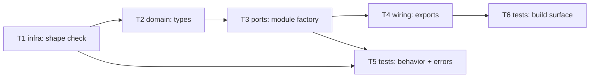

# Epic — common

> **Spec:** [spec.md](../spec.md) · **Design:** [sad.md](../sad.md) · **API:** [public-api.md](../contracts/public-api.md) · **ADRs:** [adr/](../adr/)

## Goal

Ship all 15 of Nova Poshta's documented reference/lookup lists as typed, discoverable methods on
a new `common` domain module, so consuming developers get valid input values (payment forms,
cargo types, ownership forms, etc.) without hardcoding or guessing response shapes (`spec.md` §2).

## Scope

- **In:** the shared core-client array-shape check (ADR-0001), the 15 reference-list types
  (ADR-0002's open-value pattern), the `common` module factory, its public exports, and the full
  unit test suite (behavior + error contract + build-surface + overhead benchmark).
- **Out:** caching/persisting responses, validating a value's later use in another module,
  language-variant normalization, and guaranteeing non-empty data for tier-gated lists
  (`spec.md` §3 non-goals).

## Task map

## Tasks

See [tracker.md](./tracker.md) for status. Machine contract: [tasks.json](../tasks.json).

| # | Task | Layer | Blocked by | DoD (short) |
|---|---|---|---|---|
| T1 | Rename envelope types; add array-shape check | infra | — | non-array `data` throws; array data doesn't |
| T2 | Define the 15 reference-list types | domain | T1 | types match public-api.md §3, zero `any` |
| T3 | Implement createCommonModule | ports | T2 | all 15 methods delegate to client.request |
| T4 | Wire public exports | wiring | T3 | src/index.ts exports module + types; build succeeds |
| T5 | Behavior + error-contract tests + benchmark | tests | T1, T3 | AC-01/02/03/04/05/08 covered; ≤5ms median |
| T6 | Build-surface completeness check | tests | T4 | all 15 methods in both .d.ts/.d.cts |

## Risks / Hard rules

- ADR-0001 is a **permanent trade-off, not debt** (`sad.md` §11) — do not add per-field validation
  without re-opening the ADR.
- `OpenEnum.Known` stays `never` per `public-api.md` §2 — populating literal known values from live
  captures is explicitly out of scope for this task breakdown (`spec.md` §8, due before
  `sdd:implement common`).
- Two `spec.md` §8 open questions carry a stated default and are **not** re-litigated by these
  tasks: multi-language fields pass through verbatim (no library-side selection); tier-gated lists
  ship as typed methods regardless of empty results for ordinary keys.
