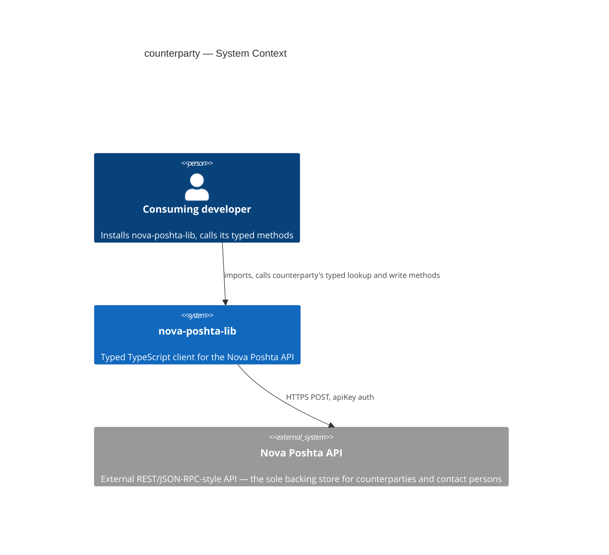
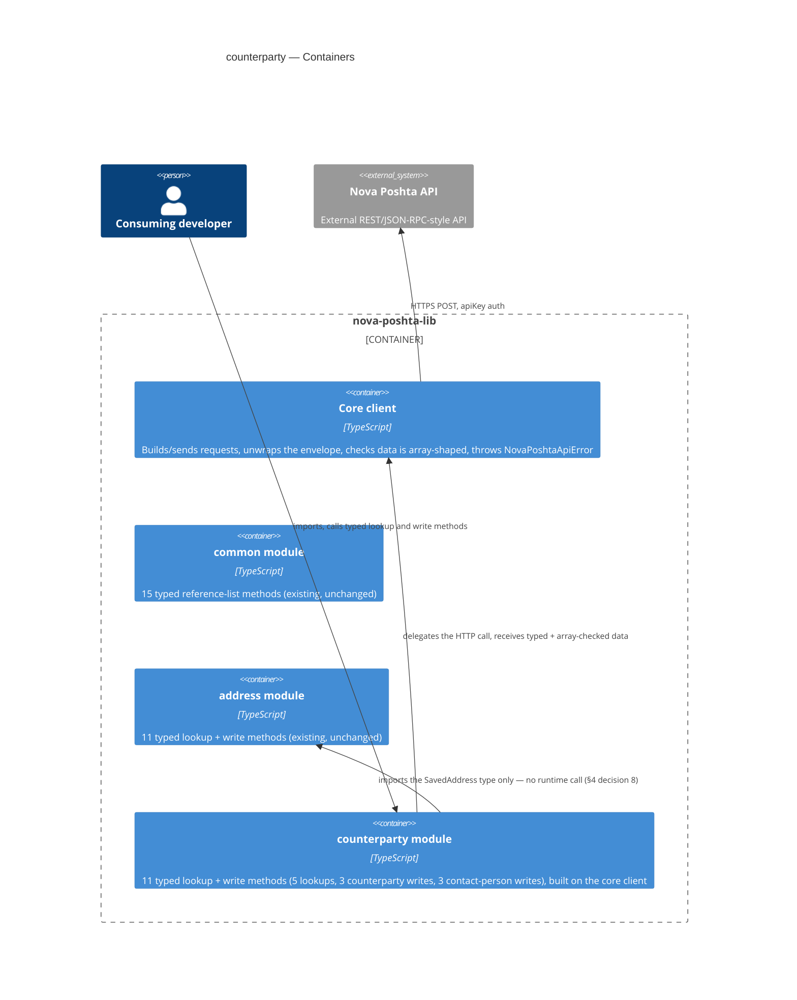
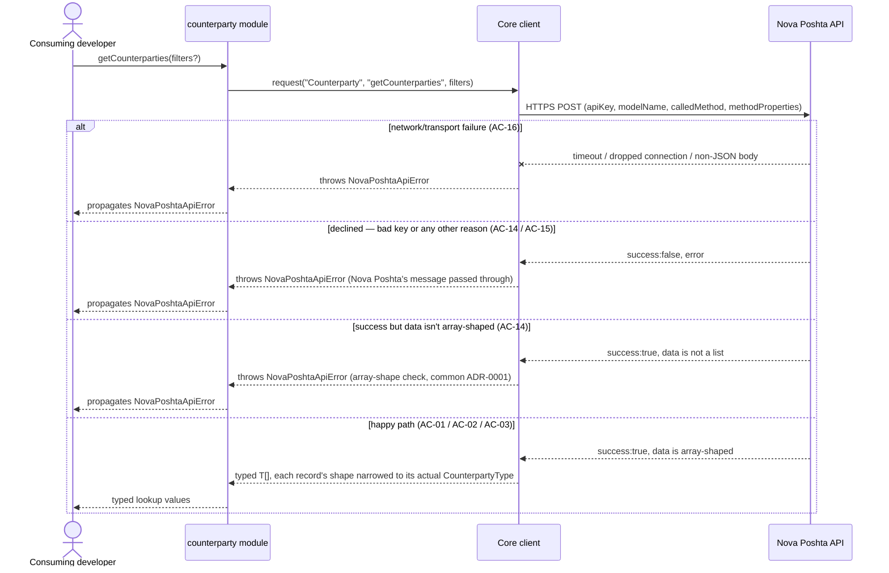
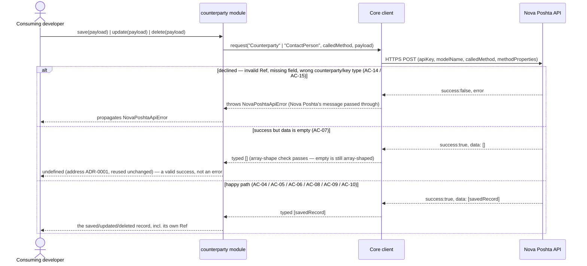

# Software Architecture Document — counterparty

## 1. Introduction and goals

**Intent.** `counterparty` gives every consuming developer typed, discoverable access to Nova
Poshta's Counterparty and ContactPerson domains — 5 read-only lookups plus 3 writes on a developer's
own counterparties (`PrivatePerson`/`Organization`/`ThirdParty`), plus 3 writes on a counterparty's
contact persons, 11 methods total — so they can resolve `Ref` values for senders, recipients, and
third parties, and manage a counterparty's contact people, without hand-rolling untyped calls
(`spec.md` §2). It makes `counterparty` the authoritative, typed source of counterparty `Ref` values
that a future shipment-creation module will depend on, mirroring the role `address` already plays for
location `Ref`s — and it is the first module in the library whose write payload must stay a true
discriminated union (`PrivatePerson`/`Organization`/`ThirdParty`) from `save` through `update`, rather
than the single flat shape `address` got away with.

**Top-3 quality goals (1-liners; full scenarios in §10):**

1. Type-safety — all 11 in-scope Counterparty/ContactPerson methods (5 lookups + 6 writes), plus any
   shipped convenience method, fully typed, zero `any` in public signatures, with a counterparty's
   result shape narrowed to its actual type — never a shared loose shape where every type-specific
   field is merely optional.
2. Error-contract correctness — every declined, malformed, or network-failed call throws the same
   `NovaPoshtaApiError`, including the write-specific "success but no record" case (AC-07), matching
   `address`'s already-proven convention.
3. Write-safety — `update` can never silently drop a previously-saved field, and can never accept a
   payload that mixes fields from more than one counterparty type (an `Organization`'s EDRPOU field
   together with a `PrivatePerson`'s first/last name) — the compiler rejects both.

**Stakeholders.**

| Role | Interest | Sign-off owner? |
|---|---|---|
| Consuming developer | Calls the 11 typed methods to resolve counterparty/contact-person `Ref` values and manage a counterparty's contact people | No |
| Tech Lead | SAD approval; owns the remaining `spec.md` §8 open questions | Yes |
| Security Lead | Reviews the module before release — write operations on personal/business identity data, plus a PII-bearing lookup (`spec.md` §6.1) | Yes |

<!-- Decision overrides (¶4) — none raised during this design pass. -->

## 2. Constraints

**Technical.**
- TypeScript, Node.js ≥18 (native `fetch`, no HTTP client dependency)
- No framework — this is a library, not an application
- No datastore — `counterparty` is stateless; the Nova Poshta API is the sole backing store
- Architecture convention: one folder per Nova Poshta model (`src/modules/<domain>/`), dual ESM+CJS
  build via `tsup` (project-level ADR-0002)

**Organisational.**
- Effort budget: sized S (2–5 PRs, ~1 week) per `classify-size`, route `quick`
- No hard deadline stated in `spec.md`
- Team: single maintainer (project owner)

**Conventions.**
- Convention file: `CLAUDE.md` + `docs/architecture-map.md`
- Error handling: a single `NovaPoshtaApiError`, no subclassing (project-level convention), reused
  unchanged for both lookups and writes, and for both the Counterparty and ContactPerson domains
- `src/types/counterparty.ts` holds this feature's request/response interfaces, per the
  `src/types/<domain>.ts`-per-model convention `common`/`address` already established
- `getCounterpartyAddresses`'s response type imports `address`'s own `SavedAddress` type directly
  rather than redefining it (`spec.md` §1) — the first cross-module type import between two domain
  modules in this library

**Regulatory / external.**
- `spec.md` §6.1: data classification confidential — a step more sensitive than `address`'s
  street-level data: a `PrivatePerson`'s name and phone, an `Organization`'s EDRPOU registration
  number, and every contact person's name and phone are personal/business identity data. Security
  review required before release — tracked as an open risk in §11, not performed in this design
  session.
- AuthZ/AuthN: none beyond the existing single-API-key model. One documented exception enforced
  entirely by Nova Poshta, not this library: contact-person operations are reserved for
  organization-held API keys (AC-15) — surfaced as the same standard error as any other decline.

## 3. Context and scope

`counterparty` gives a consuming developer typed access to Nova Poshta's Counterparty directory
(their own senders/recipients/third parties) and to each counterparty's contact persons, so they can
resolve `Ref` values and manage contact details without hardcoding values or guessing response
shapes. It ships inside the existing `nova-poshta-lib` npm package, alongside the shared core client
and the already-shipped `common` and `address` modules.

<!-- brownfield: read directly (src/client.ts, src/index.ts, src/modules/common/index.ts,
     src/modules/address/index.ts, src/types/common.ts, src/types/address.ts, src/types/envelope.ts —
     trivial codebase size, no Explore subagent needed). docs/architecture-map.md (reflects_commit
     94201ac) is 42 commits stale — both common and address have shipped in full since — but its
     target conventions still match what's actually on disk: no drift found in the conventions that
     matter to this feature (module wiring, dual-build, error handling, test layout, the
     Required<Omit<>> full-replace idiom). address's own sad.md §3/§4 served as the closer, current
     precedent where the two disagreed. -->

**External systems (in / out):**

| Actor or system | Type | Interaction |
|---|---|---|
| Consuming developer | Person | Installs `nova-poshta-lib`, calls `counterparty`'s typed lookup and write methods |
| Nova Poshta API | System (external) | HTTPS POST, `apiKey` auth — the sole backing store for a developer's counterparties and their contact persons |

**C4 Context (L1):**



*Identical in shape to `common`'s and `address`'s: the consuming developer talks only to
`nova-poshta-lib`, and the library itself is the only thing that talks to the external Nova Poshta
API. No new external system — `counterparty`'s calls land on the same single external API, just a
different `modelName`/`calledMethod` pair (`Counterparty` for counterparty ops, `ContactPerson` for
contact-person ops — exact wire values confirmed at implementation per `spec.md` §8 OQ-2).*

## 4. Solution strategy

**Top strategic choices (the seeds for ADRs):**

1. **Target surface: `library-sdk`.** Same single-surface shape `common` and `address` already
   established and the only fit for this repo (no server, no UI). Written to this document's
   frontmatter (`target_surfaces: ["library-sdk"]`); §5 draws one container for it, alongside the
   already-shipped `common` and `address` modules.
2. **Synchronous, direct calls into the existing core client — unchanged.** `counterparty`'s methods
   call `NovaPoshtaClient.request()` directly, exactly like `common`/`address`. No client-level
   change: the pagination/warnings gap noted in `spec.md` §1's Decision override stays a known
   limitation for this feature, not fixed here — it bites harder for `counterparty` than it did for
   `address` (`getCounterparties` is a growing transactional list, not a semi-static reference list),
   which is why `spec.md` §8 OQ-1 raises its urgency; still out of scope for this design.
3. **Stateless — no persistence, no caching.** Per the non-goal fixed in `spec.md` §3.
4. **Inherit `common`'s array-shape check unchanged (`common` ADR-0001).** The check already
   tolerates an empty array on success — exactly what AC-07's "successful write, no record" case
   needs, for both the Counterparty and ContactPerson write families.
5. **Write-return shape: `T | undefined`, reusing `address`'s already-Accepted ADR-0001 unchanged.**
   All 6 counterparty/contact-person write methods (`save`/`update`/`delete` × 2 families) resolve
   `undefined` when Nova Poshta reports success with an empty result (AC-07) — the identical case
   `address` already solved; no new ADR needed here, just an unchanged reuse of the existing one.
6. **`save`/`update` stay a true discriminated union across `PrivatePerson`/`Organization`/`ThirdParty`
   — three hand-written per-variant types (ADR-0001, this feature).** `address`'s precedent (one flat
   `Save` interface, `Required<Omit<Save, ...>>` to build `Update`) doesn't apply here: collapsing
   three structurally different counterparty types into one flat shape would let a payload mix an
   `Organization`'s EDRPOU with a `PrivatePerson`'s first/last name (the exact anti-pattern
   `spec.md` §1's decision override forbids). Each variant gets its own `Save` interface (tagged by a
   literal `CounterpartyType` discriminant field) and its own hand-written `Update` interface built
   with the same `Required<Omit<>>` idiom `address` already uses, three times instead of once.
   `SaveCounterpartyPayload`/`UpdateCounterpartyPayload` are the union of the three. Closes
   `spec.md` §8 OQ-4. See ADR-0001.
7. **Contact person's own `update` guard stays a single flat `Required<Omit<>>` type — no
   discriminated union.** `ContactPerson` has exactly one shape (name, phone), so it mirrors
   `address`'s `UpdateAddressPayload` pattern directly: no legitimate alternative exists here (single
   flat shape → no discriminant to preserve), so no ADR.
8. **`getCounterpartyAddresses`'s response type is imported directly from `address`'s own
   `SavedAddress` type, not redefined.** Mandated verbatim by `spec.md` §1 ("the response type is
   imported directly from address's own saved-address type... so the two modules share one definition
   of that shape") — no alternative for this design to weigh (an existing constraint already excludes
   duplicating the shape), so this stays inline, no ADR, even though it is this library's first
   cross-module type import between two domain modules (§5, §8).
9. **Convenience methods (US-08) stay unresolved at design time.** Exact set left TBD per
   `spec.md` §8 OQ-3, same as `address`'s own equivalent open question — resolved at `tasks`, not
   here (§11).

Each tactical decision in later sections traces to one of these nine. Decisions 4, 5, and 6 are the
same trio-shape `address` used (a tolerant shared check → a public-type consequence → a
feature-specific type-modeling problem), just with decision 6 solving a genuinely new problem
(discriminated unions) `address` never had to.

## 5. Building block view

Layered per the existing modular-domain convention (project-level ADR-0002): a thin `counterparty`
domain module sits on top of the shared core client, exactly like `common` and `address`. No new
layering style.

**Internal decomposition:**

```
src/
├── client.ts                     # core: request(), NovaPoshtaApiError — unchanged by this feature
├── modules/
│   ├── common/
│   │   └── index.ts               # existing — 15 typed reference-list methods
│   ├── address/
│   │   └── index.ts               # existing — 11 typed lookup + write methods
│   └── counterparty/
│       └── index.ts               # NEW — factory: createCounterpartyModule(client) → 11 typed
│                                   #   methods (5 lookups + 3 counterparty writes + 3 contact-person
│                                   #   writes), plus convenience methods (set TBD at tasks)
├── types/
│   ├── envelope.ts                 # existing — shared envelope/request types
│   ├── common.ts                   # existing — common's 15 reference-list interfaces
│   ├── address.ts                  # existing — Address interfaces; SavedAddress imported by this feature
│   └── counterparty.ts             # NEW — Counterparty/ContactPerson request/response interfaces,
│                                    #   incl. the AC-03 discriminated Save/Update union (§4 decision 6)
└── index.ts                       # public re-exports (client + common + address + counterparty + types)
```

`tsup`'s existing dual ESM+CJS build (project-level ADR-0002) already emits matching
`.d.ts`/`.d.cts` declarations for whatever `src/index.ts` re-exports — no new build step is needed to
satisfy AC-17 (every method discoverable via autocomplete in both published formats); `tasks`/
`plan-tests` verify the *published* output, not just the source, exactly as `common`/`address`
already do.

**C4 Container (L2):**



*The Containers view draws the one declared surface (`library-sdk`, the whole `nova-poshta-lib`
package) as a boundary holding four pieces: the existing core client (unchanged by this feature), the
existing `common` and `address` modules, and the new `counterparty` module the developer imports
directly. All four stay inside the same package — no second deployable, no new process.
`counterparty` never calls `address` at runtime — the only relationship is a compile-time type import
(`SavedAddress`, §4 decision 8) — and neither talks to `common` except through the shared core client.
Every domain module only ever talks down to the shared core client for actual requests.*

## 6. Runtime view

**Critical flow 1: fetch a lookup — happy path + every error branch**



**Critical flow 2: save/update/delete a counterparty or a contact person — happy path + the
empty-on-success branch**



*Flow 1 covers all 5 lookups (`getCounterparties`, `getCounterpartiesCatalog`,
`getCounterpartyContactPersons`, `getCounterpartyAddresses`, `getCounterpartyOptions`) and every
convenience method (AC-11) — same shape, different `calledMethod` and typed result; the discriminated
narrowing (AC-03) happens purely at the type level (`§4` decision 6), not as a runtime branch. Flow 2
covers all 6 writes (`save`/`update`/`delete` on counterparty, `save`/`update`/`delete` on contact
person) — identical branch structure regardless of which family or `calledMethod` is used, matching
`address`'s own Flow 2 shape exactly. AC-12/AC-13 (the authoritative-Ref invariant and the
no-cross-context-enforcement guarantee) are properties of *what these flows never do* — no caching, no
extra calls — not separate flows of their own (§8).*

**Coverage check — user stories and acceptance criteria against the runtime view above:**

| Item | Covered by |
|---|---|
| US-01 Fetch counterparty lookup data | Flow 1, happy-path branch |
| US-02 Filter a counterparty lookup | Flow 1, happy-path branch (`filters?` parameter) |
| US-03 Get typed, discriminated results | Flow 1, happy-path branch (type-level narrowing, §4 decision 6) |
| US-04 Save a new counterparty | Flow 2 |
| US-05 Update an existing counterparty | Flow 2 (identical shape, `update` in place of `save`) |
| US-06 Delete a counterparty | Flow 2 (identical shape, `delete` in place of `save`) |
| US-07 Manage a counterparty's contact persons | Flow 2 (identical shape, `ContactPerson` model in place of `Counterparty`) |
| US-08 Use a convenience method | Flow 1 (identical shape — a convenience method narrows input then makes one call, per AC-11) |
| US-09 Get a clear error on failure | Flow 1 + Flow 2, all error branches |
| US-10 Discover the full set of available methods | N/A — not a runtime path; satisfied by published `.d.ts`/`.d.cts` autocomplete (§5), verified by AC-17 |
| US-11 Rely on counterparty as the authoritative Ref source | N/A — not a distinct runtime path; the same Flow 1/2 calls are what any future module would make. The invariant itself is cross-cutting (§8), not a sequence |
| AC-01 happy-path lookup | Flow 1 |
| AC-02 filtered lookup | Flow 1 |
| AC-03 discriminated shape | N/A — non-runtime, type-level concern (§4 decision 6, §5 `src/types/counterparty.ts`) |
| AC-04 save happy path | Flow 2 |
| AC-05 update discriminant guard | N/A — non-runtime, compile-time type concern (§4 decision 6) |
| AC-06 delete happy path | Flow 2 (identical shape) |
| AC-07 empty-on-success write | Flow 2, "success but data is empty" branch |
| AC-08 contact-person save | Flow 2 (`ContactPerson` model) |
| AC-09 contact-person update guard | N/A — non-runtime, compile-time type concern (§4 decision 7) |
| AC-10 contact-person delete | Flow 2 (`ContactPerson` model, identical shape) |
| AC-11 convenience method | Flow 1 (identical shape) |
| AC-12 authoritative Ref source | N/A — non-runtime; the invariant is cross-cutting (§8), not a sequence |
| AC-13 no cross-context enforcement | N/A — non-runtime; the invariant is what Flow 2 *never* does (§8) |
| AC-14 declined or malformed-on-success | Flow 1 + Flow 2, "declined" / "not array-shaped" branches |
| AC-15 authorization / bad key / restricted key type | Flow 1 + Flow 2, "declined" branches (same code path as AC-14) |
| AC-16 network/transport failure | Flow 1, "network/transport failure" branch (identical for Flow 2, omitted there for diagram brevity) |
| AC-17 published-build discoverability | N/A — non-runtime, build-time/tooling concern; §5 explains the `.d.ts`/`.d.cts` mechanism |

No user story and no acceptance criterion is left uncovered.

## 7. Deployment view

<!-- N/A: this feature ships inside the existing npm package publish process (project-level ADR-0004,
     release strategy via changesets) — no new infrastructure, no new deployment unit, no server to
     operate. Identical reasoning to common's and address's §7. -->

## 8. Crosscutting concepts

| Concept | Convention | Where defined |
|---|---|---|
| Logging | None — the library emits no logs of its own | — (repo default, undocumented) |
| Authentication | Caller-supplied `apiKey`, unchanged by this feature | `architecture-map.md` |
| Error handling | Single `NovaPoshtaApiError`; array-shape check only, no per-field validation; identical for lookups and writes, and for the Counterparty and ContactPerson domains. `errors`/`warnings` pass through Nova Poshta's own response text verbatim, which can echo submitted personal data (a name, phone, or EDRPOU) — the library performs no redaction of its own; a consuming developer forwarding a caught error to a third-party logging service should treat its contents as potentially carrying personal data | `src/client.ts`; `common` ADR-0001; `spec.md` §6.1 |
| Write-return shape | `T \| undefined` when a successful write's data is empty | `address` ADR-0001 (reused unchanged) |
| Discriminated-type modeling | Three hand-written per-variant `Save`/`Update` interfaces (`PrivatePerson`/`Organization`/`ThirdParty`), unioned into one payload type per method — a new pattern this feature introduces | `counterparty` ADR-0001 |
| Cross-module type reuse | A domain module may import another domain module's *type* (never call it at runtime) when the API response genuinely shares that shape — first instance: `getCounterpartyAddresses` imports `address`'s `SavedAddress` | this document, §4 decision 8, §5 |
| ID strategy | N/A — the library holds no persistent IDs of its own | `architecture-map.md` |
| Internationalisation | N/A — pass-through of Nova Poshta's own language fields, no library-side selection, same convention as `common`/`address`. The still-unresolved i18n open question belongs to `common`, not this feature | `docs/features/common/spec.md` §8 |
| Observability | None new — no metrics/tracing added by this feature | — |
| Events | N/A — synchronous request/response only | `architecture-map.md` |
| Rate-limiting | None of our own — Nova Poshta's own throttling governs; the phone+last-name catalog lookup is the one PII-bearing surface worth naming explicitly (`spec.md` §6.1) | `spec.md` §6.1 |
| Testing | Mocked unit suite required in CI (`test/unit/modules/counterparty`) + opt-in integration suite against the real API, unchanged by this feature | `docs/adr/0003-testing-strategy.md` |
| Cross-module value consistency | `counterparty` is the sole source of truth for counterparty/contact-person `Ref` values; it enforces nothing about how another module later uses one, and performs no check of or cascade into dependent records on update/delete (AC-13) | `spec.md` AC-12 / AC-13 / US-11 |

## 9. Architecture decisions

| # | Title | Status | Section |
|---|---|---|---|
| 0001 | Use three hand-written per-variant discriminated update types | Accepted | §4 |

ADR files live under `docs/features/counterparty/adr/`. This feature also relies on `common`'s
already-Accepted `0001-array-shape-only-validation.md` and `address`'s already-Accepted
`0001-return-undefined-on-empty-write-response.md` (both unchanged, inherited — no new ADR needed for
either here).

## 10. Quality requirements

Each top-3 goal from §1 expanded into a full scenario:

**QG-1. Type-safety**
- **When:** any of the 11 in-scope Counterparty/ContactPerson methods (5 lookups + 6 writes), or any
  shipped convenience method, is exported from `counterparty`.
- **Then:** 100% of in-scope methods — raw and convenience alike — have zero `any` in their public
  signatures, and a counterparty's typed result narrows to its actual
  `PrivatePerson`/`Organization`/`ThirdParty` shape — never a shared loose type where a type-specific
  field is merely optional (`spec.md` §6 rows 1 and 3, AC-03; convenience-method scope matches
  `spec.md` §6 row 1's "lookups, writes, convenience" wording — measured against whichever set §8
  OQ-3 fixes, zero convenience methods in v1 satisfies this vacuously).
- **How verify:** static check in CI, plus a type-level test asserting the discriminated narrowing
  (`spec.md` §6, rows 1 and 3).

**QG-2. Error-contract correctness**
- **When:** a Counterparty or ContactPerson call — raw or convenience — is declined by Nova Poshta,
  its response isn't array-shaped, or a write succeeds with an empty data array.
- **Then:** 100% of in-scope methods throw `NovaPoshtaApiError` on a decline or non-array-shaped
  response; 0% throw on a successful write with empty data — that resolves to `undefined`, not an
  error (AC-07, `address` ADR-0001 reused).
- **How verify:** unit test suite `test/unit/modules/counterparty` (`spec.md` §6, row 2).

**QG-3. Write-safety**
- **When:** a consuming developer calls `update` (either family) with an incomplete payload, or a
  counterparty `update` payload mixing fields from more than one counterparty type.
- **Then:** 100% of such calls fail to compile — the full-replace type accepts nothing less than every
  field its own type requires, and the discriminated union rejects a mixed-type payload (AC-05, AC-09,
  `counterparty` ADR-0001).
- **How verify:** static check in CI, type-level test (`spec.md` §6, row 3).

## 11. Risks and technical debt

| Risk / debt | Severity | Mitigation | Owner |
|---|---|---|---|
| Security review required before release — write operations on personal/business identity data, plus a PII-bearing lookup (the phone+last-name catalog search) (`spec.md` §6.1) | High | Schedule and complete a security review before `sdd:ship counterparty`; not performed in this design session | Security Lead |
| Open architectural decision: the §1 in-scope 11-method list, incl. `getCounterpartiesCatalog`'s exact method name, was cross-checked against a third-party SDK, not Nova Poshta's own docs portal (blocks automated fetches) — re-verification is still pending. This also covers a second, more consequential unverified assumption ADR-0001 rests on: that Nova Poshta's lookup responses actually carry a real, runtime-checkable field identifying a counterparty's type at all (`spec.md` §1, ¶ below the method list) — if that assumption proves false, ADR-0001's discriminated-union mechanism (§4 decision 6, AC-03) needs rework, not just a method-name fix. **Status at review (2026-09-20): implementation shipped on the unverified guess** — the OQ-2 gate that was due before `sdd:implement counterparty` was not discharged; re-scoped to a release gate | Open question | Resolve before `sdd:ship counterparty` (`spec.md` §8 OQ-2, due date moved since the original pre-implement gate was missed) | Tech Lead |
| `sdd:design counterparty`'s own gate for OQ-1 (pagination/warnings) was reached in this design pass and resolved via the spec's own stated default — known limitation, not fixed in this feature (§4 decision 2, and the matching Accepted-debt bullet below). The remaining, still-open half is whether a *future* module's lookups will need the shared core client extended | Open question | Resolve before `sdd:design` of any future module whose lookups depend on complete, multi-page counterparty results (`spec.md` §8 OQ-1) | Tech Lead |
| Open architectural decision: which specific convenience method(s) (US-08) ship in v1 | Open question | Resolve before `sdd:tasks counterparty`, based on which raw lookups see the most friction in practice (`spec.md` §8 OQ-3) | Tech Lead |
| Cross-account write-decline behavior (AC-15) is trusted from Nova Poshta's own documented behavior, inferred from secondary/community sources, not confirmed against a live API response (`spec.md` §6.1) | Medium | Unit tests confirm the library surfaces whatever decline Nova Poshta sends back (mocked), not that Nova Poshta's own enforcement holds in production; the security review above should confirm this against a live call before sign-off | Security Lead |

**Accepted debt (acceptable in v1, plan to fix later):**
- No client-side pagination walking and no surfaced success-path warnings (`spec.md` §1 Decision
  override) — the project owner's deliberate choice to keep the shared core client's scope unchanged
  for this S-sized feature, not a shortcut awaiting cleanup by default. Revisit only when a future
  module's lookups genuinely need complete multi-page results (§8 OQ-1 above).
- No client-side enforcement or cascade into a counterparty's contact persons or `address`'s saved
  addresses on update/delete (AC-13) — matches the library's stateless, no-cross-call-bookkeeping
  architecture; a consuming developer who stores a `Ref` elsewhere is responsible for noticing it
  became stale.

## 12. Glossary

| Term | Meaning |
|---|---|
| Consuming developer | A developer who installs and calls this library's typed methods from their own Node.js/TypeScript project. NOT Nova Poshta itself, and NOT an end customer or shipment recipient. |
| Counterparty | A legal entity or private individual Nova Poshta associates with a shipment (sender, recipient, or the API key holder's own registered entity), used to scope which saved addresses belong to whom. NOT the consuming developer. |
| `Ref` | A UUID Nova Poshta assigns to identify a specific record (a city, street, warehouse, settlement, address, or counterparty) so it can be passed into later API calls. NOT a human-readable name or address string. |
| `ThirdParty` | A counterparty registered as neither the API key holder's own sender entity nor the shipment's recipient, e.g. a marketplace shipping on behalf of a supplier. NOT sender. |
| `PrivatePerson` | A counterparty saved as an individual (not a registered business), identified by name and phone. NOT `Organization`. |
| `Organization` | A counterparty saved as a registered legal entity, identified by an `OwnershipForm` and an EDRPOU business-registration number. NOT `PrivatePerson`. |
| Contact person | A named individual (name, phone) attached to a counterparty as the point of contact for pickup or delivery. NOT the counterparty itself — has no independent existence outside the counterparty it belongs to. |
| Counterparty property (vs type) | Two distinct axes sharing overlapping names (`spec.md` §1): *property* (`Sender`/`Recipient`/`ThirdParty`) filters `getCounterparties`; *type* (`PrivatePerson`/`Organization`/`ThirdParty`) discriminates `save`/`update` payloads. `ThirdParty` is the one value legitimately shared by both. |
| `NovaPoshtaApiError` | The library's single standard error class (extends `Error`), carrying `errors[]`/`errorCodes[]`/`warnings[]` — thrown on any declined call or transport failure, for both lookups and writes. |
| Array-shape check | The one runtime check the shared core client performs (`common` ADR-0001): confirming a response's `data` is actually an array before it's returned as typed data. An empty array still passes — this is what makes AC-07's "successful write, no record" possible. |
| Discriminated `Save`/`Update` union | The type-level mechanism (`counterparty` ADR-0001) that keeps `PrivatePerson`/`Organization`/`ThirdParty` as three distinct, hand-written interfaces unioned into one payload type per method — never collapsed to their shared fields. |
