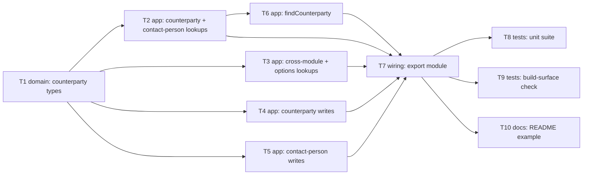

# Epic — counterparty

> **Spec:** [spec.md](../spec.md) · **Design:** [sad.md](../sad.md) · **API:** [contracts/public-api.md](../contracts/public-api.md) (no data-model.md — legal fast-lane skip, no schema change) · **ADRs:** [adr/](../adr/)

## Goal

Ship the `counterparty` domain module: 5 typed read-only lookups over Nova Poshta's Counterparty and
ContactPerson domains, 3 typed writes on a developer's own counterparties (as a true discriminated
`PrivatePerson`/`Organization`/`ThirdParty` union), 3 typed writes on a counterparty's contact persons,
and one convenience method (`findCounterparty`), so consuming developers get compile-time-checked
access to counterparty/contact-person `Ref` values without hand-rolling untyped calls (`spec.md` §2).

## Scope

- **In:** `src/types/counterparty.ts` (all request/response types, incl. the three-variant
  discriminated `Save`/`Update` union), `src/modules/counterparty/index.ts` (the 11 raw methods +
  `findCounterparty`), wiring into `src/index.ts`, the mocked unit suite, the published-build
  type-surface check, a README usage example.
- **Out (from `spec.md` §3):** chaining a counterparty-creation call and a contact-person-creation
  call into one convenience method; caching/persisting any counterparty or contact-person data;
  client-side validation of write payload fields beyond TypeScript's compile-time checks; enforcing
  referential integrity across module boundaries on update/delete (AC-13); extending the shared core
  client for pagination metadata or success-path warnings (`spec.md` §8 OQ-1, tracked separately).
  Also out: any convenience method beyond `findCounterparty` — §8 OQ-3 is resolved to this one method
  (T6), mirroring how `address` scoped its own OQ-3 down to `findCityByName`.

## Convenience-method decision (resolves `spec.md` §8 OQ-4 / OQ-3)

`findCounterparty(searchString, property?)` wraps `getCounterparties`, the highest-friction raw
lookup for the common "resolve a counterparty from a name/phone string" case. `getCounterpartiesCatalog`
was considered and rejected — its phone + partial-last-name shape is already about as simple as a
wrapper could make it. Full rationale in [T6](./t6-find-counterparty.md).

## Task map

*T2–T6 all touch the single `src/modules/counterparty/index.ts` file (mirroring `address`'s one-file
factory), so `implement` serializes them via the overlapping `files_hint` even though the DAG above
shows them as parallel candidates off `T1` — see Risks below.*

## Tasks

See [tracker.md](./tracker.md) for status. Machine contract: [tasks.json](../tasks.json).

| # | Task | Layer | Blocked by | DoD (short) |
|---|---|---|---|---|
| T1 | Define counterparty domain types | domain | — | Full type surface compiles, zero `any`; discriminated union per ADR-0001 |
| T2 | Implement counterparty and contact-person lookups | app | T1 | `getCounterparties`/`getCounterpartiesCatalog`/`getCounterpartyContactPersons` typed + tested |
| T3 | Implement cross-module address + options lookups | app | T1 | `getCounterpartyAddresses` resolves `address`'s own `SavedAddress[]`; `getCounterpartyOptions` typed |
| T4 | Implement counterparty write methods | app | T1 | `save`/`update`/`delete` resolve the discriminated `Counterparty \| undefined` |
| T5 | Implement contact-person write methods | app | T1 | `saveContactPerson`/`updateContactPerson`/`deleteContactPerson` resolve `ContactPerson \| undefined` |
| T6 | Implement `findCounterparty` convenience method | app | T2 | Exactly one call to `getCounterparties`, no post-filtering |
| T7 | Wire `counterparty` module into the public package surface | wiring | T2, T3, T4, T5, T6 | `createCounterpartyModule` + `CounterpartyModule` re-exported from `src/index.ts` |
| T8 | Unit test suite for `counterparty` | tests | T7 | Every AC-01..AC-17 branch covered against a mocked `fetch` |
| T9 | Extend published-build type-surface check | tests | T7 | Both `dist/index.d.ts` and `.d.cts` assert all 12 counterparty identifiers |
| T10 | Update README usage example | docs | T7 | README shows a real `counterparty` call, not the placeholder comment |

## Risks / Hard rules

- `sad.md` §4 decision 6 / [ADR-0001](../adr/0001-three-hand-written-per-variant-update-types.md):
  `save`/`update` must stay three hand-written per-variant interfaces unioned, never collapsed to
  shared fields and never a distributive conditional type. T1 owns this; T4 tests it at the compile
  level.
- `sad.md` §4 decision 4 / `common` ADR-0001: no new validation logic in the shared core client —
  T2–T6 call `client.request()` unchanged, exactly like `common`/`address`.
- `sad.md` §4 decision 8: `getCounterpartyAddresses`'s response type must import `address`'s
  `SavedAddress`, never redefine it — this library's first cross-module type import. T3 owns this.
- No task may add caching, retries, or client-side re-filtering/pagination-walking (`spec.md` §3
  non-goals) — applies to T2–T6 and especially T6 (AC-11's "exactly one call" rule) and T7 (AC-12).
- No task may add a check or cascade into a counterparty's contact persons or `address`'s saved
  addresses on update/delete (AC-13, `spec.md` §3 non-goal) — T4/T5 must not add one, T8 tests that
  none was added.
- T2–T6 share one file (`src/modules/counterparty/index.ts`); despite the DAG showing them as siblings
  off T1, `implement` will serialize them in practice via the shared `files_hint` — expected and fine
  at this feature's size, not a bug in the graph.
- Security review still required before `sdd:ship counterparty` (`sad.md` §11, `spec.md` §6.1) — not
  covered by any task here; tracked separately.
