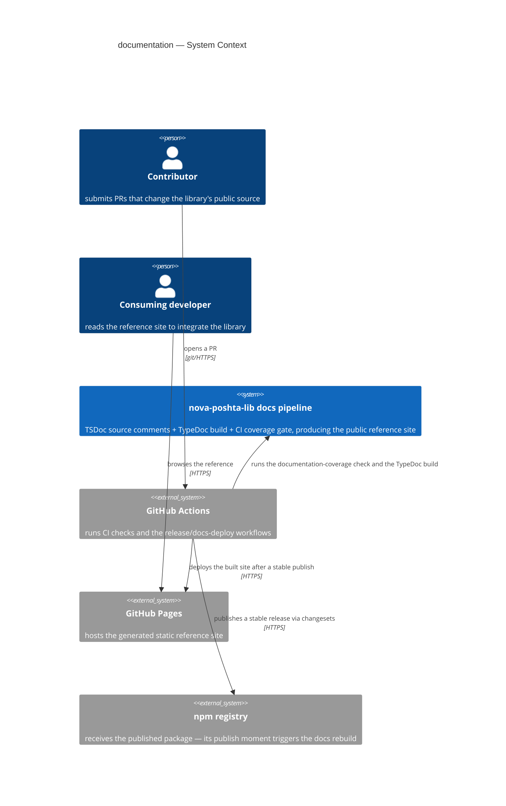
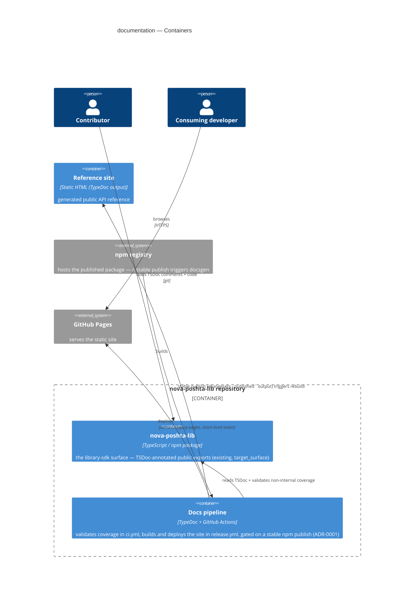
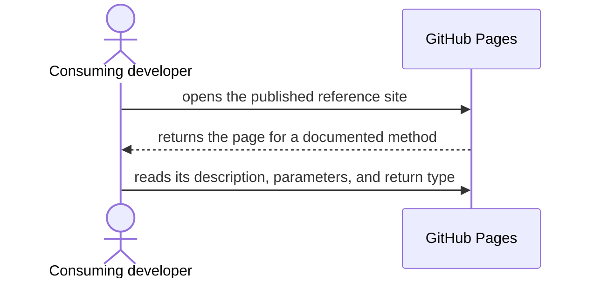
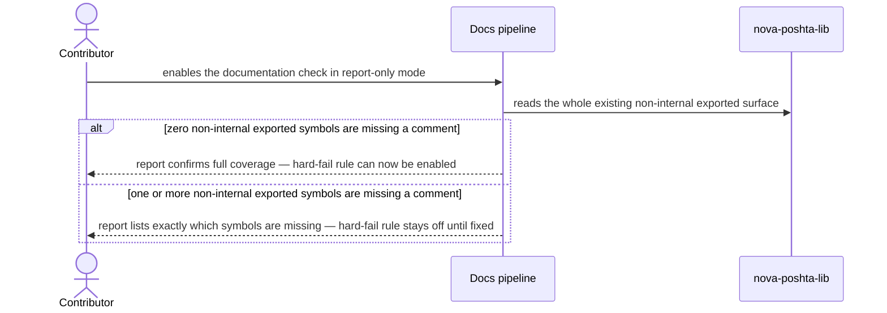
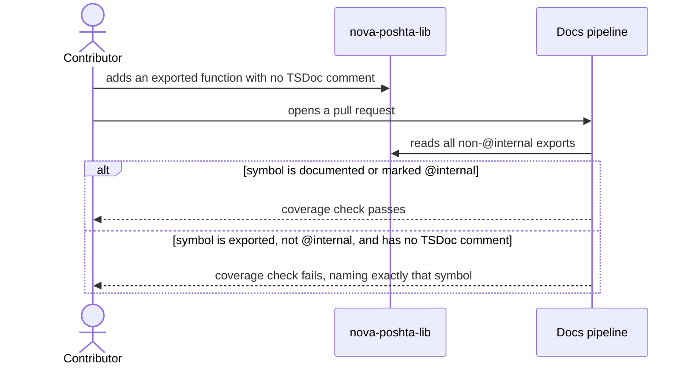
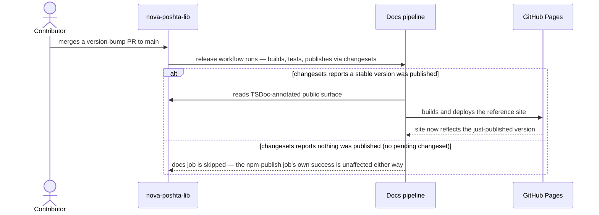

# Software Architecture Document — documentation

<!-- 12 Arc42 sections. Empty section → <!-- N/A: <reason> -->. -->
<!-- C4 Context (L1) lives inline in §3. C4 Container (L2) lives inline in §5. -->
<!-- Numbers in §10 come VERBATIM from spec.md §6 NFR — no inventing, no rounding. -->

## 1. Introduction and goals

**Intent.** Give consuming developers a generated, browsable reference for nova-poshta-lib's
complete public surface (the core client plus all 7 domain modules — on the order of 150 exported
symbols), enforced complete by CI so it can never silently regress, and always in sync with the
latest published npm version — closing the last unmet "documented" requirement named in the
project's own foundation intent.

**Top-3 quality goals (1-liners; full scenarios in §10):**

1. Fast, low-friction CI feedback — the docs build and coverage check add only seconds to the
   existing pipeline, never becoming a reason to skip or disable them.
2. Documentation completeness is enforced automatically, not by convention — 100% of the
   non-internal public surface stays documented, and a regression fails CI by name.
3. Reference freshness is tied to real releases and isolated from them — the published site always
   matches the latest npm version, and a docs-rebuild problem can never block, delay, or undo an
   already-completed npm publish.

**Stakeholders.**

| Role | Interest | Sign-off owner? |
|---|---|---|
| Consuming developer | Browses the reference to integrate without reading source (US-01, US-02, US-05) | No |
| Contributor | Writes TSDoc, gets blocked by CI when it's missing (US-03, US-06) | No |
| Tech Lead | SAD approval; also owns 1 of the 3 spec §8 open questions | Yes |
| Repo admin (associate2coder) | Registers the new CI check as a required branch-protection status check — a manual, out-of-codebase step (spec §8) | No |

**Decision overrides (from spec.md §1 ¶4 — fixed, not re-litigated here):**

- Decision override: the reference site rebuilds only when a new stable version actually reaches
  npm (the same moment the release workflow publishes), not on every merge to `main` — closes the
  risk of the site showing methods before they're actually installable, since release is a separate,
  later step from merging. There is no separate manual or on-demand rebuild trigger — a
  documentation-only fix reaches the public site only via the next npm release, same as any other
  change.
- Decision override: internal-only re-exports (e.g. `AddressReferenceRecordBase`,
  `CounterpartyRecordBase`, `SearchWrapper`, `OpenEnum`, `TRACKING_STATUS_CODES`) are marked with
  TypeDoc's `@internal` tag and excluded from both the generated site and the CI coverage
  requirement — keeps the reference focused on what a consuming developer actually calls. The
  audited full list is still open (§11).
- Decision override: only type/function/parameter/return-level comments are required, not a comment
  on every individual field of a wire-shape type — fields already mirror Nova Poshta's own names;
  per-field coverage would multiply the writing effort for comparatively little reader benefit.
- Decision override: the generated reference is hosted on GitHub Pages — a free static-site host
  already built into GitHub — fixed as the concrete target for this document to wire up.

## 2. Constraints

**Technical.**
- TypeScript, Node.js ≥18 (existing — no version change).
- No new runtime framework — `tsup` (dual ESM+CJS build), `vitest`, `eslint` + `prettier` stay as-is
  (`docs/architecture-map.md` Stack).
- New devDependency: `typedoc` (no version pinned yet — none of the existing tooling versions this
  feature depends on are pinned to a range that conflicts with it).
- Existing CI: `.github/workflows/ci.yml` (build → typecheck → test → lint, on every PR + push to
  `main`) and `.github/workflows/release.yml` (build → test → `changesets/action` publish, on push
  to `main` only).
- Existing release automation: `@changesets/cli`, configured with `baseBranch: "main"`,
  `access: "public"`, no prerelease mode (`.changeset/config.json`) — every publish from `main` is a
  stable release, matching AC-05's "pre-release/beta does not trigger this."
- New deployment target: GitHub Pages (not yet configured in this repo — no `gh-pages` branch, no
  `actions/deploy-pages` step exists today). Its two GitHub-provided actions (`actions/deploy-pages`,
  `actions/upload-pages-artifact`) are pinned to explicit major versions in the workflow, same as
  `changesets/action` already is — per spec §6.1's "pin any third-party automation used for
  publishing to an explicit version" (see ADR-0001).
- Architecture convention: this feature adds no new domain module and touches no layer described in
  `CLAUDE.md`'s Layout — it is additive tooling (TSDoc comments in existing files + two new/edited
  CI workflow steps), not a new `src/modules/<domain>/`.

**Organisational.**
- Effort budget: ~1 week, 2–5 PRs (feature_size S, from `.size`).
- No hard deadline stated in `spec.md` (see §11 for the corresponding low-severity row).
- Team: single maintainer (associate2coder) implementing; Tech Lead reviews/signs off; repo admin
  (same person, different hat) does the one manual branch-protection step after merge.

**Conventions.**
- `CLAUDE.md` Conventions (errors, tests, no-persistence) — unaffected by this feature.
- New convention this feature establishes: one TSDoc comment per exported function/class/interface/
  type/enum (type + parameter + return level), never per individual field — per the §1 ¶4 override.
- `@internal` is the sole exclusion mechanism for non-public plumbing — no separate allow-list file.

**Regulatory / external.**
- Data classification: Public (spec §6.1) — the generated site is meant to be publicly browsable; no
  confidential or regulated data.
- Personal data touched: none.
- AuthZ/AuthN impact: none — no new capability or permission checks; the site has no auth of its own.
- Security review: N/A (spec §6.1) — no new authz boundary, no personal data, no change to the
  library's Nova Poshta wire behavior.

## 3. Context and scope

nova-poshta-lib is a published TypeScript client library with no reference documentation today —
consuming developers read source directly, and contributors add exported symbols with no CI
signal if they forget to document them. This feature adds a documentation pipeline around the
existing library: TSDoc comments in source, a CI gate that fails a PR missing one, and a generated
static site kept in sync with real npm releases.

<!-- brownfield: repo scan (via sdd:explorer) — src/index.ts re-exports ~90+ types across 8
src/types/*.ts files + 7 domain-module factories + the core client; .github/workflows/ci.yml runs
build→typecheck→test→lint on every PR/push-to-main; .github/workflows/release.yml runs on push to
main and publishes via changesets/action (exposes a `published` boolean output); no typedoc config,
no GitHub Pages setup, no docs output in .gitignore exist yet. -->

**External systems (in / out):**

| Actor or system | Type | Interaction |
|---|---|---|
| Contributor | Person | Adds TSDoc comments; opens PRs that CI's new check validates |
| Consuming developer | Person | Reads the published reference site |
| GitHub Actions | System (external platform) | Runs the existing CI + release workflows, plus this feature's new docs-check step and docs-deploy job |
| GitHub Pages | System (external platform) | Hosts the generated static reference site |
| npm registry | System (external) | Receives the published package; a stable publish there is the trigger for a site rebuild |

**C4 Context (L1):**



The system shows itself as one box: the docs pipeline that lives alongside the library's own
source. GitHub Actions, GitHub Pages, and the npm registry are all external platforms this feature
depends on but does not own — the trust boundary is the same one the repo already has (nothing new
crosses into this library's own code besides the TSDoc comments themselves).

## 4. Solution strategy

**Target surface: `library-sdk`.** This feature documents an existing library's public
signatures — it introduces no new runtime consumer role, no backend service, no UI. The taxonomy's
`library-sdk` surface ("the public signatures/types it exposes are the contract") is the only one
that applies; a single surface, so the multi-surface blast-radius gate does not fire.

**Top strategic choices (the seeds for ADRs):**

1. **TSDoc-in-source + TypeDoc generation + CI-enforced coverage** — the whole documentation
   pipeline lives as comments in the existing source files plus a generator run in CI, rather than a
   hand-maintained separate docs repo or wiki. This is spec-fixed (§1 ¶4), not re-litigated here;
   it directly serves quality goal 2 (completeness enforced automatically).
2. **Release-gated, publish-isolated rebuild (→ ADR-0001)** — the reference site rebuilds only on a
   stable npm publish, wired as a job inside the existing `release.yml` gated on the
   `changesets/action` `published` output, so a docs-pipeline failure can never affect the
   already-completed npm publish. Serves quality goal 3.
3. **GitHub-native hosting, zero stored credentials** — GitHub Pages via its built-in Actions-based
   deployment (`actions/deploy-pages`, GitHub-issued short-lived token, `id-token: write`
   permission) rather than a `gh-pages` branch + a third-party action. No new long-lived secret is
   introduced, matching spec §6.1's constraint that the publishing mechanism must use a short-lived,
   narrowly-scoped credential, consistent with how the existing release workflow is already
   permissioned.
4. **Coverage check added to the existing CI workflow, not a new one** — the documentation-required
   check runs as an added step in `.github/workflows/ci.yml` (already the workflow every PR runs),
   matching spec §6 NFR's framing ("added to the existing pipeline, same runner class"). Serves
   quality goal 1.

Each tactical decision in later sections traces to one of these four pillars.

## 5. Building block view

Additive tooling around the existing layered library (`CLAUDE.md` Layout) — no new domain module,
no change to `src/modules/<domain>/` or `src/client.ts` beyond adding TSDoc comments to their
existing exports. The new behavior is entirely CI/build-time: a generator container that reads the
annotated source and produces a deployable static site.

**Internal decomposition:**

```
nova-poshta-lib/
├── src/                      <existing — gains TSDoc comments only, no structural change>
│   ├── client.ts
│   ├── modules/<domain>/
│   ├── types/
│   └── index.ts              <single TypeDoc entry point — the public surface per CLAUDE.md>
├── typedoc.json               <new — entry point, @internal exclusion, requiredToBeDocumented>
└── .github/workflows/
    ├── ci.yml                 <gains a documentation-coverage step>
    └── release.yml             <gains a docs-deploy job, gated on the publish output — ADR-0001>
```

**C4 Container (L2):** one container per declared `target_surface` (`library-sdk`) plus the new
build/publish container this feature introduces.



The library itself (the `library-sdk` target surface) stays a single container, unchanged in shape;
the new Docs pipeline container reads its TSDoc comments, builds the static Reference site, and
deploys it to GitHub Pages only after npm registers a stable publish.

## 6. Runtime view

**Critical flow 1: consuming developer browses the reference site (AC-01)**



**Critical flow 2: one-time report-only validation pass before hard-fail is enabled (AC-04, AC-06)**



**Critical flow 3: contributor PR blocked by missing documentation (AC-02, AC-03, AC-06)**



**Critical flow 4: release-triggered, publish-isolated site rebuild (AC-05, ADR-0001)**



## 7. Deployment view

This feature introduces a new deployment target (GitHub Pages, not previously configured) and adds
two GitHub Actions jobs to the repo's existing CI/CD — it does not reuse an existing deployment unit
unchanged, so this section is not `<!-- N/A -->`. Both the coverage check and the build/deploy run on
GitHub-hosted `ubuntu-latest` runners, same as the repo's existing `ci.yml`/`release.yml` jobs. The
generated site itself is static HTML with no server of its own — GitHub Pages' CDN serves it; this
library has no scaling concern of its own to manage.

**Monitoring:**
- Metrics: CI job step duration for the `typedoc` build step and the documentation-check step
  (spec §6 NFR — this is how the ≤60s / ≤30s budgets are observed).
- Alerts: none automated — a failed docs-check step is visible in the PR's CI status the same way
  every other `ci.yml` step already is; a failed docs-deploy job is visible in the Actions run for
  `release.yml`, isolated per ADR-0001 from the npm-publish job's own status.
- Tracing: N/A — no request-serving component of our own; GitHub Pages' own availability is outside
  this project's instrumentation (spec §6 NFR note).

**Scaling thresholds:**
- Comfortable indefinitely at this library's size (~150 exported symbols today) — a static site of
  this scale has no meaningful growth threshold to plan around.

## 8. Crosscutting concepts

| Concept | Convention | Where defined |
|---|---|---|
| Logging | GitHub Actions' own per-step job logs — no structured app logging added (this feature has no running service) | — |
| Authentication | None for the public site; the docs-deploy job authenticates to GitHub Pages via a short-lived OIDC token (`id-token: write` permission), no stored PAT | §4 pillar 3, spec §6.1 |
| Error handling | A missing-doc symbol fails the CI step by name (AC-02); a docs-deploy failure surfaces as a visible, isolated Actions failure that never touches the npm-publish job's own status (ADR-0001) | §6 flow 1/2 |
| ID strategy | N/A — no persistent identifiers introduced | — |
| Internationalisation | N/A — English only, matching the existing source and TSDoc comments | — |
| Observability | GitHub Actions run history is the sole observability surface — no added APM/tracing | §7 |
| Events | N/A — synchronous CI/CD steps only, no domain events | — |
| Secrets | No new long-lived secret; reuses the existing `NPM_TOKEN`/`GITHUB_TOKEN` pattern for publish, adds only the short-lived Pages OIDC token | spec §6.1 |

## 9. Architecture decisions

| # | Title | Status | Section |
|---|---|---|---|
| 0001 | Gate the docs-deploy job on the changesets publish output | Accepted | §5, §7 |

ADR files live under `docs/features/documentation/adr/NNNN-<title>.md`.

## 10. Quality requirements

**QG-1. Fast, low-friction CI feedback**
- **When:** a PR triggers CI.
- **Then:** the TypeDoc site build step completes in ≤ 60s and the added documentation-check step
  adds ≤ 30s, both on the repo's existing GitHub-hosted `ubuntu-latest` runner (spec §6 NFR;
  observed budgets, not CI-failing thresholds).
- **How verify:** CI job step duration for the `typedoc` build step and the documentation-check
  step, read from the GitHub Actions run.

**QG-2. Documentation completeness is enforced automatically**
- **When:** the one-time TSDoc pass across the whole existing surface is complete and CI's
  documentation check runs.
- **Then:** it reports 100% coverage (0 missing) of non-internal exported symbols — TypeDoc's own
  validation report shows 0 warnings (spec §6 NFR; this is the only NFR row that fails CI, per AC-02
  / AC-04 / AC-06).
- **How verify:** TypeDoc's validation report in the CI job log; AC-06's report-only run confirms
  this before the hard-fail rule (`treatWarningsAsErrors`) is switched on.

**QG-3. Reference freshness tied to real releases, isolated from publish**
- **When:** a new stable version is published to npm.
- **Then:** the published reference site rebuilds and reflects exactly that version within ≤ 5
  minutes of the npm publish completing (spec §6 NFR), and a rebuild failure never blocks, delays,
  or undoes the already-completed npm publish (spec AC-05, structurally guaranteed by ADR-0001).
- **How verify:** compare GitHub Actions workflow run timestamps (the publish job's completion vs.
  the docs-deploy job's completion) across the first 3 real releases after launch (spec §7 KPI).

## 11. Risks and technical debt

| Risk / debt | Severity | Mitigation | Owner |
|---|---|---|---|
| GitHub Pages / GitHub Actions availability is a third-party dependency outside this project's control or instrumentation | Low | No automated health-check by design (spec §3 non-goal) — a failed deploy is visible in the Actions run; accepted for a library this size | Tech Lead |
| If `changesets/action`'s `published` output is ever renamed/reshaped in a future major-version bump of that action, the gate in ADR-0001 fails closed (no docs deploy) rather than open | Medium | Pin `changesets/action` to an explicit major version; a failed/skipped docs-deploy job is visible in the Actions run, so the failure is noisy, not silent | Tech Lead |
| No explicit deadline stated in `spec.md` for this feature | Low | None needed at this size (~1 week per `.size`); add a real date here if a hard external deadline emerges | Tech Lead |
| Open architectural decision: who registers the new documentation CI check as a required branch-protection status check | Open question | Resolve immediately after this feature's PR merges — a manual, out-of-codebase GitHub-settings step | Repo admin (associate2coder) |
| Open architectural decision: the definitive, fully-audited list of `@internal`-marked exports | Open question | Resolve before `sdd:tasks` — a few examples are known (`AddressReferenceRecordBase`, `CounterpartyRecordBase`, `SearchWrapper`, `OpenEnum`, `TRACKING_STATUS_CODES`); a complete scan of all ~150 exports has not run yet | Implementer |
| Open architectural decision: whether to add a `CONTRIBUTING.md` convention to keep TSDoc updated alongside behavior changes | Open question | Resolve before `sdd:tasks` | Tech Lead |

**Accepted debt (acceptable in v1, plan to fix later):**
- No automated post-publish smoke check that the live Pages URL actually loads (spec §3 non-goal) —
  the docs-deploy job's own success/failure signal is this feature's only freshness guarantee.
- Per-field documentation is out of scope (spec §3 non-goal / §1 ¶4 override) — only
  type/function/parameter/return-level comments are required.

## 12. Glossary

| Term | Meaning |
|---|---|
| Consuming developer | A developer who installs and calls this library's typed methods from their own Node.js/TypeScript project (CONTEXT.md). |
| Contributor | A person who submits a PR to this repository that changes its own source code, gated by CI (CONTEXT.md). |
| TSDoc | The doc-comment syntax (`/** ... */` with tags like `@param`, `@returns`, `@internal`) written directly above TypeScript exports in `src/`; the source of truth this feature's coverage check validates. |
| TypeDoc | The tool that reads TSDoc comments from `src/index.ts`'s export graph and generates the static reference site + the CI validation report. |
| `@internal` | The TypeDoc tag marking an exported symbol as internal-only plumbing — excluded from both the generated site and the coverage requirement (spec §1 ¶4 override). |
| Non-internal exported symbol | Exactly what `src/index.ts` re-exports as this library's public surface (per `CLAUDE.md`'s definition of that file), minus anything marked `@internal` — the unit the 100% coverage target (§10 QG-2) is measured over. |
| Documentation coverage | The presence (not length or quality) of a TSDoc comment on a non-internal exported symbol — what TypeDoc's validation report checks. |
| Reference site | The generated, publicly browsable static HTML output of the TypeDoc build, hosted on GitHub Pages. |
