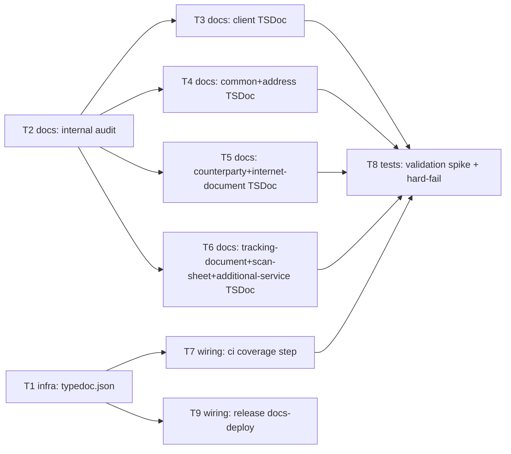

# Epic — documentation

> **Spec:** [spec.md](../spec.md) · **Design:** [sad.md](../sad.md) · **Data model:** [data-model.md](../data-model.md) (no schema change) · **ADRs:** [adr/](../adr/)

## Goal

Give consuming developers a generated, browsable reference for the library's complete public
surface, enforced complete by CI so it can never silently regress, and always in sync with the
latest published npm version (spec §2 Goals).

## Scope

- **In:** TSDoc comments across the core client + all 7 domain modules, a `typedoc.json` config,
  a documentation-coverage step added to `ci.yml`, a docs-deploy job added to `release.yml`
  (GitHub Pages, gated on a stable npm publish per ADR-0001).
- **Out (spec §3):** verifying TSDoc prose stays factually accurate over time; per-field
  documentation; archiving per-version docs; registering the new CI check as a required
  branch-protection status check (repo-admin follow-up); automated post-publish smoke check of
  the live Pages URL; automated GitHub-issue scanning for the §7 support-question KPI.

## Task map

## Tasks

See [tracker.md](./tracker.md) for status. Machine contract: [tasks.json](../tasks.json).

| # | Task | Layer | Blocked by | DoD (short) |
|---|---|---|---|---|
| T1 | Add `typedoc.json` + `typedoc` devDependency + `docs:build` script | infra | — | `npm run docs:build` produces a static site locally |
| T2 | Audit and mark all internal-only exports `@internal` | docs | — | full ~150-export scan complete; audited list recorded |
| T3 | TSDoc the core client (`src/client.ts`) | docs | T2 | every non-internal export in `client.ts` has a comment |
| T4 | TSDoc `common` + `address` modules | docs | T2 | every non-internal export in both modules has a comment |
| T5 | TSDoc `counterparty` + `internet-document` modules | docs | T2 | every non-internal export in both modules has a comment |
| T6 | TSDoc `tracking-document` + `scan-sheet` + `additional-service` modules | docs | T2 | every non-internal export in all three modules has a comment |
| T7 | Add documentation-coverage step to `ci.yml`, report-only | wiring | T1 | step runs on every PR, does not yet fail the build |
| T8 | Run the validation spike, then flip to hard-fail | tests | T3, T4, T5, T6, T7 | 0 missing reported; a temporarily-added undocumented export fails CI naming exactly that symbol; hard-fail rule enabled |
| T9 | Add docs-deploy job to `release.yml` (GitHub Pages, gated on ADR-0001) | wiring | T1 | a stable npm publish deploys the site within the isolation ADR-0001 describes |

## Risks / Hard rules

- No new long-lived credential (spec §6.1) — T9's docs-deploy job must use only the short-lived
  Pages OIDC token (`id-token: write`), never a stored PAT.
- A docs-deploy failure must never block, delay, or undo the already-completed npm publish
  (AC-05, ADR-0001) — T9 must preserve the job-level isolation ADR-0001 specifies.
- Per-field documentation is explicitly out of scope (spec §3 / §1 ¶4 override) — T3–T6 write
  type/function/parameter/return-level comments only, never a comment per field.
- The CI hard-fail rule must not be enabled before the report-only spike (T8's first half) confirms
  zero false positives (AC-06) — do not skip straight to hard-fail.
