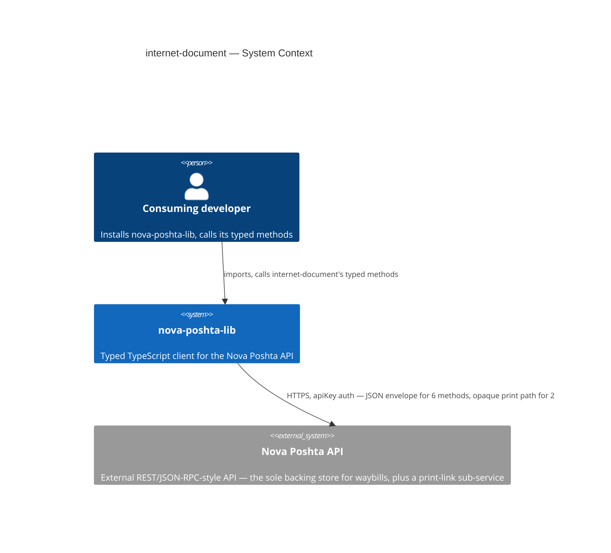
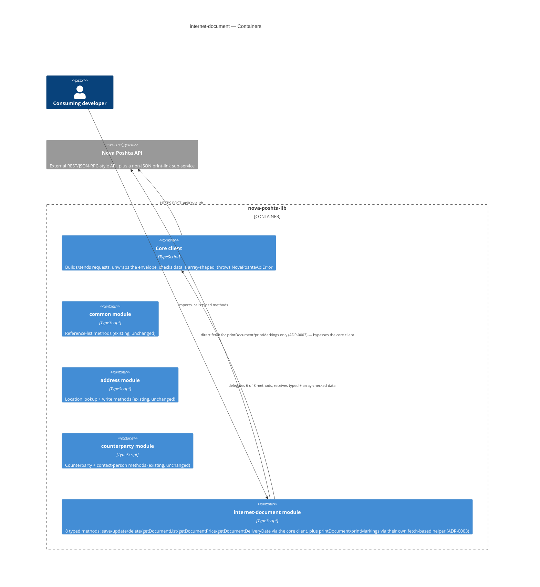
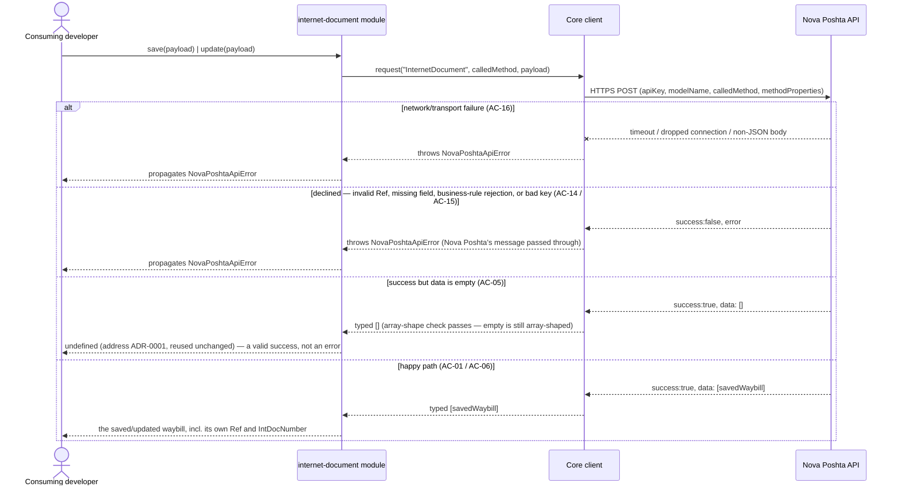
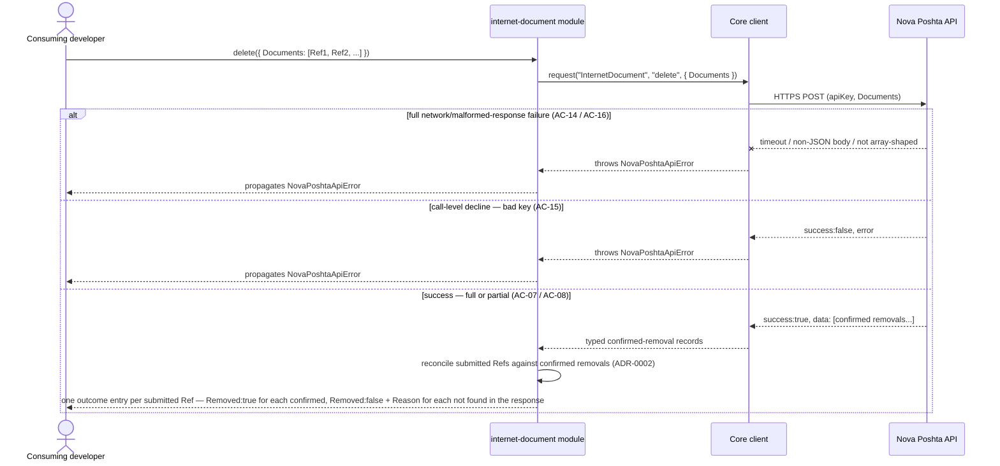
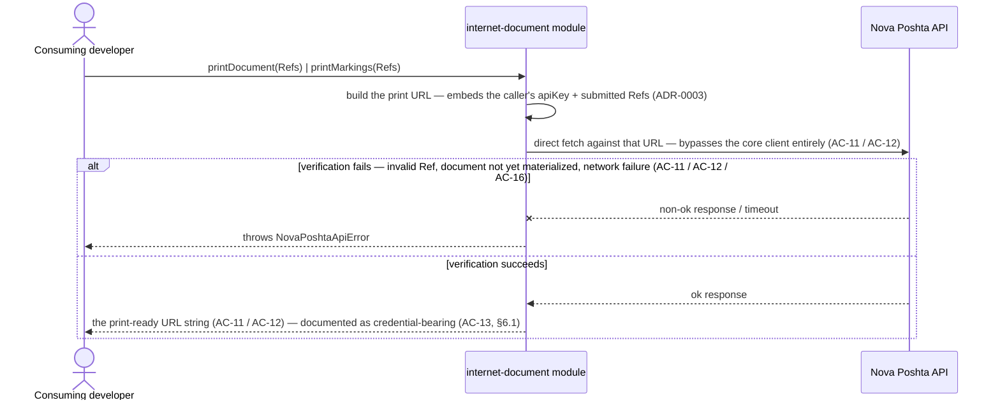

# Software Architecture Document — internet-document

<!-- 12 Arc42 sections. Empty section → <!-- N/A: <one-line reason> -->. -->
<!-- C4 Context (L1) lives inline in §3. C4 Container (L2) lives inline in §5. -->
<!-- Numbers in §10 come VERBATIM from spec.md §6 NFR — no inventing, no rounding. -->

## 1. Introduction and goals

**Intent.** `internet-document` gives every consuming developer typed, discoverable access to all 8
documented InternetDocument methods — waybill creation (`save`), full-replace `update`, single/batch
`delete`, filterable `getDocumentList`, the two pre-creation calculators (`getDocumentPrice`,
`getDocumentDeliveryDate`), and the two print-link methods (`printDocument`, `printMarkings`) — so a
developer who has already resolved a sender Ref, a recipient Ref, and a location Ref through
`counterparty`/`address` never has to hand-roll an untyped shipment-creation call (`spec.md` §2). It
makes `internet-document` the authoritative, typed source of waybill `Ref`/`IntDocNumber` values that
the roadmap's next two modules (`scan-sheet`, `additional-service`) will depend on, mirroring the role
`address` and `counterparty` already play for their own Refs — and it is the first module in the
library whose write payload must stay a discriminated union across **two** independent axes
(`ServiceType` × `CargoType`, up to 16 combinations) rather than `counterparty`'s single axis
(`CounterpartyType`, 3 variants).

**Top-3 quality goals (1-liners; full scenarios in §10):**

1. Type-safety — all 8 in-scope methods fully typed, zero `any` in public signatures, and the
   `save`/`update` payload fails to compile if any field required by the chosen delivery-method/
   cargo-type combination is missing, or if the payload mixes fields belonging to a different
   combination (AC-02).
2. Error-contract correctness — every declined, malformed, or network-failed call throws the same
   `NovaPoshtaApiError`, including the batch-delete case where some waybills in the same call succeed
   and others are rejected — that case is represented per-Ref, never collapsed into one boolean
   (AC-07, AC-08).
3. Print-link safety — the print methods are modeled as their own typed code path, distinct from every
   other method in this library, never routed through the shared envelope-unwrap; and the security
   risk of the credential-bearing link they return is documented explicitly, not left for a developer
   to discover at runtime (AC-11, AC-12, AC-13, §6.1).

**Stakeholders.**

| Role | Interest | Sign-off owner? |
|---|---|---|
| Consuming developer | Calls the 8 typed methods to create, price, schedule, update, delete, list, and print waybills | No |
| Tech Lead | SAD approval; owns the `spec.md` §8 open questions this design pass surfaces or inherits | Yes |
| Security Lead | Reviews the module before release — new money-bearing fields and a credential-bearing return value (the print link) neither `address` nor `counterparty` carried (`spec.md` §6.1) | Yes |

<!-- Decision overrides (¶4) — none raised during this design pass. -->

## 2. Constraints

**Technical.**
- TypeScript, Node.js ≥18 (native `fetch`, no HTTP client dependency)
- No framework — this is a library, not an application
- No datastore — `internet-document` is stateless; the Nova Poshta API is the sole backing store
- Architecture convention: one folder per Nova Poshta model (`src/modules/<domain>/`), dual ESM+CJS
  build via `tsup` (project-level ADR-0002)

**Organisational.**
- Effort budget: sized M per `.size` — bigger than `address`/`counterparty`'s S, driven mainly by the
  two-axis (`ServiceType` × `CargoType`) discriminated payload and the print sub-flow's distinct code
  path
- No hard deadline stated in `spec.md`
- Team: single maintainer (project owner)

**Conventions.**
- Convention file: `CLAUDE.md` + `docs/architecture-map.md`
- Error handling: a single `NovaPoshtaApiError`, no subclassing (project-level convention), reused
  unchanged for every one of the 8 methods, including the two print methods (per their own typed
  code path, §4/§5)
- `src/types/internet-document.ts` holds this feature's request/response interfaces, per the
  `src/types/<domain>.ts`-per-model convention `common`/`address`/`counterparty` already established

**Regulatory / external.**
- `spec.md` §6.1: data classification confidential — a step more sensitive than `counterparty`'s
  identity data: `internet-document` is the first module carrying money fields (`Cost`,
  cash-on-delivery/backward-delivery amounts) and the first returning a value (the print link) that
  itself carries live account credentials, per the community-SDK cross-check (unconfirmed against the
  live/official docs, `spec.md` §8 OQ-1). Security review required before release — tracked as an open
  risk in §11, not performed in this design session.
- AuthZ/AuthN: none beyond the existing single-API-key model; `internet-document` introduces no new
  permission tiers of its own (`spec.md` §6.1).

## 3. Context and scope

`internet-document` gives a consuming developer typed access to Nova Poshta's InternetDocument
domain — creating, pricing, scheduling, updating, deleting, listing, and printing their own waybills —
so they can register and manage shipments without hardcoding request shapes or guessing response
shapes. It ships inside the existing `nova-poshta-lib` npm package, alongside the shared core client
and the already-shipped `common`, `address`, and `counterparty` modules.

<!-- brownfield: read directly (src/client.ts, src/index.ts, src/modules/common/index.ts,
     src/modules/address/index.ts, src/modules/counterparty/index.ts, src/types/common.ts,
     src/types/counterparty.ts, src/types/envelope.ts — trivial codebase size, no Explore subagent
     needed). docs/architecture-map.md (reflects_commit 94201ac) is stale — both address and
     counterparty have shipped in full since, and the map still says "no code exists yet" — but its
     target conventions match what's actually on disk: no drift found in the conventions that matter
     to this feature (module wiring, dual-build, error handling, the `Required<Omit<>>` full-replace
     idiom, the per-variant discriminated-union idiom `counterparty` ADR-0001 introduced). Both
     `address`'s and `counterparty`'s own `sad.md` §3/§4 served as the closer, current precedent. -->

**External systems (in / out):**

| Actor or system | Type | Interaction |
|---|---|---|
| Consuming developer | Person | Installs `nova-poshta-lib`, calls `internet-document`'s typed methods |
| Nova Poshta API | System (external) | HTTPS, `apiKey` auth — the sole backing store for a developer's waybills; the JSON envelope for 6 methods, plus a distinct non-JSON print path for `printDocument`/`printMarkings` (§4/§5) |

**C4 Context (L1):**



*Identical in shape to `common`'s, `address`'s, and `counterparty`'s: the consuming developer talks
only to `nova-poshta-lib`, and the library itself is the only thing that talks to the external Nova
Poshta API. No new external system — `internet-document`'s calls land on the same single external
API, just a different `modelName` (`InternetDocument`), with one wrinkle none of the earlier modules
had: 2 of its 8 methods (the print methods) don't get a JSON envelope back at all (§4 decision, §5).*

## 4. Solution strategy

**Top strategic choices (the seeds for ADRs):**

1. **Target surface: `library-sdk`.** Same single-surface shape `common`, `address`, and
   `counterparty` already established and the only fit for this repo (no server, no UI). Written to
   this document's frontmatter (`target_surfaces: ["library-sdk"]`); §5 draws one container for it,
   alongside the already-shipped `common`, `address`, and `counterparty` modules.
2. **Synchronous, direct calls into the existing core client — unchanged, for the 6 JSON-enveloped
   methods.** `save`, `update`, `delete`, `getDocumentList`, `getDocumentPrice`, and
   `getDocumentDeliveryDate` call `NovaPoshtaClient.request()` directly, exactly like `common`/
   `address`/`counterparty`. No client-level change.
3. **Stateless — no persistence, no caching.** Per the non-goal fixed in `spec.md` §3: a price or
   delivery-date estimate is never linked to a later `save` call; a developer who needs a fresh number
   must request it again immediately before saving.
4. **Inherit `common`'s array-shape check unchanged, for the 6 JSON-enveloped methods.** The check
   already tolerates an empty array on success — exactly what AC-05's "success but empty data" case
   needs for `save`/`update`.
5. **Write-return shape for `save`/`update`: `T | undefined`, reusing `address`'s already-Accepted
   ADR-0001 unchanged.** Both resolve `undefined` when Nova Poshta reports success with an empty
   result (AC-05) — the identical case `address`/`counterparty` already solved; no new ADR needed here.
6. **`getDocumentList` pagination stays a known limitation, inherited unchanged from `address`/
   `counterparty`.** Every documented parameter, including any date-range/pagination field, stays
   optional at the type level; no client-side page-walking, no injected default (AC-09, matching
   `spec.md` §8 OQ-2's carried-forward default).
7. **`save`/`update` payload: two independent hand-written type-sets (`ServiceType` × `CargoType`)
   composed by TypeScript into all valid combinations — ADR-0001.** 4 hand-written `ServiceType`
   variants (each requiring the location fields its leg needs) and ~4–5 hand-written `CargoType`
   variants (each requiring its own cargo-detail fields) are written once each, then intersected so
   TypeScript itself produces every valid delivery-method/cargo-type combination — never 16 fully
   duplicated interfaces, and never one generic distributive-conditional formula (the style
   `counterparty` ADR-0001 already rejected, at a much smaller scale, for readability). Closes
   `spec.md` §8 OQ-3. See ADR-0001.
8. **`delete`'s result: a hand-built per-Ref outcome array, cross-checked defensively against the
   submitted Refs — ADR-0002.** Every `delete` call, single-Ref or batch, returns one outcome entry
   per submitted Ref (`Ref`, `Removed`, an optional rejection `Reason`) — reconciled by this module
   against whichever Refs Nova Poshta's own response actually confirms removed, so a Ref silently
   missing from that response still surfaces as "not removed" rather than vanishing (AC-07, AC-08).
   This is a deliberate, spec-mandated break from the `T | undefined` shape every other write method in
   this library uses (`spec.md` §8 OQ-4's own stated default: "build defensively"). See ADR-0002.
9. **Print methods (`printDocument`/`printMarkings`): construct the link, then verify it with one real
   network check, entirely inside this module — ADR-0003.** Both methods build the print URL per Nova
   Poshta's documented pattern (embedding the caller's own `apiKey` and the submitted Refs), then issue
   one HTTP check against that exact URL — never through `NovaPoshtaClient.request()`'s JSON-envelope
   unwrap (§1 decision override) — so an invalid Ref or an unmaterialized document surfaces as
   `NovaPoshtaApiError` at call time (AC-11, AC-12), not as a broken page discovered later. Implemented
   entirely within this module's own files, per `spec.md` §3's non-goal against changing the shared
   core client. The exact wire shape remains unconfirmed against Nova Poshta's official docs
   (`spec.md` §8 OQ-1) — flagged in §11. See ADR-0003.

Each tactical decision in later sections traces to one of these nine. Decisions 7, 8, and 9 are the
three genuinely new problems this module solves that neither `address` nor `counterparty` faced: a
two-axis discriminant (vs. `counterparty`'s one-axis ADR-0001), a batch result that can legitimately be
half-successful, and a return value that isn't JSON data at all.

## 5. Building block view

Layered per the existing modular-domain convention (project-level ADR-0002): a thin
`internet-document` domain module sits on top of the shared core client, exactly like `common`,
`address`, and `counterparty` — with one addition none of the earlier modules needed: an internal
print-link helper that calls native `fetch` directly (§4 decision 9, ADR-0003), bypassing the shared
client entirely for just those 2 of 8 methods.

**Internal decomposition:**

```
src/
├── client.ts                     # core: request(), NovaPoshtaApiError — unchanged by this feature
├── modules/
│   ├── common/                   # existing — unchanged
│   ├── address/                  # existing — unchanged
│   ├── counterparty/             # existing — unchanged
│   └── internet-document/
│       └── index.ts               # NEW — factory: createInternetDocumentModule(client) → 8 typed
│                                   #   methods. 6 delegate to client.request() (save, update, delete,
│                                   #   getDocumentList, getDocumentPrice, getDocumentDeliveryDate);
│                                   #   printDocument/printMarkings call a private, module-local
│                                   #   buildAndVerifyPrintLink() helper that uses fetch directly
│                                   #   (ADR-0003) — never client.request()
├── types/
│   ├── envelope.ts                 # existing — shared envelope/request types
│   ├── common.ts                   # existing
│   ├── address.ts                  # existing
│   ├── counterparty.ts             # existing
│   └── internet-document.ts        # NEW — ServiceType/CargoType literal types + the intersected
│                                    #   Save/Update payload union (ADR-0001), the per-Ref delete
│                                    #   outcome type (ADR-0002), list/price/delivery-date/print
│                                    #   request+response interfaces
└── index.ts                       # public re-exports (client + common + address + counterparty +
                                    #   internet-document + types)
```

`tsup`'s existing dual ESM+CJS build (project-level ADR-0002) already emits matching `.d.ts`/`.d.cts`
declarations for whatever `src/index.ts` re-exports — no new build step is needed to satisfy AC-19
(every method discoverable via autocomplete in both published formats); `tasks`/`plan-tests` verify
the *published* output, not just the source, exactly as the three existing modules already do.

**C4 Container (L2):**



*The Containers view draws the one declared surface (`library-sdk`, the whole `nova-poshta-lib`
package) as a boundary holding five pieces: the existing core client and the three existing modules
(all unchanged by this feature), and the new `internet-document` module. `internet-document` is the
first module with two distinct relationships to the outside world: it delegates 6 of its 8 methods to
the shared core client exactly like every earlier module, but its 2 print methods talk to Nova Poshta
directly via their own `fetch` call (ADR-0003), entirely inside this module's own files — the shared
core client stays untouched (§2, §4 decision 9, `spec.md` §3 non-goal). `internet-document` does not
call `address` or `counterparty` at runtime — a Ref from either is only ever a plain string input,
never a live cross-module call (AC-18, §8).*

## 6. Runtime view

**Critical flow 1: save or update a waybill — happy path + every error branch**



**Critical flow 2: batch delete — per-Ref outcome reconciliation**



**Critical flow 3: print-ready link — construct, then verify**



*Flow 1 covers `save`/`update` (AC-01, AC-05, AC-06) — the discriminated payload guard (AC-02) is a
compile-time concern, not a runtime branch (§4 decision 7, `src/types/internet-document.ts`). Flow 2
covers `delete`'s batch-capable, per-Ref-reconciled result (AC-07, AC-08, ADR-0002) — the one flow in
this module whose shape has no equivalent in `address`/`counterparty`. Flow 3 covers `printDocument`/
`printMarkings` (AC-11, AC-12, AC-13, ADR-0003) — the only flow in this entire library that never
touches the shared core client. `getDocumentList`/`getDocumentPrice`/`getDocumentDeliveryDate`
(AC-03, AC-04, AC-09, AC-10) share Flow 1's exact shape (a read/calculation instead of a write) and are
not redrawn separately — the `sequences` stage covers every §5 AC individually; this design pass seeds
the three structurally distinct shapes.*

## 7. Deployment view

<!-- pending -->

## 8. Crosscutting concepts

<!-- pending -->

## 9. Architecture decisions

<!-- pending -->

## 10. Quality requirements

<!-- pending -->

## 11. Risks and technical debt

<!-- pending -->

## 12. Glossary

<!-- pending -->
