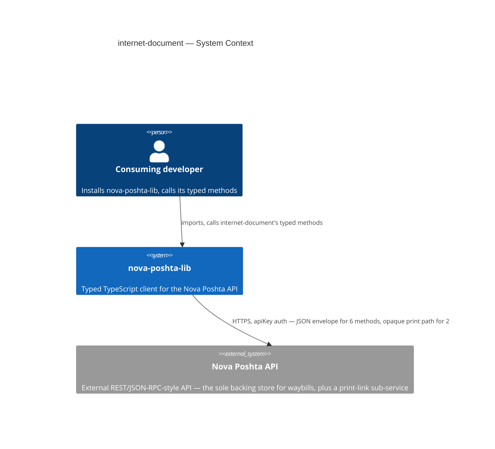

# Software Architecture Document — internet-document

<!-- 12 Arc42 sections. Empty section → <!-- N/A: <one-line reason> -->. -->
<!-- C4 Context (L1) lives inline in §3. C4 Container (L2) lives inline in §5. -->
<!-- Numbers in §10 come VERBATIM from spec.md §6 NFR — no inventing, no rounding. -->

## 1. Introduction and goals

**Intent.** `internet-document` gives every consuming developer typed, discoverable access to all 8
documented InternetDocument methods — waybill creation (`save`), full-replace `update`, single/batch
`delete`, filterable `getDocumentList`, the two pre-creation calculators (`getDocumentPrice`,
`getDocumentDeliveryDate`), and the two print-link methods (`printDocument`, `printMarkings`) — so a
developer who has already resolved a sender Ref, a recipient Ref, and a location Ref through
`counterparty`/`address` never has to hand-roll an untyped shipment-creation call (`spec.md` §2). It
makes `internet-document` the authoritative, typed source of waybill `Ref`/`IntDocNumber` values that
the roadmap's next two modules (`scan-sheet`, `additional-service`) will depend on, mirroring the role
`address` and `counterparty` already play for their own Refs — and it is the first module in the
library whose write payload must stay a discriminated union across **two** independent axes
(`ServiceType` × `CargoType`, up to 16 combinations) rather than `counterparty`'s single axis
(`CounterpartyType`, 3 variants).

**Top-3 quality goals (1-liners; full scenarios in §10):**

1. Type-safety — all 8 in-scope methods fully typed, zero `any` in public signatures, and the
   `save`/`update` payload fails to compile if any field required by the chosen delivery-method/
   cargo-type combination is missing, or if the payload mixes fields belonging to a different
   combination (AC-02).
2. Error-contract correctness — every declined, malformed, or network-failed call throws the same
   `NovaPoshtaApiError`, including the batch-delete case where some waybills in the same call succeed
   and others are rejected — that case is represented per-Ref, never collapsed into one boolean
   (AC-07, AC-08).
3. Print-link safety — the print methods are modeled as their own typed code path, distinct from every
   other method in this library, never routed through the shared envelope-unwrap; and the security
   risk of the credential-bearing link they return is documented explicitly, not left for a developer
   to discover at runtime (AC-11, AC-12, AC-13, §6.1).

**Stakeholders.**

| Role | Interest | Sign-off owner? |
|---|---|---|
| Consuming developer | Calls the 8 typed methods to create, price, schedule, update, delete, list, and print waybills | No |
| Tech Lead | SAD approval; owns the `spec.md` §8 open questions this design pass surfaces or inherits | Yes |
| Security Lead | Reviews the module before release — new money-bearing fields and a credential-bearing return value (the print link) neither `address` nor `counterparty` carried (`spec.md` §6.1) | Yes |

<!-- Decision overrides (¶4) — none raised during this design pass. -->

## 2. Constraints

**Technical.**
- TypeScript, Node.js ≥18 (native `fetch`, no HTTP client dependency)
- No framework — this is a library, not an application
- No datastore — `internet-document` is stateless; the Nova Poshta API is the sole backing store
- Architecture convention: one folder per Nova Poshta model (`src/modules/<domain>/`), dual ESM+CJS
  build via `tsup` (project-level ADR-0002)

**Organisational.**
- Effort budget: sized M per `.size` — bigger than `address`/`counterparty`'s S, driven mainly by the
  two-axis (`ServiceType` × `CargoType`) discriminated payload and the print sub-flow's distinct code
  path
- No hard deadline stated in `spec.md`
- Team: single maintainer (project owner)

**Conventions.**
- Convention file: `CLAUDE.md` + `docs/architecture-map.md`
- Error handling: a single `NovaPoshtaApiError`, no subclassing (project-level convention), reused
  unchanged for every one of the 8 methods, including the two print methods (per their own typed
  code path, §4/§5)
- `src/types/internet-document.ts` holds this feature's request/response interfaces, per the
  `src/types/<domain>.ts`-per-model convention `common`/`address`/`counterparty` already established

**Regulatory / external.**
- `spec.md` §6.1: data classification confidential — a step more sensitive than `counterparty`'s
  identity data: `internet-document` is the first module carrying money fields (`Cost`,
  cash-on-delivery/backward-delivery amounts) and the first returning a value (the print link) that
  itself carries live account credentials, per the community-SDK cross-check (unconfirmed against the
  live/official docs, `spec.md` §8 OQ-1). Security review required before release — tracked as an open
  risk in §11, not performed in this design session.
- AuthZ/AuthN: none beyond the existing single-API-key model; `internet-document` introduces no new
  permission tiers of its own (`spec.md` §6.1).

## 3. Context and scope

`internet-document` gives a consuming developer typed access to Nova Poshta's InternetDocument
domain — creating, pricing, scheduling, updating, deleting, listing, and printing their own waybills —
so they can register and manage shipments without hardcoding request shapes or guessing response
shapes. It ships inside the existing `nova-poshta-lib` npm package, alongside the shared core client
and the already-shipped `common`, `address`, and `counterparty` modules.

<!-- brownfield: read directly (src/client.ts, src/index.ts, src/modules/common/index.ts,
     src/modules/address/index.ts, src/modules/counterparty/index.ts, src/types/common.ts,
     src/types/counterparty.ts, src/types/envelope.ts — trivial codebase size, no Explore subagent
     needed). docs/architecture-map.md (reflects_commit 94201ac) is stale — both address and
     counterparty have shipped in full since, and the map still says "no code exists yet" — but its
     target conventions match what's actually on disk: no drift found in the conventions that matter
     to this feature (module wiring, dual-build, error handling, the `Required<Omit<>>` full-replace
     idiom, the per-variant discriminated-union idiom `counterparty` ADR-0001 introduced). Both
     `address`'s and `counterparty`'s own `sad.md` §3/§4 served as the closer, current precedent. -->

**External systems (in / out):**

| Actor or system | Type | Interaction |
|---|---|---|
| Consuming developer | Person | Installs `nova-poshta-lib`, calls `internet-document`'s typed methods |
| Nova Poshta API | System (external) | HTTPS, `apiKey` auth — the sole backing store for a developer's waybills; the JSON envelope for 6 methods, plus a distinct non-JSON print path for `printDocument`/`printMarkings` (§4/§5) |

**C4 Context (L1):**

*Identical in shape to `common`'s, `address`'s, and `counterparty`'s: the consuming developer talks
only to `nova-poshta-lib`, and the library itself is the only thing that talks to the external Nova
Poshta API. No new external system — `internet-document`'s calls land on the same single external
API, just a different `modelName` (`InternetDocument`), with one wrinkle none of the earlier modules
had: 2 of its 8 methods (the print methods) don't get a JSON envelope back at all (§4 decision, §5).*

## 4. Solution strategy

<!-- pending -->

## 5. Building block view

<!-- pending -->

## 6. Runtime view

<!-- pending -->

## 7. Deployment view

<!-- pending -->

## 8. Crosscutting concepts

<!-- pending -->

## 9. Architecture decisions

<!-- pending -->

## 10. Quality requirements

<!-- pending -->

## 11. Risks and technical debt

<!-- pending -->

## 12. Glossary

<!-- pending -->
