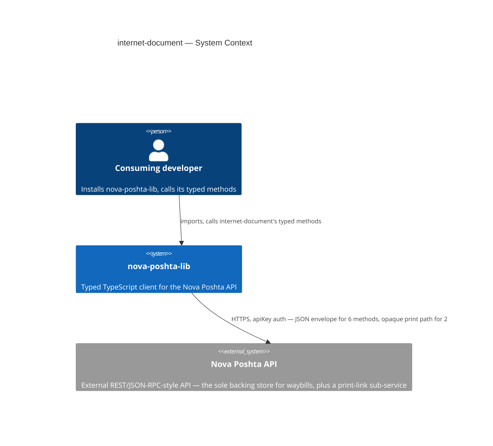
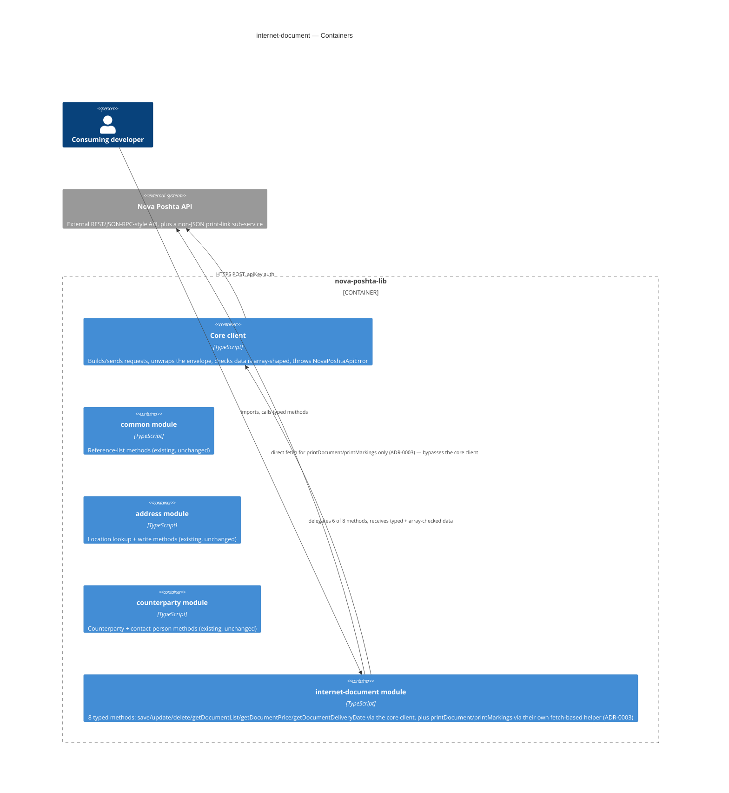
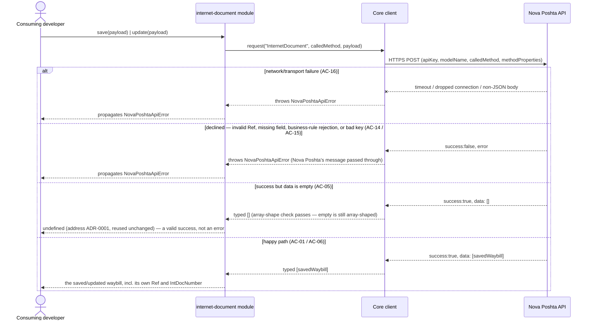
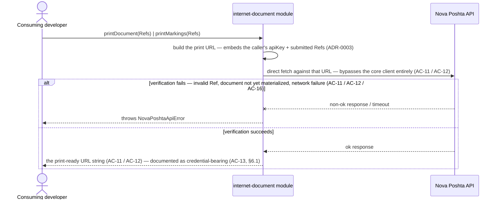
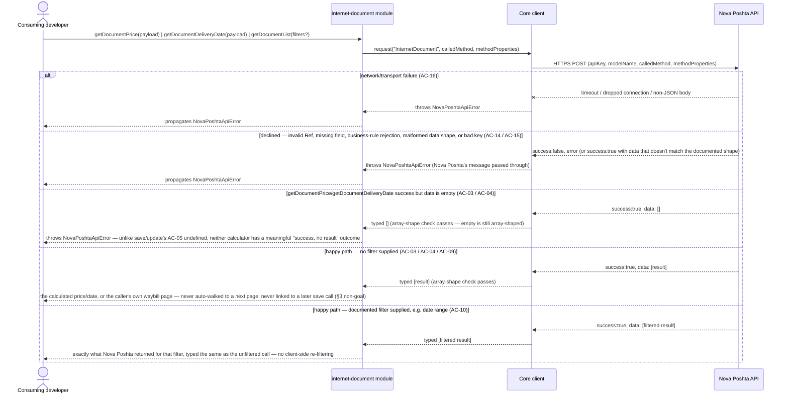

# Software Architecture Document — internet-document

<!-- 12 Arc42 sections. Empty section → <!-- N/A: <one-line reason> -->. -->
<!-- C4 Context (L1) lives inline in §3. C4 Container (L2) lives inline in §5. -->
<!-- Numbers in §10 come VERBATIM from spec.md §6 NFR — no inventing, no rounding. -->

## 1. Introduction and goals

**Intent.** `internet-document` gives every consuming developer typed, discoverable access to all 8
documented InternetDocument methods — waybill creation (`save`), full-replace `update`, single/batch
`delete`, filterable `getDocumentList`, the two pre-creation calculators (`getDocumentPrice`,
`getDocumentDeliveryDate`), and the two print-link methods (`printDocument`, `printMarkings`) — so a
developer who has already resolved a sender Ref, a recipient Ref, and a location Ref through
`counterparty`/`address` never has to hand-roll an untyped shipment-creation call (`spec.md` §2). It
makes `internet-document` the authoritative, typed source of waybill `Ref`/`IntDocNumber` values that
the roadmap's next two modules (`scan-sheet`, `additional-service`) will depend on, mirroring the role
`address` and `counterparty` already play for their own Refs — and it is the first module in the
library whose write payload must stay a discriminated union across the `ServiceType` axis (4 delivery
legs), one axis wider in variant count than `counterparty`'s single-axis `CounterpartyType` (3
variants). `CargoType` was originally scoped as a second, independent axis (up to 16 combinations);
ADR-0004 narrowed it to a plain discriminant field after implementation found no cross-checked source
confirming Nova Poshta's wire format varies required fields by cargo type — see §4 decision 7.

**Top-3 quality goals (1-liners; full scenarios in §10):**

1. Type-safety — all 8 in-scope methods fully typed, zero `any` in public signatures, and the
   `save`/`update` payload fails to compile if any field required by the chosen delivery-method leg
   is missing, or if the payload mixes location fields belonging to a different leg (AC-02);
   `CargoType` is a plain discriminant field, not part of this structural guard (ADR-0004).
2. Error-contract correctness — every declined, malformed, or network-failed call throws the same
   `NovaPoshtaApiError`, including the batch-delete case where some waybills in the same call succeed
   and others are rejected — that case is represented per-Ref, never collapsed into one boolean
   (AC-07, AC-08).
3. Print-link safety — the print methods are modeled as their own typed code path, distinct from every
   other method in this library, never routed through the shared envelope-unwrap; and the security
   risk of the credential-bearing link they return is documented explicitly, not left for a developer
   to discover at runtime (AC-11, AC-12, AC-13, §6.1).

**Stakeholders.**

| Role | Interest | Sign-off owner? |
|---|---|---|
| Consuming developer | Calls the 8 typed methods to create, price, schedule, update, delete, list, and print waybills | No |
| Tech Lead | SAD approval; owns the `spec.md` §8 open questions this design pass surfaces or inherits | Yes |
| Security Lead | Reviews the module before release — new money-bearing fields and a credential-bearing return value (the print link) neither `address` nor `counterparty` carried (`spec.md` §6.1) | Yes |

<!-- Decision overrides (¶4) — none raised during this design pass. -->

## 2. Constraints

**Technical.**
- TypeScript, Node.js ≥18 (native `fetch`, no HTTP client dependency)
- No framework — this is a library, not an application
- No datastore — `internet-document` is stateless; the Nova Poshta API is the sole backing store
- Architecture convention: one folder per Nova Poshta model (`src/modules/<domain>/`), dual ESM+CJS
  build via `tsup` (project-level ADR-0002)

**Organisational.**
- Effort budget: sized M per `.size` — bigger than `address`/`counterparty`'s S, driven mainly by the
  `ServiceType`-discriminated payload (originally scoped two-axis with `CargoType`, narrowed to one
  axis by ADR-0004) and the print sub-flow's distinct code path
- No hard deadline stated in `spec.md`
- Team: single maintainer (project owner)

**Conventions.**
- Convention file: `CLAUDE.md` + `docs/architecture-map.md`
- Error handling: a single `NovaPoshtaApiError`, no subclassing (project-level convention), reused
  unchanged for every one of the 8 methods, including the two print methods (per their own typed
  code path, §4/§5)
- `src/types/internet-document.ts` holds this feature's request/response interfaces, per the
  `src/types/<domain>.ts`-per-model convention `common`/`address`/`counterparty` already established

**Regulatory / external.**
- `spec.md` §6.1: data classification confidential — a step more sensitive than `counterparty`'s
  identity data: `internet-document` is the first module carrying money fields (`Cost`,
  cash-on-delivery/backward-delivery amounts) and the first returning a value (the print link) that
  itself carries live account credentials, per the community-SDK cross-check (unconfirmed against the
  live/official docs, `spec.md` §8 OQ-1). Security review required before release — tracked as an open
  risk in §11, not performed in this design session.
- AuthZ/AuthN: none beyond the existing single-API-key model; `internet-document` introduces no new
  permission tiers of its own (`spec.md` §6.1).

## 3. Context and scope

`internet-document` gives a consuming developer typed access to Nova Poshta's InternetDocument
domain — creating, pricing, scheduling, updating, deleting, listing, and printing their own waybills —
so they can register and manage shipments without hardcoding request shapes or guessing response
shapes. It ships inside the existing `nova-poshta-lib` npm package, alongside the shared core client
and the already-shipped `common`, `address`, and `counterparty` modules.

<!-- brownfield: read directly (src/client.ts, src/index.ts, src/modules/common/index.ts,
     src/modules/address/index.ts, src/modules/counterparty/index.ts, src/types/common.ts,
     src/types/counterparty.ts, src/types/envelope.ts — trivial codebase size, no Explore subagent
     needed). docs/architecture-map.md (reflects_commit 94201ac) is stale — both address and
     counterparty have shipped in full since, and the map still says "no code exists yet" — but its
     target conventions match what's actually on disk: no drift found in the conventions that matter
     to this feature (module wiring, dual-build, error handling, the `Required<Omit<>>` full-replace
     idiom, the per-variant discriminated-union idiom `counterparty` ADR-0001 introduced). Both
     `address`'s and `counterparty`'s own `sad.md` §3/§4 served as the closer, current precedent. -->

**External systems (in / out):**

| Actor or system | Type | Interaction |
|---|---|---|
| Consuming developer | Person | Installs `nova-poshta-lib`, calls `internet-document`'s typed methods |
| Nova Poshta API | System (external) | HTTPS, `apiKey` auth — the sole backing store for a developer's waybills; the JSON envelope for 6 methods, plus a distinct non-JSON print path for `printDocument`/`printMarkings` (§4/§5) |

**C4 Context (L1):**



*Identical in shape to `common`'s, `address`'s, and `counterparty`'s: the consuming developer talks
only to `nova-poshta-lib`, and the library itself is the only thing that talks to the external Nova
Poshta API. No new external system — `internet-document`'s calls land on the same single external
API, just a different `modelName` (`InternetDocument`), with one wrinkle none of the earlier modules
had: 2 of its 8 methods (the print methods) don't get a JSON envelope back at all (§4 decision, §5).*

## 4. Solution strategy

**Top strategic choices (the seeds for ADRs):**

1. **Target surface: `library-sdk`.** Same single-surface shape `common`, `address`, and
   `counterparty` already established and the only fit for this repo (no server, no UI). Written to
   this document's frontmatter (`target_surfaces: ["library-sdk"]`); §5 draws one container for it,
   alongside the already-shipped `common`, `address`, and `counterparty` modules.
2. **Synchronous, direct calls into the existing core client, for the 6 JSON-enveloped methods.**
   `save`, `update`, `getDocumentList`, `getDocumentPrice`, and `getDocumentDeliveryDate` call
   `NovaPoshtaClient.request()` directly, exactly like `common`/`address`/`counterparty`. `delete`
   also calls the core client directly, but through a second, narrower entry point —
   `requestEnvelope()` — added to `client.ts` during review remediation; see decision 8's amendment
   and ADR-0002's update.
3. **Stateless — no persistence, no caching.** Per the non-goal fixed in `spec.md` §3: a price or
   delivery-date estimate is never linked to a later `save` call; a developer who needs a fresh number
   must request it again immediately before saving.
4. **Inherit `common`'s array-shape check unchanged, for the 6 JSON-enveloped methods.** The check
   already tolerates an empty array on success — exactly what AC-05's "success but empty data" case
   needs for `save`/`update`.
5. **Write-return shape for `save`/`update`: `T | undefined`, reusing `address`'s already-Accepted
   ADR-0001 unchanged.** Both resolve `undefined` when Nova Poshta reports success with an empty
   result (AC-05) — the identical case `address`/`counterparty` already solved; no new ADR needed here.
6. **`getDocumentList` pagination stays a known limitation, inherited unchanged from `address`/
   `counterparty`.** Every documented parameter, including any date-range/pagination field, stays
   optional at the type level; no client-side page-walking, no injected default (AC-09, matching
   `spec.md` §8 OQ-2's carried-forward default).
7. **`save`/`update` payload: 4 hand-written `ServiceType` variants, one per delivery-method leg,
   each requiring the sender-leg and recipient-leg location fields that leg needs — ADR-0001, as
   narrowed by ADR-0004.** ADR-0001 originally scoped this as two independent axes (`ServiceType` ×
   `CargoType`, up to 16 combinations); implementation found no cross-checked source confirming Nova
   Poshta's wire format varies required fields by cargo type, so ADR-0004 (Accepted, superseding
   ADR-0001's cargo axis) narrowed `CargoType` to one plain discriminant field, identical across every
   variant. The 4 `ServiceType` variants are still written once each and unioned — never one generic
   distributive-conditional formula (the style `counterparty` ADR-0001 already rejected, at a much
   smaller scale, for readability). Closes `spec.md` §8 OQ-3. See ADR-0001, ADR-0004.
8. **`delete`'s result: a hand-built per-Ref outcome array, cross-checked defensively against the
   submitted Refs — ADR-0002.** Every `delete` call, single-Ref or batch, returns one outcome entry
   per submitted Ref (`Ref`, `Removed`, an optional rejection `Reason`) — reconciled by this module
   against whichever Refs Nova Poshta's own response actually confirms removed, so a Ref silently
   missing from that response still surfaces as "not removed" rather than vanishing (AC-07, AC-08).
   This is a deliberate, spec-mandated break from the `T | undefined` shape every other write method in
   this library uses (`spec.md` §8 OQ-5's own stated default: "build defensively"). **Amendment
   (review remediation, 2026-09-21):** a rejected Ref's `Reason` must carry Nova Poshta's own
   explanation, not a hardcoded placeholder (AC-08) — but the confirmed-removed response shape
   `request()` returns carries no per-item reason. `client.ts` gained a second entry point,
   `requestEnvelope()`, returning the full success-path envelope (`data`/`errors`/`warnings`)
   instead of just `data`, so `delete` can read Nova Poshta's own warning/error text. This is a
   narrow, additive change to the shared core client — the first this feature makes — recorded
   against `spec.md` §3's non-goal and §8 OQ-2, both of which previously said the client stays
   unchanged; see ADR-0002.
9. **Print methods (`printDocument`/`printMarkings`): construct the link, then verify it with one real
   network check, entirely inside this module — ADR-0003.** Both methods build the print URL per Nova
   Poshta's documented pattern (embedding the caller's own `apiKey` and the submitted Refs), then issue
   one HTTP check against that exact URL — never through `NovaPoshtaClient.request()`'s JSON-envelope
   unwrap (`spec.md` §1 decision override) — so an invalid Ref or an unmaterialized document surfaces as
   `NovaPoshtaApiError` at call time (AC-11, AC-12), not as a broken page discovered later. Implemented
   entirely within this module's own files, per `spec.md` §3's non-goal against changing the shared
   core client. The exact wire shape remains unconfirmed against Nova Poshta's official docs
   (`spec.md` §8 OQ-1) — flagged in §11. See ADR-0003.

Each tactical decision in later sections traces to one of these nine. Decisions 7, 8, and 9 are the
three genuinely new problems this module solves that neither `address` nor `counterparty` faced: a
`ServiceType`-discriminated payload with an independent leg-consistency guard on each side (still a
single structural axis, like `counterparty`'s ADR-0001 — `CargoType` is a plain field, not a second
axis; narrowed by ADR-0004, superseding this decision's original two-axis design), a batch result that
can legitimately be half-successful, and a return value that isn't JSON data at all.

## 5. Building block view

Layered per the existing modular-domain convention (project-level ADR-0002): a thin
`internet-document` domain module sits on top of the shared core client, exactly like `common`,
`address`, and `counterparty` — with one addition none of the earlier modules needed: an internal
print-link helper that calls native `fetch` directly (§4 decision 9, ADR-0003), bypassing the shared
client entirely for just those 2 of 8 methods.

**Internal decomposition:**

```
src/
├── client.ts                     # core: request(), requestEnvelope() (NEW — added for delete's
                                   #   AC-08 remediation, §4 decision 8 amendment), NovaPoshtaApiError
├── modules/
│   ├── common/                   # existing — unchanged
│   ├── address/                  # existing — unchanged
│   ├── counterparty/             # existing — unchanged
│   └── internet-document/
│       └── index.ts               # NEW — factory: createInternetDocumentModule(client) → 8 typed
│                                   #   methods. 5 delegate to client.request() (save, update,
│                                   #   getDocumentList, getDocumentPrice, getDocumentDeliveryDate);
│                                   #   delete delegates to client.requestEnvelope() instead, to read
│                                   #   Nova Poshta's success-path warnings/errors for AC-08's rejected-
│                                   #   Ref reason (review 2026-09-21 finding 4, §4 decision 8 amendment);
│                                   #   printDocument/printMarkings call a private, module-local
│                                   #   buildAndVerifyPrintLink() helper that uses fetch directly
│                                   #   (ADR-0003) — never client.request()/requestEnvelope()
├── types/
│   ├── envelope.ts                 # existing — shared envelope/request types
│   ├── common.ts                   # existing
│   ├── address.ts                  # existing
│   ├── counterparty.ts             # existing
│   └── internet-document.ts        # NEW — ServiceType/CargoType literal types + the ServiceType-
│                                    #   discriminated Save/Update payload union, narrowed to a single
│                                    #   structural axis with an independent per-leg guard (ADR-0004,
│                                    #   superseding ADR-0001's original two-axis design), the per-Ref
│                                    #   delete outcome type (ADR-0002), list/price/delivery-date/print
│                                    #   request+response interfaces
└── index.ts                       # public re-exports (client + common + address + counterparty +
                                    #   internet-document + types)
```

`tsup`'s existing dual ESM+CJS build (project-level ADR-0002) already emits matching `.d.ts`/`.d.cts`
declarations for whatever `src/index.ts` re-exports — no new build step is needed to satisfy AC-19
(every method discoverable via autocomplete in both published formats); `tasks`/`plan-tests` verify
the *published* output, not just the source, exactly as the three existing modules already do.

**C4 Container (L2):**



*The Containers view draws the one declared surface (`library-sdk`, the whole `nova-poshta-lib`
package) as a boundary holding five pieces: the existing core client and the three existing modules
(all unchanged by this feature), and the new `internet-document` module. `internet-document` is the
first module with two distinct relationships to the outside world: it delegates 6 of its 8 methods to
the shared core client exactly like every earlier module (5 through `request()` unchanged, `delete`
through the new `requestEnvelope()` entry point, §4 decision 8 amendment), but its 2 print methods
talk to Nova Poshta directly via their own `fetch` call (ADR-0003), entirely inside this module's own
files (§2, §4 decision 9, `spec.md` §3 non-goal). `internet-document` does not
call `address` or `counterparty` at runtime — a Ref from either is only ever a plain string input,
never a live cross-module call (AC-18, §8).*

## 6. Runtime view

**Critical flow 1: save or update a waybill — happy path + every error branch**



**Critical flow 2: batch delete — per-Ref outcome reconciliation**

```mermaid
sequenceDiagram
    actor Dev as Consuming developer
    participant IDoc as internet-document module
    participant Client as Core client
    participant NP as Nova Poshta API

    Dev->>IDoc: delete({ Documents: [Ref1, Ref2, ...] })
    IDoc->>Client: requestEnvelope("InternetDocument", "delete", { DocumentRefs })
    Client->>NP: HTTPS POST (apiKey, DocumentRefs)

    alt full network/malformed-response failure (AC-14 / AC-16)
        NP--xClient: timeout / non-JSON body / not array-shaped
        Client-->>IDoc: throws NovaPoshtaApiError
        IDoc-->>Dev: propagates NovaPoshtaApiError
    else call-level decline — bad key (AC-15)
        NP-->>Client: success:false, error
        Client-->>IDoc: throws NovaPoshtaApiError
        IDoc-->>Dev: propagates NovaPoshtaApiError
    else success — full or partial (AC-07 / AC-08)
        NP-->>Client: success:true, data: [confirmed removals...], warnings/errors: [per-rejected-Ref reasons]
        Client-->>IDoc: full envelope (data + warnings + errors) via requestEnvelope() — review 2026-09-21 finding 4
        IDoc->>IDoc: reconcile submitted Refs against confirmed removals (ADR-0002); for each not confirmed, match a warning/error naming that Ref, falling back to all of them joined (review 2026-09-21-02 finding N3)
        IDoc-->>Dev: one outcome entry per submitted Ref — Removed:true for each confirmed, Removed:false + Reason for each not found in the response
    end
```

**Critical flow 3: print-ready link — construct, then verify**



**Critical flow 4: calculate or list — price, delivery date, and document list**



*Flow 1 covers `save`/`update` (AC-01, AC-05, AC-06) — the discriminated payload guard (AC-02) is a
compile-time concern, not a runtime branch (§4 decision 7, `src/types/internet-document.ts`). Flow 2
covers `delete`'s batch-capable, per-Ref-reconciled result (AC-07, AC-08, ADR-0002) — the one flow in
this module whose shape has no equivalent in `address`/`counterparty`. Flow 3 covers `printDocument`/
`printMarkings` (AC-11, AC-12, AC-13, ADR-0003) — the only flow in this entire library that never
touches the shared core client. Flow 4 covers `getDocumentList`/`getDocumentPrice`/
`getDocumentDeliveryDate` (AC-03, AC-04, AC-09, AC-10) — the same request/typed-response shape as
Flow 1's happy path, but a read/calculation instead of a write. `getDocumentList`'s own empty result is
simply an empty array — a valid, meaningful "no waybills match" page, not an error. `getDocumentPrice`/
`getDocumentDeliveryDate` diverge from AC-05's write-only "resolve `undefined`" convention: an
empty-`data` success throws `NovaPoshtaApiError` instead, since neither calculator has a meaningful
"success, no result" outcome to return. AC-14/AC-15/AC-16 recur here because every in-scope method,
not just writes, must raise the same standard error on decline, auth denial, or network failure
(US-10). AC-17/AC-18 (the cross-module Ref-authority and no-local-validation guarantees) and AC-19
(published-build type-surface, a CI-time check) stay non-runtime — they describe a guarantee about
values already shown crossing the wire in Flows 1 and 4, not a distinct runtime branch of their own.*

## 7. Deployment view

<!-- N/A: this feature ships inside the existing npm package publish process (project-level ADR-0004,
     release strategy via changesets) — no new infrastructure, no new deployment unit, no server to
     operate. Identical reasoning to common's, address's, and counterparty's §7. -->

## 8. Crosscutting concepts

| Concept | Convention | Where defined |
|---|---|---|
| Logging | None — the library emits no logs of its own | — (repo default, undocumented) |
| Authentication | Caller-supplied `apiKey`, unchanged by this feature — including the print sub-flow, which embeds the same `apiKey` directly into the returned URL rather than authenticating a separate way | `architecture-map.md`; §4 decision 9, ADR-0003 |
| Error handling | Single `NovaPoshtaApiError` for all 8 methods, including the two print methods via their own verification check (ADR-0003) — no subclassing, no per-method error type | `src/client.ts`; `CLAUDE.md`; `spec.md` §6.1 |
| Write-return shape (save/update) | `T \| undefined` when a successful write's data is empty | `address` ADR-0001 (reused unchanged) |
| Write-return shape (delete) | A per-Ref outcome array, never `T \| undefined` — the one deliberate divergence from every other write method in this library | `internet-document` ADR-0002 |
| Discriminated-type modeling | 4 hand-written `ServiceType` variants, unioned — one axis, narrowed from an originally-scoped two-axis (`ServiceType` × `CargoType`) design after ADR-0004 found no source confirming a cargo-type axis exists on the wire; still a new pattern vs. `counterparty`'s single-axis three-hand-written-types approach | `internet-document` ADR-0001, ADR-0004 |
| Non-JSON transport path | The print methods bypass the shared core client entirely, using a module-local `fetch`-based helper — the only code path in this library that doesn't go through `NovaPoshtaClient.request()` | `internet-document` ADR-0003; `spec.md` §3 non-goal (shared client stays unchanged) |
| Cross-module type reuse | None new — unlike `counterparty`'s import of `address`'s `SavedAddress`, `internet-document` takes every cross-module value (sender/recipient/contact-person/location Refs) as a plain `string`, performing no cross-module type import and no runtime check of its own (AC-18) | `spec.md` §3 non-goal, AC-18 |
| ID strategy | N/A — the library holds no persistent IDs of its own; a waybill's `Ref`/`IntDocNumber` are Nova Poshta's, passed through live (AC-17) | `architecture-map.md` |
| Internationalisation | N/A — pass-through of Nova Poshta's own language fields, no library-side selection, same convention as every other module | `docs/features/common/spec.md` §8 |
| Observability | None new — no metrics/tracing added by this feature | — |
| Events | N/A — synchronous request/response only, including the print sub-flow's own direct `fetch` | `architecture-map.md` |
| Rate-limiting | None of our own — Nova Poshta's own throttling governs | — |
| Testing | Mocked unit suite required in CI (`test/unit/modules/internet-document`), including the print helper's `fetch` mocked the same way + opt-in integration suite against the real API | `docs/adr/0003-testing-strategy.md` |
| Money-field handling | Pass-through only — no currency conversion, no unit checking, no precision logic beyond TypeScript's numeric type (§2, `spec.md` §3 non-goal) | `spec.md` §3 non-goal |
| Cross-module value consistency | `internet-document` is the sole source of truth for waybill `Ref`/`IntDocNumber` values that `scan-sheet`/`additional-service` will depend on; it enforces nothing about how a later module uses one, and performs no check of or cascade into a dependent record on update/delete (AC-17, AC-18) | `spec.md` AC-17 / AC-18 / US-11 |

## 9. Architecture decisions

| # | Title | Status | Section |
|---|---|---|---|
| 0001 | Compose ServiceType and CargoType as two intersected type-sets | Accepted (cargo axis superseded by 0004) | §4 |
| 0002 | Represent batch delete as a defensively reconciled per-Ref outcome array | Accepted (amended: `delete` reads its Reason via `client.ts`'s new `requestEnvelope()`) | §4 |
| 0003 | Construct the print link, then verify it with one live check | Accepted | §4 |
| 0004 | CargoType is a plain discriminant field, not a structural variant axis | Accepted | §1, §4 |

ADR files live under `docs/features/internet-document/adr/`. This feature also relies on `common`'s
already-Accepted `0001-array-shape-only-validation.md` and `address`'s already-Accepted
`0001-return-undefined-on-empty-write-response.md` (both unchanged, inherited for the 6
JSON-enveloped methods — no new ADR needed for either here).

## 10. Quality requirements

Each top-3 goal from §1 expanded into a full scenario:

**QG-1. Type-safety**
- **When:** any of the 8 in-scope InternetDocument methods is exported from `internet-document`, or a
  consuming developer builds a `save`/`update` payload for a specific `ServiceType` leg.
- **Then:** 100% of in-scope methods have zero `any` in their public signatures, and 100% of
  `save`/`update` calls fail to compile if any field the chosen `ServiceType` leg requires is omitted,
  or if the payload mixes location fields belonging to a different leg (`spec.md` §6 NFR rows
  "Type-safety coverage" and "Save/update discriminant guard", AC-02, ADR-0001 as narrowed by
  ADR-0004).
- **How verify:** static check in CI, plus a type-level test asserting the discriminant guard
  (`spec.md` §6, rows 1 and 3).

**QG-2. Error-contract correctness**
- **When:** any InternetDocument call — including a batch `delete` — is declined, malformed, network-
  failed, or (for `delete`) partially rejected within an otherwise-successful call.
- **Then:** 100% of in-scope methods throw `NovaPoshtaApiError` on a decline, malformed response, or
  network failure; 0% throw an unhandled error type; 100% of `delete` calls, single-Ref or batch,
  return a per-Ref outcome array — never a collapsed boolean, and never an error for a partial
  rejection (`spec.md` §6 NFR rows "Error-contract coverage" and "Batch-delete result fidelity", AC-07,
  AC-08, AC-14, AC-16, ADR-0002).
- **How verify:** unit test suite `test/unit/modules/internet-document` (`spec.md` §6, rows 2 and 4).

**QG-3. Print-link safety**
- **When:** a consuming developer calls `printDocument` or `printMarkings`, or receives the URL either
  returns.
- **Then:** a failure to obtain the link (an invalid Ref, an unmaterialized document, a network
  failure) throws `NovaPoshtaApiError` — the same standard error every other method uses, verified by
  the ADR-0003 construct-then-verify check — never a link that resolves to a blank or error page; and
  the returned link's credential-bearing nature (it carries the same access as the caller's own API
  key) is documented explicitly in the public API surface, not left for a developer to discover
  (AC-11, AC-12, AC-13, ADR-0003).
- **How verify:** unit test suite `test/unit/modules/internet-document` asserting the error path with
  `fetch` mocked to fail (`spec.md` §6 row "Error-contract coverage", which the print methods share);
  a documentation check (doc comment / README section covering AC-13) reviewed at `sdd:ship`.

Three further `spec.md` §6 NFR rows apply library-wide, not to one specific quality goal above, and are
still binding: **Library-added overhead per call** (median ≤5ms across all 8 methods, `fetch` stubbed
to near-zero latency, benchmarked in `test/unit/modules/internet-document`); **Method-surface
completeness** (all 8 methods enumerated in §1 have a corresponding typed method, verified by a manual
audit against the three cross-checked community SDKs before release); and **Published-build
type-surface check** (all 8 methods importable and typed from the *built* ESM and CJS output, not just
the source — AC-19, verified by an automated post-build CI step that imports the built package in both
module formats and type-checks the method surface).

## 11. Risks and technical debt

| Risk / debt | Severity | Mitigation | Owner |
|---|---|---|---|
| Security review required before release — new money-bearing fields and a credential-bearing return value (the print link) neither `address` nor `counterparty` carried (`spec.md` §6.1) | High | Schedule and complete a security review before `sdd:ship internet-document`; not performed in this design session | Security Lead |
| Open architectural decision: re-verify the 8-method InternetDocument surface, the full `save`/`update` field shape per combination, whether the print-link methods' URL genuinely embeds the caller's API key, whether print genuinely returns one combined link per call, the print request/response format (copies, label size, PDF vs HTML), and how a caller can tell a print request failed — all currently inferred from three cross-checked community SDKs, not Nova Poshta's official docs (portal still blocks automated fetches) | Open question | Resolve before next release (`sdd:ship internet-document`); ADR-0003's construct-then-verify mechanism is built on this same unconfirmed assumption set (`spec.md` §8 OQ-1) | Tech Lead |
| Should the shared core client be extended to expose Nova Poshta's pagination metadata (`totalCount`) for `getDocumentList`? `address` and `counterparty` both deferred this; carried forward unchanged here (§4 decision 6) — `getDocumentList` is the same kind of growing, transactional list `getCounterparties` already is. **Narrowed (review remediation, 2026-09-21):** success-path warnings are no longer part of this open question — `requestEnvelope()` already exposes them, added for `delete`'s AC-08 fix; only `totalCount`/pagination metadata remains undecided | Open question | Resolve before `sdd:design` of any future module whose lookups depend on complete, multi-page results (`spec.md` §8 OQ-2) | Tech Lead |
| Whether `delete`'s per-Ref outcome (AC-08) is genuinely distinguishable in Nova Poshta's live response, or whether the "mixed batch result" risk is purely theoretical for this endpoint. **Status at this design review:** the gate this open question flagged was reached in this pass and resolved via the spec's own stated default — ADR-0002's defensive reconciliation, which holds up either way — but the underlying live-API confirmation itself is still outstanding | Open question | Resolve before `sdd:ship internet-document` (re-scoped from the original pre-design due date, mirroring how `counterparty`'s equivalent OQ-2 was handled) — downgrade ADR-0002's reconciliation logic if the live API never actually returns a mixed result (`spec.md` §8 OQ-5) | Tech Lead |
| Should the print-link methods' return type carry a stronger developer-facing warning (a distinct wrapper type, a lint-enforced doc comment) about the embedded-credential risk (AC-13), beyond the doc comment ADR-0003/QG-3 already commit to? | Open question | Resolve before `sdd:ship internet-document`; default for now is document only, no code-level warning mechanism (`spec.md` §8 OQ-4) | Tech Lead |
| Cross-account write/list-decline behavior (AC-15) is trusted from community-sourced docs, not confirmed against a live API response (`spec.md` §6.1, same unresolved category as the OQ-1 row above) | Medium | Unit tests confirm the library surfaces whatever decline Nova Poshta sends back (mocked), not that Nova Poshta's own enforcement holds in production; the security review above should confirm this against a live call before sign-off | Security Lead |
| The print methods' construct-then-verify mechanism (ADR-0003) makes two real network round-trips per call instead of one, unlike every other method in this library — real-world latency for `printDocument`/`printMarkings` will be measurably higher than the rest of the surface, even though the ≤5ms NFR (measured with `fetch` stubbed to near-zero latency) still technically passes | Low | Document the two-round-trip behavior for print methods specifically in the public API docs, so a developer doesn't assume uniform latency across all 8 methods | Tech Lead |

**Accepted debt (acceptable in v1, plan to fix later):**
- No client-side pagination walking and no surfaced success-path warnings for `getDocumentList`
  (`spec.md` §1 Decision override, §4 decision 6) — the project owner's deliberate choice to keep the
  shared core client's scope unchanged for this feature, not a shortcut awaiting cleanup by default.
  Revisit only when a future module's lookups genuinely need complete multi-page results (§8 OQ-2
  above).
- No client-side check that a sender/recipient/contact-person Ref or a location Ref supplied to this
  module actually belongs to the caller's own account, or was resolved by `address`/`counterparty`
  rather than typed by hand (AC-18) — matches the library's stateless, no-cross-call-bookkeeping
  architecture; Nova Poshta's own response is the sole judge.
- No redaction, scoping, or expiry of the credential-bearing print link (AC-13, `spec.md` §3
  non-goal) — that link's authentication mechanism is Nova Poshta's own design, external to this
  library.

## 12. Glossary

| Term | Meaning |
|---|---|
| Consuming developer | A developer who installs and calls this library's typed methods from their own Node.js/TypeScript project. NOT Nova Poshta itself, and NOT an end customer or shipment recipient. |
| Waybill (internet document) | The shipment record Nova Poshta creates for a single parcel/cargo, identified by a `Ref` (UUID, used to update/delete it) and an `IntDocNumber` (the printed/tracked number). NOT the `Ref` alone — a waybill is trackable and printable by its `IntDocNumber` even by someone who never sees its `Ref`. |
| `Ref` | A UUID Nova Poshta assigns to identify a specific record so it can be passed into later API calls. NOT a human-readable name or address string. |
| Backward delivery | Nova Poshta's cash-on-delivery/return-to-sender mechanism, configured as a payer/amount instruction on a waybill. NOT a return shipment — a return shipment is a separate later action against an already-delivered parcel (`additional-service`'s future scope); backward delivery is a payment instruction on the outbound waybill itself. |
| `ServiceType` | This module's own fixed, compile-time set of delivery-method literal values (warehouse-to-warehouse, warehouse-to-door, door-to-warehouse, door-to-door) — the axis of the discriminated `save`/`update` payload (ADR-0001, as narrowed by ADR-0004). NOT `common`'s runtime `getServiceTypes` lookup, which returns `{Ref?, Description?}` records for display/validation, kept in sync by hand. |
| `CargoType` | This module's own fixed, compile-time set of cargo-classification literal values (parcel, cargo, documents, pallet) — a plain discriminant field on every `save`/`update` payload variant, not a structural axis of its own (ADR-0004, superseding ADR-0001's originally-scoped second axis). NOT `common`'s runtime `getCargoTypes` lookup, same relationship as `ServiceType` above. |
| Discriminated `ServiceType` payload | The type-level mechanism (`internet-document` ADR-0001) writing one hand-written type-set per delivery-method leg and unioning them — never 4 fully duplicated interfaces beyond what's needed, never a single generic distributive-conditional formula. Originally scoped as a second axis crossed with `CargoType`; narrowed to this one axis by ADR-0004. |
| Per-Ref outcome array | `delete`'s return shape (`internet-document` ADR-0002): one entry per submitted Ref, each reporting whether it was removed and, if not, Nova Poshta's own reason — reconciled defensively against the submitted Ref set so a Ref missing from Nova Poshta's response is never mistaken for a successful removal. The one write method in this library that returns an array, not `T \| undefined`. |
| Print-ready link | The URL string `printDocument`/`printMarkings` return (`internet-document` ADR-0003) — constructed per Nova Poshta's documented pattern and verified with one live check before being returned. Carries the caller's own API key embedded in it: whoever holds the link can act with the caller's full account privileges, not merely view the document (AC-13, §6.1). This library performs no redaction, scoping, or expiry of it. |
| `NovaPoshtaApiError` | The library's single standard error class (extends `Error`), carrying `errors[]`/`errorCodes[]`/`warnings[]` — thrown on any declined call, malformed response, transport failure, or (for the print methods) a failed construct-then-verify check. |
| Array-shape check | The one runtime check the shared core client performs (`common` ADR-0001): confirming a response's `data` is actually an array before it's returned as typed data. An empty array still passes — this is what makes AC-05's "successful write, no record" possible for `save`/`update`; `delete` never resolves this way (ADR-0002). |
