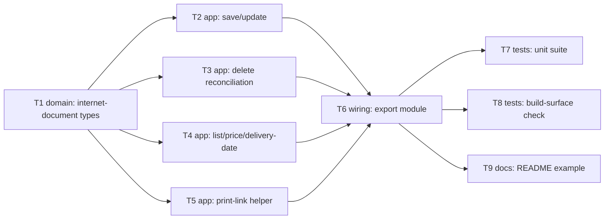

# Epic — internet-document

> **Spec:** [spec.md](../spec.md) · **Design:** [sad.md](../sad.md) · **Data model:** [data-model.md](../data-model.md) (no schema change) · **API:** [contracts/public-api.md](../contracts/public-api.md) · **ADRs:** [adr/](../adr/)

## Goal

Ship the `internet-document` domain module: typed `save`/`update` on a discriminated
`ServiceType`×`CargoType` payload, batch-capable `delete` with a per-Ref reconciled outcome, the two
pre-creation calculators (`getDocumentPrice`, `getDocumentDeliveryDate`), filterable
`getDocumentList`, and the two print-link methods (`printDocument`/`printMarkings`) on their own
construct-then-verify code path — so consuming developers get compile-time-checked, typed access to
every documented InternetDocument method, and `internet-document` becomes the authoritative typed
source of waybill `Ref`/`IntDocNumber` values `scan-sheet`/`additional-service` will depend on
(`spec.md` §2).

## Scope

- **In:** `src/types/internet-document.ts` (all request/response types, incl. the intersected
  `ServiceType`×`CargoType` union and the per-Ref delete outcome array),
  `src/modules/internet-document/index.ts` (the 8 typed methods, including the print methods' private
  `fetch`-based construct-then-verify helper), wiring into `src/index.ts`, the mocked unit suite, the
  published-build type-surface check, a README usage example.
- **Out (from `spec.md` §3):** currency/unit validation of money fields; caching or auto-linking a
  price/delivery-date estimate to a later `save` call; redacting/scoping/expiring the print-ready
  link; chaining a price check + delivery-date check + `save` into one convenience call; verifying
  that a supplied Ref belongs to the caller's own account; extending the shared core client
  (`src/client.ts`) with a non-JSON transport path — the print helper stays entirely inside this
  module's own files.

## Task map

*T2–T5 all touch the single `src/modules/internet-document/index.ts` file (mirroring `counterparty`'s
one-file factory), so `implement` serializes them via the overlapping `files_hint` even though the DAG
above shows them as parallel candidates off `T1` — see Risks below.*

## Tasks

See [tracker.md](./tracker.md) for status. Machine contract: [tasks.json](../tasks.json).

| # | Task | Layer | Blocked by | DoD (short) |
|---|---|---|---|---|
| T1 | Define internet-document domain types | domain | — | Full type surface compiles, zero `any`; intersected discriminated union per ADR-0001; per-Ref delete outcome array per ADR-0002 |
| T2 | Implement save and update methods | app | T1 | Happy path + empty-on-success typed; discriminant-mix payload fails to compile |
| T3 | Implement delete with per-Ref outcome reconciliation | app | T1 | Single- and batch-Ref calls both resolve a per-Ref outcome array |
| T4 | Implement list/price/delivery-date methods | app | T1 | Unfiltered + filtered `getDocumentList`, no-linkage calculators, all typed + tested |
| T5 | Implement printDocument/printMarkings via construct-then-verify | app | T1 | Private helper bypasses `client.request()`; verification failure throws `NovaPoshtaApiError` |
| T6 | Wire `internet-document` module into the public package surface | wiring | T2, T3, T4, T5 | `createInternetDocumentModule` + types re-exported from `src/index.ts` |
| T7 | Unit test suite for `internet-document` | tests | T6 | Every AC-01..AC-18 branch covered against a mocked `fetch` |
| T8 | Extend published-build type-surface check | tests | T6 | Both `dist/index.d.ts` and `.d.cts` assert all 8 internet-document identifiers |
| T9 | Update README usage example | docs | T6 | README shows a real `internet-document` call and documents the print-link's credential-bearing nature |

## Risks / Hard rules

- `sad.md` §4 decision 7 / [ADR-0001](../adr/0001-compose-service-type-and-cargo-type-as-two-intersected-type-sets.md):
  `save`/`update` must stay two intersected hand-written type-sets, never collapsed to shared fields
  and never a single distributive-conditional formula. T1 owns this; T2 tests it at the compile level.
  **Superseded (review remediation, 2026-09-21):** [ADR-0004](../adr/0004-cargo-type-is-a-plain-discriminant-field-not-a-structural-variant-axis.md)
  narrows this to a single `ServiceType`-leg axis with an independent per-leg guard on each side —
  `CargoType` is a plain discriminant field, not a second structural axis. The "never collapsed to
  shared fields" rule still holds for the `ServiceType` axis; it no longer applies to `CargoType`.
- `sad.md` §4 decision 8 / [ADR-0002](../adr/0002-per-ref-outcome-array-for-batch-delete.md): `delete`
  must return a per-Ref outcome array, never `T | undefined` — the one deliberate divergence from
  every other write method in this library. T1 owns the type, T3 owns the reconciliation logic, T7
  tests both the full- and partial-success cases.
- `sad.md` §4 decision 9 / [ADR-0003](../adr/0003-construct-then-verify-print-links.md): the print
  methods must never route through
  `client.request()`'s JSON-envelope unwrap — T5 owns the private `fetch`-based helper, entirely
  within this module's own files (`spec.md` §3 non-goal against changing the shared core client).
- `contracts/public-api.md` §10 flags two open drift findings from the API pass (ServiceType/CargoType
  cardinality, delete batch-capability confirmation) — neither blocks this task breakdown; T1/T3 build
  to the already-Accepted ADRs' shape, not the wider wire cardinality the community-SDK re-fetch found.
- No task may add caching, retries, or client-side re-filtering/pagination-walking (`spec.md` §3
  non-goals) — applies to T2–T5, especially T4 (AC-09/AC-10's pass-through rule).
- No task may add a check or cascade into `address`/`counterparty` records, or validate a supplied
  Ref's ownership (AC-18, `spec.md` §3 non-goal) — T6 must not add one, T7 tests that none was added.
- T2–T5 share one file (`src/modules/internet-document/index.ts`); despite the DAG showing them as
  siblings off T1, `implement` will serialize them in practice via the shared `files_hint` — expected
  and fine at this feature's size, not a bug in the graph.
- Security review still required before `sdd:ship internet-document` (`sad.md` §11, `spec.md` §6.1) —
  not covered by any task here; tracked separately.
