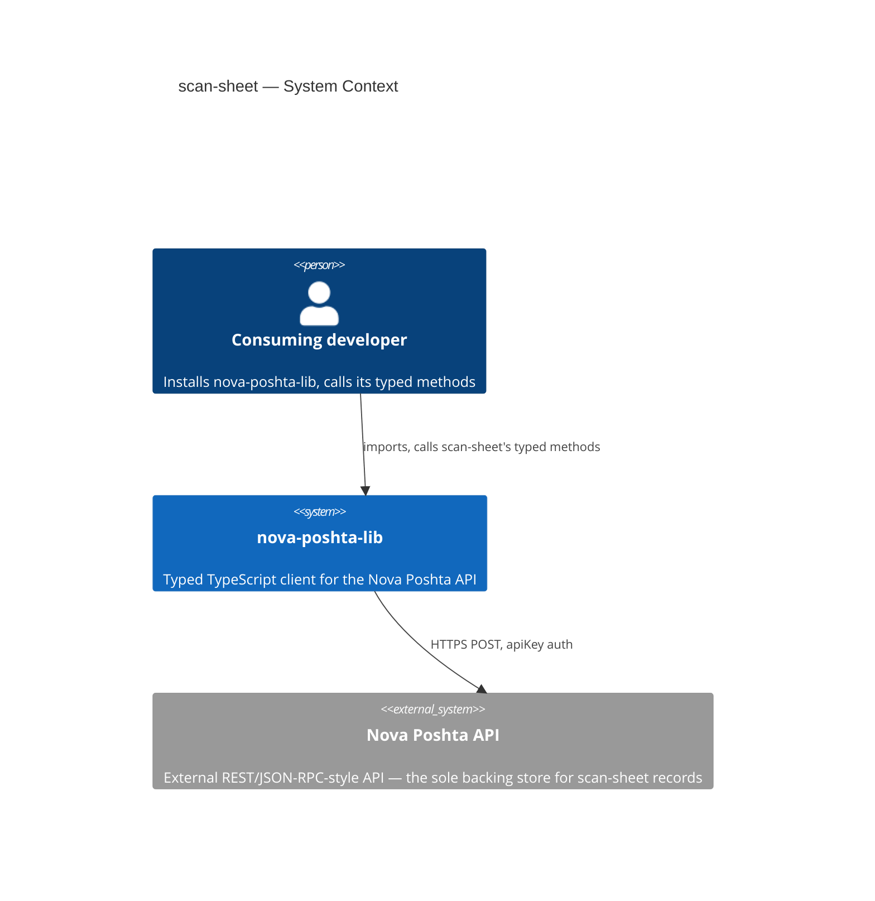
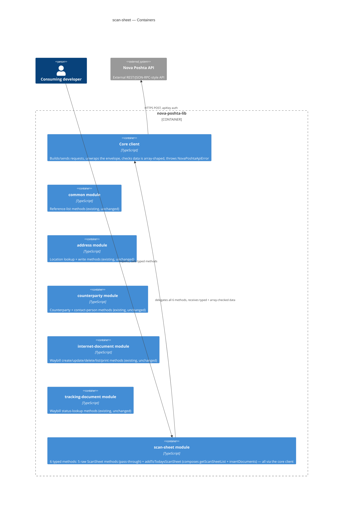
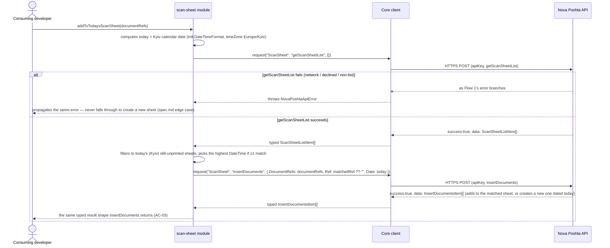

# Software Architecture Document — scan-sheet

<!-- 12 Arc42 sections. Empty section → <!-- N/A: <one-line reason> -->. -->
<!-- C4 Context (L1) lives inline in §3. C4 Container (L2) lives inline in §5. -->
<!-- Numbers in §10 come VERBATIM from spec.md §6 NFR — no inventing, no rounding. -->

## 1. Introduction and goals

**Intent.** `scan-sheet` gives every consuming developer a typed, discoverable way to batch waybills
into the manifest a courier scans once at pickup, instead of scanning every parcel individually
(`spec.md` §2) — the same hand-rolled-call gap `common`, `address`, `counterparty`,
`internet-document`, and `tracking-document` already closed for their own slices of the API. It
wraps Nova Poshta's 5 confirmed `ScanSheet` methods (`insertDocuments`, `getScanSheet`,
`getScanSheetList`, `deleteScanSheet`, `removeDocuments`) plus one convenience method
(`addToTodaysScanSheet`) that removes the `getScanSheetList`-then-`insertDocuments` chained-call
friction for the common "add to today's still-open batch" case.

**Top-3 quality goals (1-liners; full scenarios in §10):**

1. Error-contract correctness — a top-level declined/malformed/network-failed call always throws
   `NovaPoshtaApiError`; a per-item `Error`/`Errors` value inside an otherwise-successful batch
   response never does (AC-07, AC-09, AC-11, AC-12, AC-13; ADR-0001 settles the empty-array edge case).
2. Batch pass-through completeness — every `DocumentRefs`/`ScanSheetRefs` array reaches Nova Poshta
   unmodified, with no client-side cap, split, or reorder (AC-01, AC-07, AC-09; spec §3 non-goal).
3. `addToTodaysScanSheet` correctness — the convenience method finds the right "today" sheet (Europe/Kyiv
   calendar date, most-recently-created unprinted candidate) or creates a new one, without ever
   double-batching into the wrong sheet (AC-03; spec KPI "Convenience-method correctness").

**Stakeholders.**

| Role | Interest | Sign-off owner? |
|---|---|---|
| Consuming developer | Calls the 6 typed methods to batch/inspect/undo waybill-to-scan-sheet membership | No |
| Tech Lead | SAD approval; owns the `spec.md` §8 open questions this design pass inherits, and performs the §6.1 security review this module requires before `sdd:ship` (`spec.md` §8) | Yes |

<!-- Decision overrides (¶4) — none raised during this design pass; the spec's own 9 §1 Decision
     overrides are inherited unchanged, not re-litigated here — see §4. -->

## 2. Constraints

**Technical.**
- TypeScript, Node.js ≥18 (native `fetch`, no HTTP client dependency)
- No framework — this is a library, not an application
- No datastore — `scan-sheet` is stateless; the Nova Poshta API is the sole backing store
- Architecture convention: one folder per Nova Poshta model (`src/modules/<domain>/`), dual ESM+CJS
  build via `tsup` (project-level convention)

**Organisational.**
- Effort budget: sized S per `.size` / route `quick` — 6 methods (5 raw + 1 convenience), no schema,
  no new client capability; comparable to `tracking-document`'s S sizing but with 3x the raw-method
  count, offset by every raw method being a thin pass-through with no discriminated-payload logic
  (unlike `internet-document`). `addToTodaysScanSheet`'s two-sequential-call shape is the one piece
  worth re-checking against the S estimate once `tasks` breaks the work down.
- No hard deadline stated in `spec.md`
- Team: single maintainer (project owner)

**Conventions.**
- Convention file: `CLAUDE.md` + `docs/architecture-map.md`
- Error handling: a single `NovaPoshtaApiError`, no subclassing (project-level convention); ADR-0001
  additionally fixes how an empty-but-successful batch response is treated (§4, §8)
- `src/types/scan-sheet.ts` holds this feature's request/response interfaces, per the
  `src/types/<domain>.ts`-per-model convention every prior module already established

**Regulatory / external.**
- `spec.md` §6.1: data classification confidential — a `getScanSheet` response carries sender
  identity/address fields (`Sender`, `SenderAddress`, `CitySender`), similar in sensitivity to
  `address`'s saved-address data and `tracking-document`'s sender/recipient fields. Personal data is
  touched whenever the underlying counterparty is a `PrivatePerson` (CONTEXT glossary).
- AuthZ/AuthN: the library sends the caller's API key the same way every module does (AC-12);
  `getScanSheet`'s `CounterpartyRef` scoping (AC-05) is enforced by Nova Poshta itself, not by this
  library — no ownership check of its own, matching `tracking-document`'s precedent.
- Security review: **required** before `sdd:ship` — this module returns sender PII from a call whose
  only scoping is enforced entirely by Nova Poshta, the same class of first-time risk
  `tracking-document`'s review flagged (`spec.md` §6.1, §8 OQ; carried into §11).

## 3. Context and scope

`scan-sheet` gives a consuming developer typed access to Nova Poshta's ScanSheet domain — batching
waybills into a courier-handoff manifest — so they can build up, inspect, and undo a handoff batch
without hand-rolling an untyped call. It ships inside the existing `nova-poshta-lib` npm package,
alongside the shared core client and the already-shipped `common`, `address`, `counterparty`,
`internet-document`, and `tracking-document` modules.

<!-- brownfield: read directly (src/client.ts, src/modules/internet-document/index.ts,
     src/modules/tracking-document/index.ts, src/index.ts, src/types/internet-document.ts,
     src/types/counterparty.ts — trivial codebase size, no Explore subagent needed, same reasoning
     tracking-document's and internet-document's sad.md already used). docs/architecture-map.md
     (reflects_commit 94201ac) predates internet-document/tracking-document shipping but its target
     conventions still match what's on disk: no drift found in what matters here (module wiring,
     dual-build, the client.request<T>() array-shape-checked read path every sibling module's raw
     lookups already use). internet-document's deleteBatch→delete composition (a module's own
     convenience method calling its own raw method internally, ADR-0005) is the closest structural
     precedent for addToTodaysScanSheet→{getScanSheetList, insertDocuments}; tracking-document's
     raw-plus-single-convenience module shape is the closest precedent for scan-sheet's own
     5-raw-plus-1-convenience shape. -->

**External systems (in / out):**

| Actor or system | Type | Interaction |
|---|---|---|
| Consuming developer | Person | Installs `nova-poshta-lib`, calls `scan-sheet`'s typed methods |
| Nova Poshta API | System (external) | HTTPS, `apiKey` auth — the sole backing store for scan-sheet records |

**C4 Context (L1):**



*Identical in shape to every sibling module's: the consuming developer talks only to
`nova-poshta-lib`, and the library itself is the only thing that talks to the external Nova Poshta
API. No new external system — `scan-sheet`'s calls land on the same single external API, just a
different `modelName` (`ScanSheet`). Every one of its 6 methods returns the standard JSON envelope —
no second, non-JSON transport path like `internet-document`'s print links.*

## 4. Solution strategy

**Top strategic choices (the seeds for ADRs):**

1. **Target surface: `library-sdk`.** Same single-surface shape every prior module already
   established and the only fit for this repo (no server, no UI). Written to this document's
   frontmatter (`target_surfaces: ["library-sdk"]`); §5 draws one container for it, alongside the
   five already-shipped modules. Single surface → the multi-surface blast-radius trigger never fires.
2. **All 6 methods call `client.request()` directly — `requestEnvelope()` is never needed.** Unlike
   `internet-document`'s `delete` (which needed the full envelope to read a success-path warning not
   present on the returned item), every one of `insertDocuments`/`removeDocuments`/`deleteScanSheet`'s
   per-item outcomes already carries its own `Error`/`Errors` field directly on the returned item
   (`spec.md` §1, quoted `InsertDocumentsItem`/`RemoveDocumentsItem`/`DeleteScanSheetItem` structs) —
   `client.request<T>()`'s existing array-shape-checked, error-throwing contract is already everything
   this module's error contract needs (AC-11, AC-12, AC-13).
3. **`addToTodaysScanSheet` composes this module's own `getScanSheetList` + `insertDocuments`
   internally, never a separate lookup path.** The same shape `internet-document`'s `deleteBatch`
   already uses (a module's own convenience method calling its own raw method, ADR-0005) — finds the
   most recently created still-unprinted sheet from today (Europe/Kyiv calendar date, computed via the
   native `Intl.DateTimeFormat` with `timeZone: "Europe/Kyiv"` — no new runtime dependency, matching
   this library's zero-dependency posture) and calls `insertDocuments` with its `Ref` (or an empty
   string to create a new one). This mechanism is fully spec-mandated (`spec.md` AC-03, §1 Decision
   override, resolved during clarify) — no legitimate alternative is open to this design pass, so it's
   documented here as a building-block decision, not spawned as its own ADR.
4. **Two distinct response types — `ScanSheetDetail` (for `getScanSheet`) and `ScanSheetListItem`
   (for `getScanSheetList`) — never one shared type with optional fields.** The two calls return
   genuinely different field sets (sender identity/address + `Count` vs. `Printed` with no sender
   fields at all, per §1's quoted `GetScanSheetItem`/`GetScanSheetListItem` structs) and every prior
   module in this library already types one distinct response shape per distinct call rather than
   overloading a shared type — an existing, unambiguous repo convention, not a fresh decision with a
   legitimate alternative open to this design pass.
5. **Empty-but-successful batch result: return the array as-is, never throw — ADR-0001.** When
   `insertDocuments`/`removeDocuments`/`deleteScanSheet` report success but the returned array comes
   back with zero items despite one or more submitted, the typed method returns `[]` rather than
   raising `NovaPoshtaApiError` — matching this library's library-wide rule that "empty result" and
   "failure" are always distinct (the same rule `common`/`address`/`tracking-document`'s raw reads
   already follow; AC-04's "empty array, not an error" is the read-side precedent). See ADR-0001.
6. **Response fields stay unparsed — inherited from `spec.md`, not re-decided here.** `Count`,
   `DateTime`, `Date`, and `Printed` are typed and returned as raw `string`s, with no client-side
   parsing into `number`/`Date`/`boolean` (`spec.md` §1 Decision override, following the same
   TypeScript-ecosystem-source precedent `tracking-document`'s `StatusCode` already established). No
   legitimate alternative was open to this design pass — the spec already fixed this during drafting.

Each tactical decision in later sections traces to one of these six. Decision 5 (empty-array handling)
is the one genuinely new problem this module's write methods face that no earlier module's raw reads
had to resolve — a real fork with a real alternative, hence the one ADR this pass spawns.

## 5. Building block view

Layered per the existing modular-domain convention: a thin `scan-sheet` domain module sits on top of
the shared core client, exactly like `tracking-document`'s two methods — with no module-local `fetch`
helper and no `requestEnvelope()` use (§4 decision 2), since every one of this module's 6 methods
needs nothing beyond `client.request()`'s existing array-shape-checked, error-throwing contract.

**Internal decomposition:**

```
src/
├── client.ts                     # existing — unchanged (request(), requestEnvelope(), NovaPoshtaApiError)
├── modules/
│   ├── common/                   # existing — unchanged
│   ├── address/                  # existing — unchanged
│   ├── counterparty/              # existing — unchanged
│   ├── internet-document/        # existing — unchanged
│   ├── tracking-document/        # existing — unchanged
│   └── scan-sheet/
│       └── index.ts               # NEW — factory: createScanSheetModule(client) → 6 typed methods.
│                                   #   5 raw methods delegate straight to client.request() (§4
│                                   #   decision 2); addToTodaysScanSheet composes getScanSheetList +
│                                   #   insertDocuments internally (§4 decision 3), computing "today"
│                                   #   in Europe/Kyiv via a module-local Intl.DateTimeFormat helper
│                                   #   (not exported — single-module use, no shared-utility need)
├── types/
│   ├── envelope.ts                 # existing — shared envelope/request types
│   ├── common.ts                   # existing
│   ├── address.ts                  # existing
│   ├── counterparty.ts             # existing
│   ├── internet-document.ts        # existing
│   ├── tracking-document.ts        # existing
│   └── scan-sheet.ts               # NEW — InsertDocumentsPayload ({DocumentRefs, Ref?, Date}),
│                                    #   InsertDocumentsItem ({Ref, Number, Date, Errors}),
│                                    #   GetScanSheetPayload ({Ref, CounterpartyRef}),
│                                    #   ScanSheetDetail (§4 decision 4), ScanSheetListItem
│                                    #   (§4 decision 4), DeleteScanSheetPayload ({ScanSheetRefs}),
│                                    #   DeleteScanSheetItem ({Ref, Number, Error}),
│                                    #   RemoveDocumentsPayload ({DocumentRefs, Ref}),
│                                    #   RemoveDocumentsItem ({Ref, Number, Error}) — every DocumentRef/
│                                    #   Ref/ScanSheetRef inlined as `string`, never importing a shared
│                                    #   Ref alias (spec.md §1 Decision override — internet-document
│                                    #   exports no such alias to import)
└── index.ts                       # public re-exports (existing 5 modules + scan-sheet + types)
```

`tsup`'s existing dual ESM+CJS build already emits matching `.d.ts`/`.d.cts` declarations for whatever
`src/index.ts` re-exports — no new build step needed, exactly as the five existing modules already
rely on.

**C4 Container (L2):**



*The Containers view draws the one declared surface (`library-sdk`, the whole `nova-poshta-lib`
package) as a boundary holding seven pieces: the existing core client and the five existing modules
(all unchanged by this feature), and the new `scan-sheet` module. Like every sibling module,
`scan-sheet` has exactly one relationship to the outside world — every method delegates to the shared
core client, with no second, direct-`fetch` code path. `scan-sheet` does not call `internet-document`
or `counterparty` at runtime — a waybill `Ref` or `CounterpartyRef` is only ever a plain string input,
never resolved through a live cross-module call (§1 Decision override, spec.md).*

## 6. Runtime view

**Critical flow 1: `insertDocuments` — raw batch insert, happy path + every error branch**

```mermaid
sequenceDiagram
    actor Dev as Consuming developer
    participant Scan as scan-sheet module
    participant Client as Core client
    participant NP as Nova Poshta API

    Dev->>Scan: insertDocuments({ DocumentRefs, Ref?, Date })
    Scan->>Client: request("ScanSheet", "insertDocuments", { DocumentRefs, Ref: Ref ?? "", Date })
    Client->>NP: HTTPS POST (apiKey, modelName, calledMethod, methodProperties)

    alt network/transport failure (AC-13)
        NP--xClient: timeout / dropped connection / non-JSON body
        Client-->>Scan: throws NovaPoshtaApiError
        Scan-->>Dev: propagates NovaPoshtaApiError
    else declined — bad key, or response isn't a navigable list (AC-11 / AC-12)
        NP-->>Client: success:false, error (or a non-array data field)
        Client-->>Scan: throws NovaPoshtaApiError (Nova Poshta's own message passed through)
        Scan-->>Dev: propagates NovaPoshtaApiError
    else success — data array is empty despite submitted DocumentRefs (§4 decision 5, ADR-0001)
        NP-->>Client: success:true, data: []
        Client-->>Scan: typed InsertDocumentsItem[] (array-shape check passes)
        Scan-->>Dev: [] — returned as-is, not an error (ADR-0001)
    else success — one item per submitted DocumentRef, some carrying a per-item Error (AC-01 / AC-02)
        NP-->>Client: success:true, data: [InsertDocumentsItem, ...] (Ref/Number/Date of the sheet; Errors populated only on failed items)
        Client-->>Scan: typed InsertDocumentsItem[]
        Scan-->>Dev: the array exactly as received — never thrown for a per-item Errors value
    end
```

**Critical flow 2: `addToTodaysScanSheet` — two-call convenience, match-or-create**



*Flow 1 covers `insertDocuments` (AC-01, AC-02, AC-11, AC-12, AC-13) and, by the same request/response
shape, stands in for `removeDocuments`/`deleteScanSheet`/`getScanSheet`/`getScanSheetList`'s identical
error branches (AC-04 through AC-10) — every raw method shares one mechanism: delegate to
`client.request()`, propagate its errors unchanged, never special-case a per-item `Error`/`Errors`
value. Flow 2 covers `addToTodaysScanSheet` (AC-03) — the one flow in this module with genuine
sequencing: a failed first call never triggers the fallback "create new" behavior, and the "no source
confirms a full/paginated list" risk (§11) is exactly the assumption this flow depends on.*

## 7. Deployment view

<!-- N/A: this feature ships inside the existing npm package publish process (project-level release
     strategy via changesets) — no new infrastructure, no new deployment unit, no server to operate.
     Identical reasoning to every sibling module's §7. -->

## 8. Crosscutting concepts

| Concept | Convention | Where defined |
|---|---|---|
| Logging | None — the library emits no logs of its own | — (repo default, undocumented) |
| Authentication | Caller-supplied `apiKey`, unchanged by this feature; no independent key-validity or ownership check performed (AC-12, AC-05) | `architecture-map.md`; spec.md §6.1 |
| Error handling | Single `NovaPoshtaApiError` for all 6 methods; a top-level decline/malformed/network failure throws, a per-item `Error`/`Errors` on an otherwise-successful batch never does, and an empty-but-successful batch array is returned as-is, not thrown (§4 decision 5, ADR-0001) | `src/client.ts`; `CLAUDE.md`; spec.md §6.1; ADR-0001 |
| Read-return shape | `InsertDocumentsItem[]` / `RemoveDocumentsItem[]` / `DeleteScanSheetItem[]` / `ScanSheetDetail[]` / `ScanSheetListItem[]` for the 5 raw methods (never reindexed/reordered/capped); same `InsertDocumentsItem[]` shape for `addToTodaysScanSheet` (AC-03) | scan-sheet §4/§6 |
| Response-field typing | `Count`/`DateTime`/`Date`/`Printed` are raw, unparsed `string`s — no client-side `number`/`Date`/`boolean` coercion (§4 decision 6) | spec.md §1 Decision override |
| Cross-module type reuse | None — every `Ref`/`DocumentRefs`/`ScanSheetRefs`/`CounterpartyRef` field is inlined as `string`, no shared `Ref` alias imported from `internet-document` (spec.md §1 Decision override, corrected during critic pass) | spec.md §1; scan-sheet §5 |
| Timezone handling | `addToTodaysScanSheet`'s "today" is the Europe/Kyiv calendar date, computed via the native `Intl.DateTimeFormat` (`timeZone: "Europe/Kyiv"`) — no new runtime dependency, module-local (not exported, no other module needs it yet) | spec.md §1 Decision override; scan-sheet §4 decision 3 |
| ID strategy | N/A — the library holds no persistent IDs of its own; a scan-sheet `Ref`/`Number` is Nova Poshta's, passed through live | `architecture-map.md` |
| Internationalisation | N/A — pass-through of Nova Poshta's own fields, no library-side selection, same convention as every other module | `docs/features/common/spec.md` §8 |
| Observability | None new — no metrics/tracing added by this feature | — |
| Events | N/A — synchronous request/response only | `architecture-map.md` |
| Rate-limiting | None of our own — Nova Poshta's own throttling governs; no client-side cap on `DocumentRefs`/`ScanSheetRefs` batch size (spec.md §3 non-goal) | spec.md §3 non-goal, §6.1 |
| Testing | Mocked unit suite required in CI (`test/unit/modules/scan-sheet`), plus an opt-in integration suite (create-a-throwaway-waybill-via-internet-document, then exercise scan-sheet, then clean up both) against the real API | spec.md Test plan; `docs/adr/0003-testing-strategy.md` |

## 9. Architecture decisions

| # | Title | Status | Section |
|---|---|---|---|
| 0001 | Return empty batch-result arrays as-is instead of throwing | Accepted | §4 |

ADR files live under `docs/features/scan-sheet/adr/`. This feature also relies on `common`'s
already-Accepted `0001-array-shape-only-validation.md` (unchanged, inherited by every raw method) —
no new ADR needed for it here.

## 10. Quality requirements

Each top-3 goal from §1 expanded into a full scenario:

**QG-1. Error-contract correctness**
- **When:** any of the 6 methods is declined, malformed, network-failed, or returns a batch response
  with a per-item `Error`/`Errors` value or an empty-but-successful array.
- **Then:** 100% of in-scope methods throw `NovaPoshtaApiError` on a decline, malformed response, or
  network failure; 0% throw on a per-item `Error`/`Errors` value inside an overall-successful batch,
  and 0% throw on an empty-but-successful array (ADR-0001) — `spec.md` §6 NFR row "Error-contract
  coverage", AC-07, AC-09, AC-11, AC-12, AC-13.
- **How verify:** unit test suite `test/unit/modules/scan-sheet` (`spec.md` §6 row 2; test plan
  AC-07/AC-09/AC-11/AC-12/AC-13 rows, plus a dedicated empty-array fixture for ADR-0001).

**QG-2. Batch pass-through completeness**
- **When:** a consuming developer submits a multi-item `DocumentRefs`/`ScanSheetRefs` array to
  `insertDocuments`, `removeDocuments`, or `deleteScanSheet`.
- **Then:** 100% of submitted arrays reach Nova Poshta unmodified — no client-side split, cap, or
  reorder (`spec.md` §6 NFR row "Batch pass-through", AC-01, AC-07, AC-09).
- **How verify:** unit test suite, dedicated fixture with a multi-item batch asserting the request
  body's array matches the input array exactly (`spec.md` §6 row 4; test plan AC-01/AC-07/AC-09 rows).

**QG-3. `addToTodaysScanSheet` correctness**
- **When:** a consuming developer calls `addToTodaysScanSheet` while zero, one, or several of today's
  (Europe/Kyiv) scan sheets are still unprinted.
- **Then:** the method calls `getScanSheetList` exactly once, then `insertDocuments` exactly once,
  picking the highest-`DateTime` still-unprinted today-sheet when ≥1 exists, or creating a new one
  when none does — 0 GitHub issues within 90 days of release reporting the wrong sheet chosen or an
  already-open sheet missed (`spec.md` §7 KPI "Convenience-method correctness", AC-03).
- **How verify:** unit test suite, dedicated fixture with 2+ unprinted today-sheets asserting the
  newest `DateTime` is chosen, plus a zero-match fixture asserting a new sheet is created (`spec.md`
  test plan AC-03 row).

Three further `spec.md` §6 NFR rows apply library-wide, not to one specific quality goal above, and
are still binding: **Type-safety coverage** (100% of the 6 in-scope methods carry zero `any` in their
public signatures, static check in CI); **Method-surface completeness** (100% of the 5 raw methods + 1
convenience method have a corresponding typed method, asserted exported/callable in the unit suite);
and **Library-added overhead per call** (median ≤5ms beyond the underlying network round-trip for the
5 raw methods, `addToTodaysScanSheet` explicitly excluded since its two-call cost is by design —
benchmarked with `fetch` stubbed to near-zero latency across ≥30 repeated single-item calls, always
runs in CI).

## 11. Risks and technical debt

| Risk / debt | Severity | Mitigation | Owner |
|---|---|---|---|
| Security review required before release — sender PII (`Sender`, `SenderAddress`) returned from a call whose only scoping (`CounterpartyRef`) is enforced entirely by Nova Poshta, not this library (`spec.md` §6.1) | Medium | Performed by the Tech Lead during `sdd:review`/before `sdd:ship`, matching `tracking-document`'s precedent — no code change expected unless the review finds one | Tech Lead |
| `getScanSheetList`'s "still unprinted" sentinel value is a best guess (`Printed === "0"`) — no source confirms Nova Poshta's exact literal for "not printed" vs. "printed" (§4 decision 3, ledger assumption) | Medium | **Must be resolved before `sdd:ship`** (live-API check during `sdd:review`), per CLAUDE.md's API-contract sourcing policy — an unresolved API-contract question blocks ship, the same bar that excluded `printScanSheet` above; if wrong, `addToTodaysScanSheet` could miss an open sheet or treat a printed one as open — fix is a one-line comparison change, no public-signature impact | Tech Lead |
| Does saving an unprinted waybill via `internet-document` (needed to seed this module's integration tests) incur any real cost on a live account? (`spec.md` §8 OQ) | Low | Default: proceed with the create-then-delete integration test design; if it turns out costly, switch to a pre-existing-`Ref` env var instead (spec's own fallback) | Tech Lead — due before `sdd:tasks` |
| Does `getScanSheetList` return every scan sheet regardless of account volume, or can it be capped/paginated? No source shows a `Page`/`Limit` parameter (`spec.md` §8 OQ) — `addToTodaysScanSheet` depends on this list being complete to reliably find today's sheet | Medium | Default: assume the list is always complete, no client-side paging added; re-verify against the live API once reachable (`spec.md` §8) | Tech Lead |
| `printScanSheet` — single-sourced only (1 of 4 cross-checked SDKs), excluded from this module's confirmed 6-method surface (`spec.md` §1 Decision override, §8 OQ) | Low | Tracked as an open question, not shipped as an AC; revisit once a 2nd agreeing source or the official docs are reachable | Tech Lead |
| Re-verify the 5-raw-method `ScanSheet` surface and `insertDocuments`'s empty-string-creates-new-sheet semantics against Nova Poshta's live/official documentation once the portal is reachable by automated tooling — the 3-SDK cross-check agrees field-for-field but is still a third-party source, the same caveat every shipped spec in this repo already carries (`spec.md` §8 OQ) | Low | Re-attempt during `sdd:review`/`sdd:ship`, same schedule every sibling module's equivalent OQ follows | Tech Lead |
| `addToTodaysScanSheet`'s two sequential calls (`getScanSheetList` then `insertDocuments`) are not atomic — another caller could insert into or the courier could print the matched sheet between the two calls (TOCTOU) | Low | Accepted by design — Nova Poshta itself provides no locking primitive, and the spec's own "picks the most recent, never blocks" resolution already tolerates this race; not a code change | Tech Lead |

**Accepted debt (acceptable in v1, plan to fix later):**
- No client-side caching, rate-limiting, or ownership check of any kind — matches the library's
  existing stateless convention (`spec.md` §3 non-goal, §6.1).
- No client-side capping, splitting, or reordering of `DocumentRefs`/`ScanSheetRefs` batch arrays —
  Nova Poshta's own limits, if any, are not enforced client-side (`spec.md` §3 non-goal).
- No reconciliation of a scan sheet's `Printed` state with any print action of this library's own —
  `printScanSheet` is out of scope (`spec.md` §3 non-goal).
- `addToTodaysScanSheet`'s two-call TOCTOU race (above) is tolerated, not guarded against.

## 12. Glossary

| Term | Meaning |
|---|---|
| Consuming developer | A developer who installs and calls this library's typed methods from their own Node.js/TypeScript project. NOT Nova Poshta itself, and NOT an end customer or shipment recipient. |
| Scan sheet | A courier-handoff manifest Nova Poshta generates for a batch of waybills, identified by its own `Ref` and `Number`, that a courier scans once instead of scanning each waybill individually at pickup. NOT a waybill itself, and NOT the printed label (`printMarkings`) — a scan sheet's own print representation is a separate, currently unconfirmed capability (CONTEXT.md glossary). |
| Waybill (internet document) | The shipment record Nova Poshta creates for a single parcel/cargo, identified by a `Ref` and an `IntDocNumber`. `scan-sheet` accepts only a waybill's `Ref` — never its `IntDocNumber` — and performs no lookup against any `internet-document` record. |
| `ScanSheetDetail` | This module's response type for one `getScanSheet` record — sender identity/address + waybill count (§4 decision 4). Distinct from `ScanSheetListItem`; the two are never merged into one shared type. |
| `ScanSheetListItem` | This module's response type for one `getScanSheetList` record — `Ref`/`Number`/creation `DateTime`/`Printed` (§4 decision 4). Carries no sender fields, unlike `ScanSheetDetail`. |
| Empty-batch-result rule | ADR-0001's invariant: `insertDocuments`/`removeDocuments`/`deleteScanSheet` return `[]` — not a thrown error — when Nova Poshta reports success but the batch array comes back empty. Distinct from a per-item `Error`/`Errors` value (which also never throws) and from a top-level decline (which always does). |
| `addToTodaysScanSheet` | The convenience method (spec.md AC-03) that finds today's (Europe/Kyiv calendar date) most-recently-created still-unprinted scan sheet and adds waybills to it, or creates a new one if none exists — composing this module's own `getScanSheetList` + `insertDocuments` internally (§4 decision 3). |
| `NovaPoshtaApiError` | The library's single standard error class (extends `Error`), carrying `errors[]`/`errorCodes[]`/`warnings[]` — thrown on any declined call, malformed response, or transport failure across all 6 methods. |
| Array-shape check | The one runtime check the shared core client performs (`common` ADR-0001): confirming a response's `data` is actually an array before it's returned as typed data. An empty array still passes — this is what makes ADR-0001's "empty result, not an error" rule possible. |
