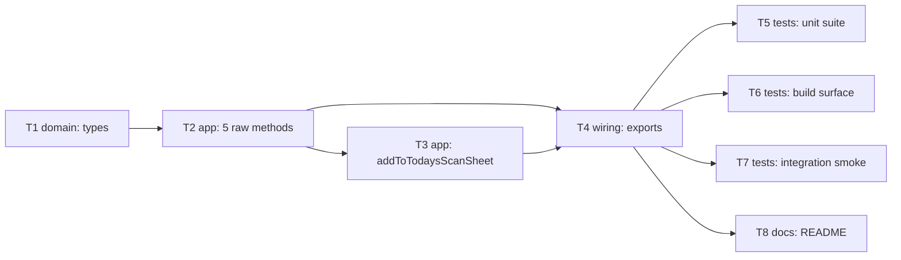

# Epic — scan-sheet

> **Spec:** [spec.md](../spec.md) · **Design:** [sad.md](../sad.md) · **ADRs:** [adr/](../adr/)

## Goal

Ship a typed, discoverable way to batch waybills into a courier-handoff manifest — Nova Poshta's 5
confirmed `ScanSheet` methods (`insertDocuments`, `getScanSheet`, `getScanSheetList`,
`deleteScanSheet`, `removeDocuments`) plus the `addToTodaysScanSheet` convenience method that
removes the `getScanSheetList`-then-`insertDocuments` chained-call friction for the common
"add to today's still-open batch" case (`spec.md` §2).

## Scope

- **In:** the 6 typed methods, the `ScanSheetDetail`/`ScanSheetListItem` distinct response types
  (`sad.md` §4 decision 4), the shared error contract inherited unchanged from `client.request()`,
  ADR-0001's empty-batch-result rule, and the public package export.
- **Out:** `printScanSheet` (single-sourced, excluded — `spec.md` §1 Decision override, §8 OQ); any
  client-side caching, rate-limiting, batch capping/splitting/reordering, or ownership check
  (`spec.md` §3 non-goals); reconciling a sheet's `Printed` state with any print action of this
  library's own.

## Task map

## Tasks

See [tracker.md](./tracker.md) for status. Machine contract: [tasks.json](../tasks.json).

| # | Task | Layer | Blocked by | DoD (short) |
|---|---|---|---|---|
| T1 | Define scan-sheet domain types | domain | — | 5 payload/item type pairs, zero `any` |
| T2 | Implement the 5 raw pass-through methods | app | T1 | delegate to `client.request()`, no split/cap/reorder |
| T3 | Implement addToTodaysScanSheet | app | T2 | match-or-create, Kyiv "today", no fallthrough on failure |
| T4 | Wire public exports | wiring | T2, T3 | `src/index.ts` exports module + types; build succeeds |
| T5 | Unit test suite | tests | T4 | AC-01..AC-13 covered; ADR-0001 empty-array fixtures; ≤5ms overhead |
| T6 | Build-surface completeness check | tests | T4 | all 6 methods in `.d.ts`/`.d.cts` |
| T7 | Opt-in integration smoke test | tests | T4 | real-API check via a throwaway waybill, skipped without env var |
| T8 | README usage example | docs | T4 | type-checked call + ADR-0001 note |

## Risks / Hard rules

- No client-side cap, split, or reorder of any `DocumentRefs`/`ScanSheetRefs` array (`spec.md` §3
  non-goal, AC-01/AC-07/AC-09) — enforced by review, not a runtime check.
- A per-item `Error`/`Errors` value inside an otherwise-successful batch response must never throw,
  and an empty-but-successful batch array must never throw either (ADR-0001) — only a top-level
  decline/malformed/network failure throws (AC-11/AC-12/AC-13). Conflating these is the exact bug
  class QG-1 (`sad.md` §10) guards against.
- `removeDocuments`/`deleteScanSheet` must never call any waybill-invalidating endpoint (AC-08,
  AC-10) — undoing batch membership only, never the waybill itself.
- Security review is still open (`spec.md` §6.1, §8 OQ) and gates `sdd:ship scan-sheet`, not this
  task breakdown — tracked here for visibility, not re-resolved.
- `getScanSheetList`'s `Printed === "0"` "still unprinted" sentinel is a best guess (`sad.md` §11) —
  **must be re-verified against the live API before `sdd:ship`**, per CLAUDE.md's API-contract
  sourcing policy; do not silently change the sentinel without re-confirming the source.
