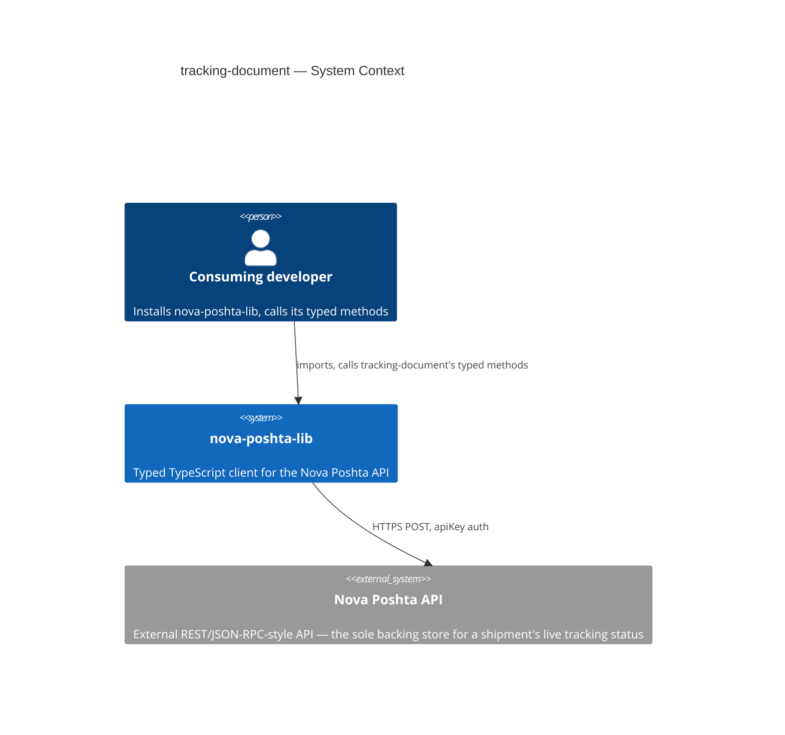
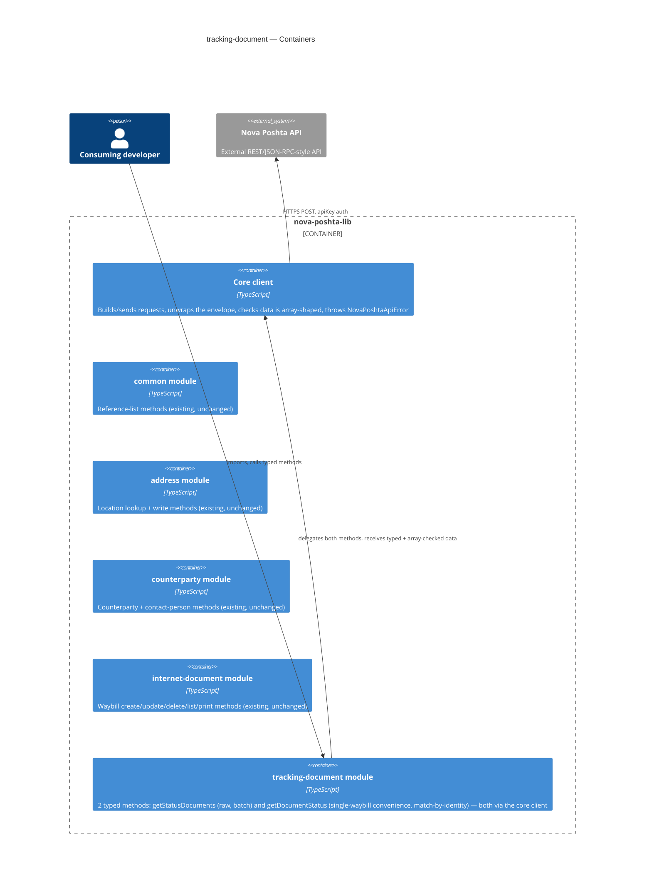
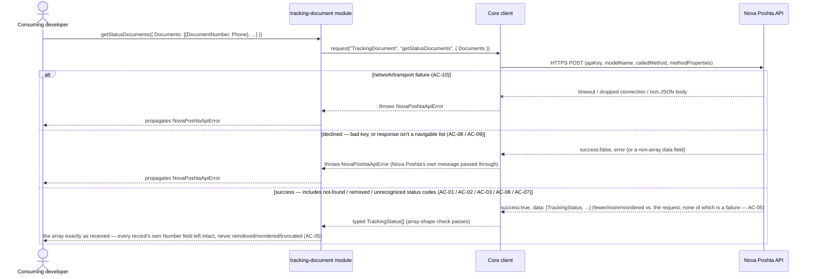
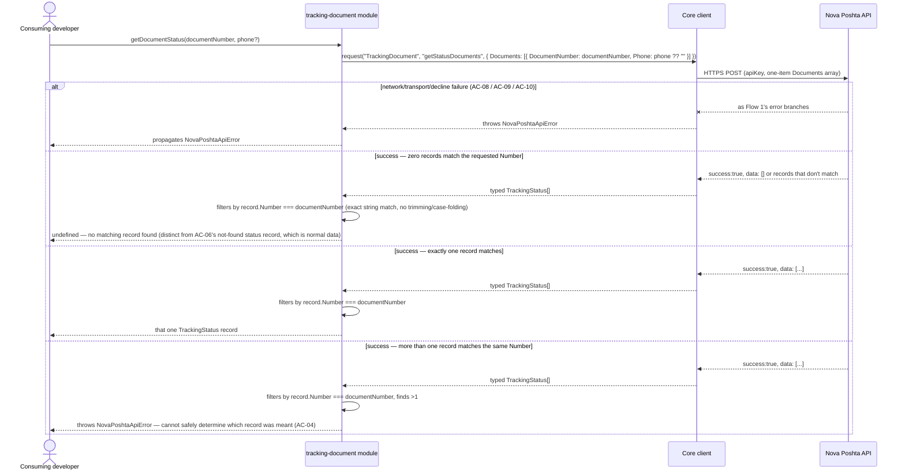

# Software Architecture Document — tracking-document

<!-- 12 Arc42 sections. Empty section → <!-- N/A: <one-line reason> -->. -->
<!-- C4 Context (L1) lives inline in §3. C4 Container (L2) lives inline in §5. -->
<!-- Numbers in §10 come VERBATIM from spec.md §6 NFR — no inventing, no rounding. -->

## 1. Introduction and goals

**Intent.** `tracking-document` gives every consuming developer a typed, discoverable way to check a
shipment's live delivery status by waybill number — the one remaining hand-rolled call `common`,
`address`, `counterparty`, and `internet-document` haven't already closed (`spec.md` §2). It wraps
Nova Poshta's one real `TrackingDocument` method, `getStatusDocuments`, plus one single-waybill
convenience wrapper, and is deliberately kept independent of every other module: it accepts a plain
waybill number and nothing else, so it tracks a shipment `internet-document` created, one imported
from Nova Poshta's own portal, or one a third party shipped, all the same way (`spec.md` §1, AC-11).

**Top-3 quality goals (1-liners; full scenarios in §10):**

1. Forward-compatible typing — every status value Nova Poshta returns, including a code this
   library's authors have never seen, is preserved and returned exactly as received, never dropped,
   coerced to a placeholder, or rejected (AC-07).
2. Error-contract correctness — every declined, malformed, or network-failed call throws the same
   `NovaPoshtaApiError`, while a "not found" or "removed" waybill resolves as a normal, successful
   status record, never an error (AC-06, AC-08, AC-09, AC-10).
3. Match-by-identity correctness — a multi-waybill response is never reindexed, reordered, or
   truncated to line up with the request, and the single-waybill convenience method locates its one
   result by the returned record's own waybill-number field, never by position or by blindly taking
   the first record back (AC-04, AC-05) — the guard against silently attaching one shipment's
   recipient details to a different shipment's request.

**Stakeholders.**

| Role | Interest | Sign-off owner? |
|---|---|---|
| Consuming developer | Calls the 2 typed methods to check a shipment's live status by waybill number | No |
| Tech Lead | SAD approval; owns the `spec.md` §8 open questions this design pass inherits, and performs the §6.1 security review this module requires before `sdd:implement` (`spec.md` §8, resolved during clarify) | Yes |

<!-- Decision overrides (¶4) — none raised during this design pass; the spec's own §1 Decision
     overrides (self-contained module, match-by-identity) are inherited unchanged, not re-litigated
     here — see §4. -->

## 2. Constraints

**Technical.**
- TypeScript, Node.js ≥18 (native `fetch`, no HTTP client dependency)
- No framework — this is a library, not an application
- No datastore — `tracking-document` is stateless; the Nova Poshta API is the sole backing store
- Architecture convention: one folder per Nova Poshta model (`src/modules/<domain>/`), dual ESM+CJS
  build via `tsup` (project-level convention)

**Organisational.**
- Effort budget: sized S per `.size` / route `quick` — 2 methods, no schema, no new client capability;
  smaller than `internet-document`'s M, closer to `common`'s/`address`'s original scope. `spec.md`
  §1 flags one sizing risk worth watching: the response type's 91-field exhaustive typing is larger
  than the ~12-field PII subset quoted in the spec, so `classify-size` should be re-run once `tasks`
  breaks the work down.
- No hard deadline stated in `spec.md`
- Team: single maintainer (project owner)

**Conventions.**
- Convention file: `CLAUDE.md` + `docs/architecture-map.md`
- Error handling: a single `NovaPoshtaApiError`, no subclassing (project-level convention), reused
  unchanged for both methods
- `src/types/tracking-document.ts` holds this feature's request/response interfaces, per the
  `src/types/<domain>.ts`-per-model convention `common`/`address`/`counterparty`/`internet-document`
  already established

**Regulatory / external.**
- `spec.md` §6.1: data classification confidential — a tracking response carries recipient/sender
  name, address, and phone fields (`RecipientFullName`, `RecipientAddress`, `PhoneRecipient`,
  `PhoneSender`, `WarehouseRecipient`/`WarehouseSender`), closer in sensitivity to `address`'s
  saved-address data than to `common`'s public reference catalog. Sharper than any earlier module:
  `tracking-document` has **no** per-counterparty ownership scoping at all — any caller with a valid
  key can track any waybill number by design (AC-09), matching Nova Poshta's own public tracking
  page. Security review required before release, performed by the Tech Lead and gated before
  `sdd:implement tracking-document` — `spec.md` §8's own resolution, not performed in this design
  session (tracked in §11).
- AuthZ/AuthN: the library sends the caller's API key the same way every module does; one
  cross-checked source states this specific method doesn't require a key at all, unconfirmed by the
  other three (`spec.md` §8 OQ, carried into §11) — the library performs no key-validity check of its
  own either way, matching every other module.

## 3. Context and scope

`tracking-document` gives a consuming developer typed access to Nova Poshta's TrackingDocument
domain — checking a shipment's live delivery status by waybill number — so they can show where a
parcel is without hand-rolling an untyped call. It ships inside the existing `nova-poshta-lib` npm
package, alongside the shared core client and the already-shipped `common`, `address`, `counterparty`,
and `internet-document` modules.

<!-- brownfield: read directly (src/client.ts, src/modules/common/index.ts, src/modules/address/index.ts,
     src/types/common.ts, src/types/internet-document.ts, src/index.ts — trivial codebase size, no
     Explore subagent needed, same reasoning `internet-document`'s sad.md already used).
     docs/architecture-map.md (reflects_commit 94201ac) is stale — it predates common, address,
     counterparty, and internet-document all shipping — but its target conventions still match what's
     on disk: no drift found in what matters to this feature (module wiring, dual-build, error
     handling, the `client.request<T>()` array-shape-checked read path every sibling module's raw
     lookups already use). `common`'s and `address`'s own read-only methods (`getDocumentStatuses`,
     `getCities`) are the closest structural precedent — `tracking-document` needs neither
     `internet-document`'s discriminated write payload nor its `requestEnvelope()`/print-link paths,
     since every one of its methods is a read with a single-`request()`-call shape. -->

**External systems (in / out):**

| Actor or system | Type | Interaction |
|---|---|---|
| Consuming developer | Person | Installs `nova-poshta-lib`, calls `tracking-document`'s typed methods |
| Nova Poshta API | System (external) | HTTPS, `apiKey` auth — the sole backing store for a waybill's live tracking status |

**C4 Context (L1):**



*Identical in shape to every sibling module's: the consuming developer talks only to
`nova-poshta-lib`, and the library itself is the only thing that talks to the external Nova Poshta
API. No new external system — `tracking-document`'s calls land on the same single external API, just
a different `modelName` (`TrackingDocument`). Unlike `internet-document`, there is no second,
non-JSON transport path here — both of `tracking-document`'s methods return the standard JSON
envelope.*

## 4. Solution strategy

**Top strategic choices (the seeds for ADRs):**

1. **Target surface: `library-sdk`.** Same single-surface shape `common`, `address`, `counterparty`,
   and `internet-document` already established and the only fit for this repo (no server, no UI).
   Written to this document's frontmatter (`target_surfaces: ["library-sdk"]`); §5 draws one
   container for it, alongside the four already-shipped modules.
2. **Synchronous, direct calls into the existing core client for both methods.** `getStatusDocuments`
   calls `NovaPoshtaClient.request()` directly, exactly like `common`'s and `address`'s read methods —
   no new client capability needed (unlike `internet-document`'s `requestEnvelope()`/print-link
   additions, this module never needs per-item success-path warnings or a non-JSON transport path).
3. **Single-waybill convenience method locates its result by identity, not position — genuinely new
   shape vs. `address`'s `firstOrUndefined` helper.** `getDocumentStatus` makes exactly one call
   carrying a single-item `Documents` array, then matches the response by the returned record's own
   `Number` field against the requested waybill: exact string comparison, no trimming/case-folding.
   Zero matches resolves `undefined` (AC-04); more than one match — a case `address`'s
   `firstOrUndefined` never has to consider, since it takes whichever record comes back first —
   throws `NovaPoshtaApiError`, since the library cannot safely guess which record was meant (AC-04).
   This mechanism is fully spec-mandated (`spec.md` AC-04, resolved during clarify) — no legitimate
   alternative is open to this design pass, so it's documented here as a building-block decision, not
   spawned as its own ADR.
4. **Response type named `TrackingStatus` — ADR-0001.** `common` already exports a type named
   `DocumentStatus` for an unrelated concept (a reference-list lookup of possible status values for
   UI dropdowns); CONTEXT.md's glossary is explicit the two must never be confused, and both would be
   re-exported from the same `src/index.ts` entry point. `TrackingStatus` was chosen over
   `TrackingDocumentStatus`/`DocumentTrackingStatus` because it matches CONTEXT.md's canonical
   glossary term ("tracking status") verbatim. See ADR-0001.
5. **Status representation stays independent of `common` and `internet-document` — inherited from
   `spec.md` §1's own Decision override, not re-decided here.** `StatusCode`/`Status` are this
   module's own fields, never cross-referenced against `common.DocumentStatus` or
   `internet-document`'s `StateId`/`StateName` — nothing confirms the three vocabularies correspond
   one-to-one (`spec.md` §1, §3 non-goal). No legitimate alternative was open to this design pass
   either: the spec already fixed this during drafting, so it's documented here in prose, not
   re-litigated as a fresh ADR.
6. **`StatusCode`/`Status` typed as a plain `number`/`string` — no closed enum, no `OpenEnum`
   wrapper.** `common.ts` already exports an `OpenEnum<Known extends string>` helper
   (`Known | (string & {})`) for forward-compatible *string* literal unions (used nowhere in this
   module) — but `tracking-document` never needs it: a plain `number` field is already
   forward-compatible by construction, since there's no closed literal set being widened. This
   satisfies AC-07 (an unrecognized status code is preserved exactly, never coerced) without any new
   type machinery, matching `spec.md`'s own "Resolved during clarify" note that the code is typed
   numerically, not as text.
7. **Inherit `common`'s array-shape-only validation unchanged, for both methods.** The shared
   `client.request()` path already throws `NovaPoshtaApiError` on a declined call, a malformed
   (non-array) response, or a network failure (AC-08, AC-09, AC-10) — exactly what this module's
   error contract needs, with no per-method override.

Each tactical decision in later sections traces to one of these seven. Decision 3 (match-by-identity)
and decision 4 (the `TrackingStatus` name) are the two genuinely new problems this module solves that
no earlier module faced — decision 3 as a mandated behavior with no open alternative, decision 4 as
the one choice this design pass actually had to make.

## 5. Building block view

Layered per the existing modular-domain convention: a thin `tracking-document` domain module sits on
top of the shared core client, exactly like `common`'s and `address`'s read-only methods — with no
module-local `fetch` helper and no `requestEnvelope()` use, since neither of this module's two methods
needs anything beyond `client.request()`'s existing array-shape-checked, error-throwing contract.

**Internal decomposition:**

```
src/
├── client.ts                     # existing — unchanged (request(), requestEnvelope(), NovaPoshtaApiError)
├── modules/
│   ├── common/                   # existing — unchanged
│   ├── address/                  # existing — unchanged
│   ├── counterparty/             # existing — unchanged
│   ├── internet-document/        # existing — unchanged
│   └── tracking-document/
│       └── index.ts               # NEW — factory: createTrackingDocumentModule(client) → 2 typed
│                                   #   methods. getStatusDocuments delegates straight to
│                                   #   client.request(); getDocumentStatus wraps it in a single-item
│                                   #   call, then matches the response by Number (ADR: §4 decision 3)
├── types/
│   ├── envelope.ts                 # existing — shared envelope/request types
│   ├── common.ts                   # existing — unchanged (DocumentStatus stays its own, unrelated type)
│   ├── address.ts                  # existing
│   ├── counterparty.ts             # existing
│   ├── internet-document.ts        # existing
│   └── tracking-document.ts        # NEW — TrackingDocumentFilter ({DocumentNumber, Phone}),
│                                    #   GetStatusDocumentsPayload ({Documents: [...]}), and
│                                    #   TrackingStatus (ADR-0001) — the full 91-field response
│                                    #   record, typed exhaustively per spec.md's "Resolved during
│                                    #   clarify" note (matching common/address's exhaustive-typing
│                                    #   precedent, not just the ~12-field PII subset spec.md quotes)
└── index.ts                       # public re-exports (client + common + address + counterparty +
                                    #   internet-document + tracking-document + types)
```

`tsup`'s existing dual ESM+CJS build already emits matching `.d.ts`/`.d.cts` declarations for whatever
`src/index.ts` re-exports — no new build step needed, exactly as the four existing modules already
rely on.

**C4 Container (L2):**



*The Containers view draws the one declared surface (`library-sdk`, the whole `nova-poshta-lib`
package) as a boundary holding six pieces: the existing core client and the four existing modules
(all unchanged by this feature), and the new `tracking-document` module. Unlike `internet-document`,
`tracking-document` has exactly one relationship to the outside world — both its methods delegate to
the shared core client, with no second, direct-`fetch` code path. `tracking-document` does not call
`common` or `internet-document` at runtime (§4 decision 5, AC-11) — a waybill number is only ever a
plain string input, never resolved through a live cross-module call.*

## 6. Runtime view

**Critical flow 1: `getStatusDocuments` — batch tracking, happy path + every error branch**



**Critical flow 2: `getDocumentStatus` — single-waybill convenience, match-by-identity**



*Flow 1 covers `getStatusDocuments` (AC-01, AC-02, AC-03, AC-05, AC-06, AC-07, AC-08, AC-09, AC-10) —
the module's one raw method, a straight pass-through with no client-side splitting, capping, or
reordering. Flow 2 covers `getDocumentStatus` (AC-04) — the one flow in this module with a shape no
sibling module's convenience method has: a three-way branch on how many returned records match the
requested identity, not just "take the first." AC-11 (origin-independent tracking) is not a distinct
runtime branch — it's the *absence* of one: neither flow ever queries or depends on any
`internet-document` `Ref` or record, visible in both diagrams' participant list (no `internet-document`
box appears in either flow).*

## 7. Deployment view

<!-- N/A: this feature ships inside the existing npm package publish process (project-level release
     strategy via changesets) — no new infrastructure, no new deployment unit, no server to operate.
     Identical reasoning to common's, address's, counterparty's, and internet-document's §7. -->

## 8. Crosscutting concepts

| Concept | Convention | Where defined |
|---|---|---|
| Logging | None — the library emits no logs of its own | — (repo default, undocumented) |
| Authentication | Caller-supplied `apiKey`, unchanged by this feature; the library performs no key-validity check of its own, regardless of whether this specific method actually enforces one (`spec.md` §8 OQ) | `architecture-map.md`; AC-09 |
| Error handling | Single `NovaPoshtaApiError` for both methods — no subclassing, no per-method error type | `src/client.ts`; `CLAUDE.md`; `spec.md` §6.1 |
| Read-return shape | `TrackingStatus[]` for `getStatusDocuments` (never reindexed/reordered — AC-05); `TrackingStatus \| undefined` for `getDocumentStatus`, or a thrown error on an ambiguous match (§4 decision 3) | `tracking-document` §4/§6 |
| Status-code typing | Plain `number`/`string`, no closed enum — forward-compatible by construction, no `OpenEnum` wrapper needed | `tracking-document` §4 decision 6 |
| Cross-module type reuse | None — `tracking-document` takes a waybill number as a plain `string`, performs no cross-module type import and no runtime check against `internet-document`'s Refs (AC-11), and keeps its own status representation independent of `common.DocumentStatus` (§4 decision 5) | `spec.md` §1 Decision override, §3 non-goal, AC-11 |
| ID strategy | N/A — the library holds no persistent IDs of its own; a waybill number is Nova Poshta's, passed through live | `architecture-map.md` |
| Internationalisation | N/A — pass-through of Nova Poshta's own language fields, no library-side selection, same convention as every other module | `docs/features/common/spec.md` §8 |
| Observability | None new — no metrics/tracing added by this feature | — |
| Events | N/A — synchronous request/response only | `architecture-map.md` |
| Rate-limiting | None of our own — Nova Poshta's own throttling governs; flagged as a first-time-relevant risk since tracking is the read endpoint most likely to be polled repeatedly (`spec.md` §6.1) | `spec.md` §3 non-goal, §6.1 |
| Testing | Mocked unit suite required in CI (`test/unit/modules/tracking-document`), plus an opt-in integration suite against the real API, same convention as every sibling module | `docs/adr/0003-testing-strategy.md` |

## 9. Architecture decisions

| # | Title | Status | Section |
|---|---|---|---|
| 0001 | Name the response type TrackingStatus, distinct from common's DocumentStatus | Accepted | §4 |

ADR files live under `docs/features/tracking-document/adr/`. This feature also relies on `common`'s
already-Accepted `0001-array-shape-only-validation.md` (unchanged, inherited for both methods) — no
new ADR needed for it here.

## 10. Quality requirements

Each top-3 goal from §1 expanded into a full scenario:

**QG-1. Forward-compatible typing**
- **When:** a consuming developer reads a `TrackingStatus` record whose `StatusCode` isn't one this
  library's authors had seen when it was built.
- **Then:** 100% of in-scope methods (`getStatusDocuments` + `getDocumentStatus`) carry zero `any` in
  their public signatures, and an unrecognized status code and its description are preserved and
  returned exactly as Nova Poshta sent them — never dropped, coerced, or rejected (`spec.md` §6 NFR
  row "Type-safety coverage", AC-07).
- **How verify:** static check in CI, plus a unit fixture asserting an unrecognized status code
  round-trips exactly (`spec.md` §6, row 1; test plan AC-07 row).

**QG-2. Error-contract correctness**
- **When:** any `TrackingDocument` call is declined, malformed, network-failed, or returns a
  not-found/removed status for a requested waybill.
- **Then:** 100% of in-scope methods throw `NovaPoshtaApiError` on a decline, malformed response, or
  network failure; 0% throw when a document merely comes back not-found or removed (`spec.md` §6 NFR
  row "Error-contract coverage", AC-06, AC-08, AC-09, AC-10).
- **How verify:** unit test suite `test/unit/modules/tracking-document` (`spec.md` §6, row 2; test
  plan AC-06/AC-08/AC-09/AC-10 rows).

**QG-3. Match-by-identity correctness**
- **When:** a multi-waybill response comes back shorter than, reordered from, or longer than the
  request, or the single-waybill convenience method's response contains zero or more than one
  matching record.
- **Then:** 100% of multi-document test cases resolve a result by its returned waybill-number field,
  0% by array index (`spec.md` §6 NFR row "Match-by-identity guard", AC-04, AC-05).
- **How verify:** unit test suite, dedicated fixture with a short/reordered response and a fixture
  with a duplicate-`Number` response (`spec.md` §6, row 3; test plan AC-04/AC-05 rows).

Two further `spec.md` §6 NFR rows apply library-wide, not to one specific quality goal above, and are
still binding: **Library-added overhead per call** (median ≤5ms beyond the underlying network
round-trip, benchmarked with `fetch` stubbed to near-zero latency across ≥30 repeated single-waybill
calls, always runs in CI); and **Method-surface completeness** (both the raw method and the
convenience method have a corresponding typed method, asserted exported/callable in the unit suite,
cross-checked once manually against the 4-SDK sourcing before release).

## 11. Risks and technical debt

| Risk / debt | Severity | Mitigation | Owner |
|---|---|---|---|
| Security review required before release — the first module in the library returning recipient/sender PII from a call with no per-counterparty ownership scoping at all (`spec.md` §6.1) | High | Complete a security review before `sdd:implement tracking-document`; not performed in this design session | Tech Lead |
| Who performs the §6.1 security review this module requires, and what does it block? (`spec.md` §8 OQ) | Open question | Resolve before `sdd:implement tracking-document`; default now: the Tech Lead performs it, gating before implementation begins — same due-date pattern as the Tech-Lead-owned open questions below | Tech Lead |
| Does `getStatusDocuments` actually require a valid API key, or does Nova Poshta accept the call regardless? One cross-checked source states no key is required, unconfirmed by the other three (`spec.md` §8 OQ) | Open question | Resolve before `sdd:implement tracking-document`; the library sends the key like every other call and never independently validates it either way, so this doesn't change the design, only the authorization-boundary claim in §2/§6.1 | Tech Lead |
| Does the phone number affect which response fields Nova Poshta returns (masking recipient detail on a non-matching phone), and if so how does that show up (empty string / null / absent field)? (`spec.md` §8 OQ) | Open question | Resolve before `sdd:tasks tracking-document`; every response field is typed optional regardless of the answer, so behavior doesn't depend on resolving this | Tech Lead |
| Should the library's now-three independent status vocabularies (`common.DocumentStatus`, `internet-document`'s `StateId`/`StateName`, and this module's `TrackingStatus`) eventually be reconciled into one shared type? (`spec.md` §8 OQ, §4 decision 5) | Open question | Re-evaluate once a fourth module needs its own status representation — a cross-module change bigger than any one domain module's spec | Tech Lead |
| Re-verify the 1-method TrackingDocument surface against Nova Poshta's live/official documentation once the portal is reachable by automated tooling — the 4-SDK cross-check agrees field-for-field but is still a third-party source, the same caveat every shipped spec in this repo carries (`spec.md` §8 OQ) | Open question | Resolve before `sdd:implement tracking-document`; proceed on the SDK-verified single-method list until then | Tech Lead |
| Sizing risk: the response type's exhaustive 91-field typing (`spec.md`'s "Resolved during clarify" note) is materially larger than the ~12-field PII subset quoted in the spec, against this feature's current S estimate | Medium | Re-run `classify-size` once `sdd:tasks` breaks the work down, as `spec.md` itself flags | Tech Lead |

**Accepted debt (acceptable in v1, plan to fix later):**
- No client-side caching, rate-limiting, or polling backoff — matches the library's existing
  stateless convention (`spec.md` §3 non-goal), even though tracking is the read endpoint most likely
  to be polled repeatedly on an interval.
- No client-side capping, splitting, or validation of how many waybills go into one `Documents` array
  call — Nova Poshta's own ~100-document ceiling (one source, unconfirmed by the others) is never
  enforced client-side, matching the library's pass-through convention (`spec.md` §3 non-goal).
- No reconciliation between this module's `TrackingStatus`, `common.DocumentStatus`, and
  `internet-document`'s `StateId`/`StateName` — three independent, hand-synced status
  representations by deliberate choice (§4 decision 5, §8 OQ row above).

## 12. Glossary

| Term | Meaning |
|---|---|
| Consuming developer | A developer who installs and calls this library's typed methods from their own Node.js/TypeScript project. NOT Nova Poshta itself, and NOT an end customer or shipment recipient. |
| Waybill (internet document) | The shipment record Nova Poshta creates for a single parcel/cargo, identified by a `Ref` and an `IntDocNumber`/waybill number. `tracking-document` accepts only the plain waybill number — never a `Ref` — and performs no lookup against any `internet-document` record. |
| Tracking status | The live, per-shipment status Nova Poshta returns from `TrackingDocument.getStatusDocuments` for one waybill — a numeric status code plus a human-readable description; "not found" and "removed" are themselves valid status values, not request failures. NOT `common`'s `DocumentStatus` reference list — a separate, unrelated lookup, fetched via a different call, with no confirmed one-to-one correspondence to this module's codes (CONTEXT.md glossary). |
| `TrackingStatus` | This module's own response type for one tracking-status record (ADR-0001) — named to match the CONTEXT.md glossary term "tracking status" verbatim, distinct from `common`'s unrelated `DocumentStatus` export. Typed exhaustively across all 91 documented fields, not just the PII-relevant subset. |
| Match-by-identity | The invariant (`spec.md` §1 Decision override, AC-04, AC-05) that every returned record is resolved by its own `Number` field, never by array position — closing the risk of silently attaching one shipment's recipient details to a different shipment's request, the same shape of risk `internet-document`'s ADR-0005 incident already produced once in this library. |
| `NovaPoshtaApiError` | The library's single standard error class (extends `Error`), carrying `errors[]`/`errorCodes[]`/`warnings[]` — thrown on any declined call, malformed response, transport failure, or (for `getDocumentStatus`) an ambiguous multi-match. |
| Array-shape check | The one runtime check the shared core client performs (`common` ADR-0001): confirming a response's `data` is actually an array before it's returned as typed data. An empty array still passes — this is what makes `getStatusDocuments`' "success, zero results" (AC-05's smallest case) possible. |
