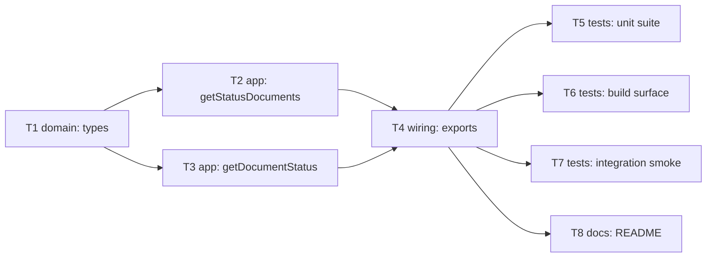

# Epic — tracking-document

> **Spec:** [spec.md](../spec.md) · **Design:** [sad.md](../sad.md) · **API:** [contracts/public-api.md](../contracts/public-api.md) · **ADRs:** [adr/](../adr/)

## Goal

Ship a typed, discoverable way to check a shipment's live tracking status by waybill number — Nova
Poshta's one real `TrackingDocument` method (`getStatusDocuments`) plus a single-waybill convenience
wrapper (`getDocumentStatus`) — kept fully independent of `internet-document` so any waybill number
works regardless of who created it (`spec.md` §2).

## Scope

- **In:** the two typed methods, the full 118-field `TrackingStatus` response type (ADR-0001), the
  match-by-identity guard both in the convenience method (AC-04) and the raw method's response
  (AC-05), the shared error contract inherited unchanged from `client.request()`, and the public
  package export.
- **Out:** any dependency on `common.DocumentStatus` or `internet-document`'s `StateId`/`StateName`;
  caching, rate-limiting, or backoff; client-side capping/splitting of the `Documents` array
  (`spec.md` §3 non-goals).

## Task map

## Tasks

See [tracker.md](./tracker.md) for status. Machine contract: [tasks.json](../tasks.json).

| # | Task | Layer | Blocked by | DoD (short) |
|---|---|---|---|---|
| T1 | Define tracking-document domain types | domain | — | 118-field `TrackingStatus` union, zero `any` |
| T2 | Implement getStatusDocuments | app | T1 | pass-through batch call, no reorder/cap |
| T3 | Implement getDocumentStatus | app | T1 | match-by-identity, 0/1/>1 branches |
| T4 | Wire public exports | wiring | T2, T3 | `src/index.ts` exports module + types; build succeeds |
| T5 | Unit test suite | tests | T4 | AC-01..AC-11 covered; ≤5ms median overhead |
| T6 | Build-surface completeness check | tests | T4 | both methods in `.d.ts`/`.d.cts` |
| T7 | Opt-in integration smoke test | tests | T4 | real-API check, skipped without env vars |
| T8 | README usage example | docs | T4 | type-checked call + AC-06 note |

## Risks / Hard rules

- Match-by-identity (`spec.md` §1 Decision override, AC-04, AC-05) is a hard rule: no task may
  resolve a multi-waybill result by array position — always by the record's own `Number` field.
- `TrackingStatus` types the 118-field **union** of both cross-checked SDK sources, not the
  103-field intersection (`contracts/api-sync-report.md` Drift finding 1) — dropping the 15
  single-sourced fields to "simplify" T1 would violate AC-07.
- No cross-module import from `internet-document` or `common` (`spec.md` §1 Decision override, §3
  non-goal, AC-11) — enforced by file boundary, not a runtime check.
- Security review is still open (`spec.md` §6.1, §8 OQ) and gates `sdd:implement
  tracking-document`, not this task breakdown — tracked here for visibility, not re-resolved.
